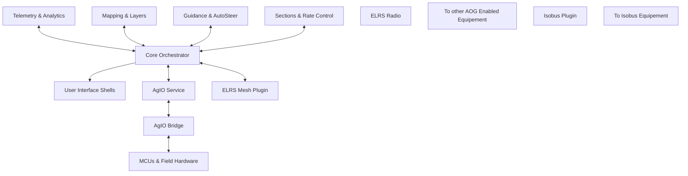

# Nexus (AgOpenGPS Next Generation)

Nexus is an experiment in how far a community guided by AI co-pilots can take AgOpenGPS when human time is no longer the limiting factor. The goal is to produce the best, most connected version of AOG possible while staying transparent, documented, and collaborative for the broader farming community.

## Vision at a Glance

- **AI-assisted evolution.** Nexus treats every artifact—code, docs, packaging, and automation—as something an AI helper can draft while humans review and steer.
- **CM5-first hardware plan.** A Raspberry Pi Compute Module 5 (or Pi 5) is positioned to replace both the Teensy on an All-In-One (AIO) board and the traditional Windows tablet by hosting the entire AOG stack with one or more HDMI/DSI touch displays.
- **Runs how you want.** The same stack operates on Linux or Windows tablets, laptops and desktops, and it remains compatible with existing AIO hardware through USB, Ethernet, or CAN links.
- **AOG-Link V1 bridge.** Nexus modernizes the legacy UDP PGN link (AOG-Link V0) with nanopb messaging and optional MQTT/MQTT-SN transport while keeping the V0 protocol available for drop-in compatibility.
- **Composable everything.** Every service is a replaceable block that communicates through efficient gRPC contracts, letting operators enable, disable, or swap plugins without rewriting the core.

## Modular Architecture (Slightly Simplified)



Core coordinates the data model, kinematics, job/session orchestration, and routing while UI shells focus on visualization. Plugins plug into the gRPC event bus for guidance, mapping, telemetry, analytics, and hardware integrations. AgIO (and its bridge) surface those decisions to MCU modules or legacy AIO boards through AOG-Link V1 or the existing UDP PGN stack.

## Hardware & Deployment Vision

| Scenario | What It Looks Like |
| --- | --- |
| **CM5 / Pi 5 all-in-one** | CM5 mounted on an AIO carrier board powers display(s), GNSS, steering, sections, and sensors while running the complete Nexus stack locally. |
| **Laptop or desktop** | Windows and Linux builds run the same binaries; connect to existing Teensy-based AIOs over USB, Ethernet, or CAN without replacing hardware. |
| **Hybrid rigs** | Mix-and-match host control with remote MCU modules (rate control, section control, ISOBUS, etc.) connected by Ethernet, Wi-Fi, ELRS, LoRa, or CAN. |

## AOG-Link Evolution

The Nexus roadmap upgrades the legacy UDP PGN interface to **AOG-Link V1**, a nanopb-based contract with optional MQTT/MQTT-SN transport. The bridge maintains full compatibility with **AOG-Link V0**, allowing existing rigs and logging workflows to continue operating unchanged while unlocking richer diagnostics, higher throughput, and device identity.

## Plugin & Component Highlights

- **AutoSteer & Guidance.** Closed-loop steering, lookahead tuning, and constraint gating run as plugins connected to Core routing. Refer to [docs/plugins/AutoSteer.md](docs/plugins/AutoSteer.md) and [docs/ADR/ADR-033-guidance-planner-autosteer.md](docs/ADR/ADR-033-guidance-planner-autosteer.md) for control theory and safety notes.
- **Sections & Rate Control.** Section management, variable rate, and product control share the Layer Registry and telemetry feeds, with nanopb contracts ready for MCU modules. See [docs/plugins/Sections.md](docs/plugins/Sections.md) and [docs/plugins/RateControl.md](docs/plugins/RateControl.md).
- **Mapping & Analytics.** Layer editing, replay, and telemetry logging use the TileStore, Layer Registry, and report builder services. Explore [docs/plugins/Mapping.md](docs/plugins/Mapping.md), [docs/plugins/Replay.md](docs/plugins/Replay.md), and [docs/plugins/TelemetryLogging.md](docs/plugins/TelemetryLogging.md).
- **ISOBUS & External Devices.** The ISOBUS bridge, GNSS/IMU fusion, and device manager plugins coordinate identities and capabilities across the mesh; details are under [docs/plugins/ISOBUS.md](docs/plugins/ISOBUS.md) and [docs/plugins/DeviceManager.md](docs/plugins/DeviceManager.md).
- **Simulation & Testing.** Deterministic simulation scenarios, Parquet telemetry logs, and replay fixtures keep regression coverage aligned with the SRS. Start with [docs/howto/simulation-scenarios.md](docs/howto/simulation-scenarios.md) and [docs/plugins/Replay.md](docs/plugins/Replay.md).

## Repository Tour

```text
/
├── docs/                  # SRS, ADRs, plugin guides, training, support
│   ├── ADR/               # Architecture Decision Records
│   ├── SRS/               # System Requirements Specification
│   ├── plugins/           # Plugin requirements and planned surfaces
│   ├── INDEX.md           # Quick links into docs
│   └── CONTRIBUTING-PLUGINS.md # Packaging and governance guidance
├── Nexus SourceCode/      # .NET 8 solution (Core, UI, plugins, tests)
├── schemas/               # JSON schemas for jobs, sessions, layers, mesh
├── tasks.md               # Backlog (NX-###) with automation guardrails
└── README.md              # This document
```

## Getting Started

1. Read `docs/INDEX.md` to see how the ADR roadmap, SRS sections, and how-to guides connect.
2. Choose an NX ticket from `tasks.md`, confirm the referenced ADR/SRS material, and align scope in `#nexus-dev`.
3. Follow `AGENTS.md` for branch naming, ownership bands, and PR expectations—every change ties to one NX ticket.
4. Keep documentation, schema, and test updates alongside code changes; deterministic storage and replay are core principles.
5. When you are ready to run the stack, follow the [developer setup quick start](docs/howto/developer-setup.md) for packaging downloads or local builds.

## Continuous Integration & Release Automation

- **Nexus CI** (`.github/workflows/ci.yml`) restores, builds, and tests the .NET solution on Windows and Linux, then runs linting, contract governance, deterministic simulation smoke tests, and packaging probes.
- **Release Packaging** (`.github/workflows/release.yml`) rebuilds tagged releases, generates single-file bundles via `tools/ci/package-windows.ps1` and `tools/ci/package-linux.ps1`, and publishes zip archives for operators.

## Safety, Access, and Roadmap

- Remote dashboards stay monitor-only unless an operator grants an explicit control lease; mesh profiles restrict which telemetry leaves the cab by default.
- Constraint gates and safety checks stay in Core; plugins receive advisory overlays without gaining direct actuator control.
- Nexus remains experimental. The Architecture Decision Records (ADR) catalog and System Requirements Specification (SRS) outline the proposed path forward so the community can iterate together even when AI authors the first draft.

## Additional Resources

- [docs/INDEX.md](docs/INDEX.md) — curated links into ADRs, SRS sections, and plugin guides.
- [docs/SRS/NOTES.md](docs/SRS/NOTES.md) — narrative summary of the SRS with quick links into requirement sections.
- [docs/ADR/](docs/ADR) — Architecture Decision Records, including [ADR roadmap highlights](docs/ADR/INDEX.md) for upcoming work.
- [docs/howto/developer-setup.md](docs/howto/developer-setup.md) — step-by-step instructions for downloading release builds or running from source.
- [docs/howto/simulation-scenarios.md](docs/howto/simulation-scenarios.md) — deterministic sim walkthroughs for validation and QA.
- [docs/templates/ui-modernization-ai-prompts.md](docs/templates/ui-modernization-ai-prompts.md) — examples of AI prompt bundles used in Nexus development.

Nexus continues to evolve in public. The ADR and SRS trail markers are meant to keep the community aligned, even when the AI prototypes the next chapter.
