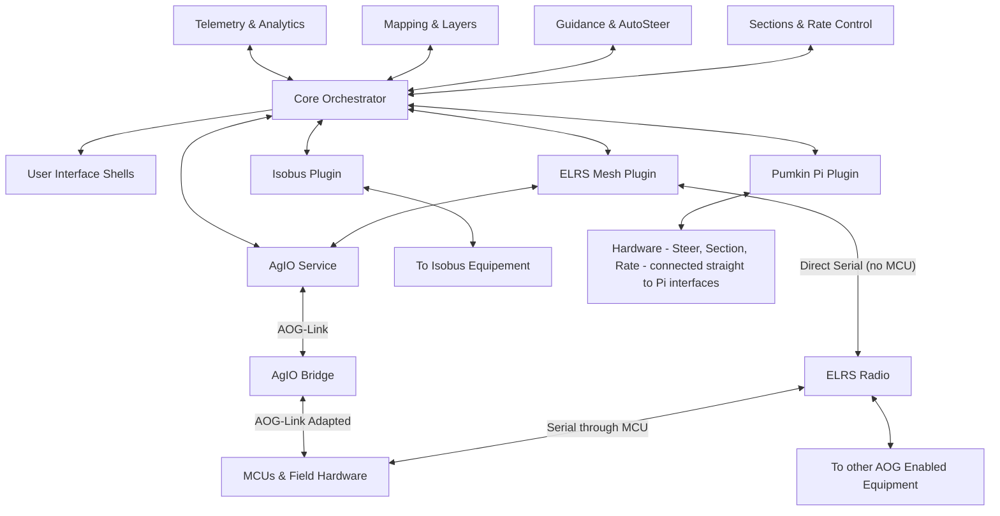

# Welcome to the Nexus Experiment

_AgOpenGPS Next Generation_

Nexus is the living laboratory for a community effort to see how far we can take AgOpenGPS when AI co-pilots help carry the load. The repository now serves two audiences at once: people following the **Nexus Experiment** itself, and people who want to evaluate or adopt **Jon Fortney's proposed System Requirements Specification (SRS) and companion Architecture Decision Records (ADRs)** as the foundation for next-generation development.

## Start Here

- **Review the SRS first if requirements are your focus.** Head over to the [SRS overview](docs/development/SRS/00_ReadMe.md) to explore Jon's proposed structure, requirements, and ADR trail. The draft began as a single place to capture every note Jon collected while researching AgOpenGPS. It has since been reorganized so the community can adopt, modify, or replace sections rather than starting from scratch.
- **Remember the experiment's origin story.** The SRS and ADR bundle was prepared so we could hand a "finished" spec to AI helpers and learn how far automated development could go. You are encouraged to critique the assumptions, update requirements, and document revisions as Nexus transitions from experiment to shared roadmap.

## Why "Nexus"?

The name highlights the goal of building a hub that connects the people, hardware, and software that make precision agriculture work. The next-generation program should keep the Nexus identity because the project stands at the intersection of legacy rigs, future hardware like the CM5/Pi 5, and the AI-assisted workflows that tie everything together.

## Experiment at a Glance

- **Full backward compatibility.**
  Nexus is built to run natively with existing **AgOpenGPS Windows tablet + AIO** setups—no hardware changes or wiring rewrites required. Every configuration, connection, and control scheme supported today continues to work out of the box.
- **CM5-first option.**
  For new installations, a **Raspberry Pi Compute Module 5 (or Pi 5)** can host the entire Nexus stack—replacing both the tablet and the Teensy in an AIO—with identical functionality, reduced complexity, and a **steep cost savings**. One or more HDMI/DSI touch displays can be connected directly.
- **AI-assisted evolution.**
  Nexus treats every artifact—code, docs, packaging, and automation—as something an AI helper can draft while humans review and steer.
- **Runs how you want.**
  The same stack operates on Linux or Windows tablets, laptops, and desktops, and it remains compatible with existing AIO hardware through USB, Ethernet, or CAN links.
- **AOG-Link V1 bridge.**
  Nexus modernizes the legacy UDP PGN link (V0) with nanopb messaging and optional MQTT/MQTT-SN transport while keeping the V0 protocol available for drop-in compatibility.
- **Composable everything.**
  Every service is a replaceable block that communicates through efficient gRPC contracts, letting operators enable, disable, or swap plugins without rewriting the core.

## Modular Software Architecture (Slightly Simplified)



Core coordinates the data model, kinematics, job/session orchestration, and routing while UI shells focus on visualization. Plugins plug into the gRPC event bus for guidance, mapping, telemetry, analytics, and hardware integrations. AgIO (and its bridge) surface those decisions to MCU modules or legacy AIO boards through AOG-Link V1 or the existing UDP PGN stack.

## Hardware & Deployment Vision

| Scenario | What It Looks Like |
| --- | --- |
| **CM5 / Pi 5 all-in-one** | CM5 mounted on an AIO carrier board powers display(s), GNSS, steering, sections, and sensors while running the complete Nexus stack locally. |
| **Laptop or desktop** | Windows and Linux builds run the same binaries; connect to existing Teensy-based AIOs over USB, Ethernet, or CAN without replacing hardware. |
| **Hybrid rigs** | Mix-and-match host control with remote MCU modules (rate control, section control, ISOBUS, etc.) connected by Ethernet, Wi-Fi, Serial, or CAN. |

## AOG-Link Evolution

The Nexus roadmap upgrades the legacy UDP PGN (Coined AOG-Link V0) interface to **AOG-Link V1**, a nanopb-based contract with optional MQTT/MQTT-SN transport. The bridge maintains full compatibility with **AOG-Link V0**, allowing existing rigs and logging workflows to continue operating unchanged while unlocking richer diagnostics, higher throughput, and device identity.

## Plugin & Component Highlights

- **AutoSteer & Guidance.** Closed-loop steering, lookahead tuning, and constraint gating run as plugins connected to Core routing. Refer to [docs/Plugins/AutoSteer.md](docs/Plugins/AutoSteer.md) and [docs/development/SRS/sections/8X_Guidance/81-ADR-033 - Guidance planner and autosteer orchestration.md](docs/development/SRS/sections/8X_Guidance/81-ADR-033 - Guidance planner and autosteer orchestration.md) for control theory and safety notes.
- **Sections & Rate Control.** Section management, variable rate, and product control share the Layer Registry and telemetry feeds, with nanopb contracts ready for MCU modules. See [docs/Plugins/Sections.md](docs/Plugins/Sections.md) and [docs/Plugins/RateControl.md](docs/Plugins/RateControl.md).
- **Mapping & Analytics.** Layer editing, replay, and telemetry logging use the TileStore, Layer Registry, and report builder services. Explore [docs/Plugins/Mapping.md](docs/Plugins/Mapping.md), [docs/Plugins/Replay.md](docs/Plugins/Replay.md), and [docs/Plugins/TelemetryLogging.md](docs/Plugins/TelemetryLogging.md).
- **ISOBUS & External Devices.** The ISOBUS bridge, GNSS/IMU fusion, and device manager plugins coordinate identities and capabilities across the mesh; details are under [docs/Plugins/ISOBUS.md](docs/Plugins/ISOBUS.md) and [docs/Plugins/DeviceManager.md](docs/Plugins/DeviceManager.md).
- **Simulation & Testing.** Deterministic simulation scenarios, Parquet telemetry logs, and replay fixtures keep regression coverage aligned with the SRS. Start with [docs/Core/howto/simulation-scenarios.md](docs/Core/howto/simulation-scenarios.md) and [docs/Plugins/Replay.md](docs/Plugins/Replay.md).

## Repository Tour

```text
/
├── docs/                  # SRS, ADRs, plugin guides, training, support
│   ├── ADR/               # Architecture Decision Records
│   ├── SRS/               # System Requirements Specification
│   ├── plugins/           # Plugin requirements and planned surfaces
│   ├── INDEX.md           # Quick links into docs
│   └── CONTRIBUTING-PLUGINS.md # Packaging and governance guidance
├── Nexus SourceCode/      # .NET 8 solution (Core, UI, plugins, tests)
├── schemas/               # JSON schemas for jobs, sessions, layers, mesh
├── tasks.md               # Backlog (NX-###) with automation guardrails
└── README.md              # This document
```

## Getting Started

1. Read `docs/INDEX.md` to see how the ADR roadmap, SRS sections, and how-to guides connect.
2. Choose an NX ticket from `tasks.md`, confirm the referenced ADR/SRS material, and align scope in `#nexus-dev`.
3. Follow `AGENTS.md` for branch naming, ownership bands, and PR expectations—every change ties to one NX ticket.
4. Keep documentation, schema, and test updates alongside code changes; deterministic storage and replay are core principles.
5. When you are ready to run the stack, follow the [developer setup quick start](docs/Core/howto/developer-setup.md) for packaging downloads or local builds.

## Installing from Release

- Releases are produced by `.github/workflows/release.yml`. Each tagged build first publishes individual component and plugin archives, then attempts bundle assembly once every required artifact is present.
- Bundles are never partial. If a dependency is missing, the Release stays in **components-only** mode so you can pick the pieces you need without waiting for a retry.
- Download the archive that matches your runtime. Windows builds use `.zip` while Linux builds use `.tar.gz`.
- Verify the attached `SHA256SUMS.txt` (and optional Cosign signatures) before deploying to production rigs.
- Bundle layouts are documented in `SERVICES.md` and `PLUGINS.md`; upgrade steps are captured in `UPGRADING.md`.

| Artifact Type | Naming Pattern |
| --- | --- |
| Component archives | `<Component>_v<VER>_<RUNTIME>.zip\|.tar.gz` |
| Plugin archives | `Plugin-<Name>_v<VER>_<RUNTIME>.zip\|.tar.gz` |
| Bundles | `Nexus-Base_v<VER>_<RUNTIME>.<ext>`, `Nexus-Headless_v<VER>_<RUNTIME>.tar.gz`, `Nexus-UI_v<VER>_<RUNTIME>.<ext>` |

Reference `bundles/base.bundle.json` and `bundles/headless.bundle.json` for the exact component and plugin manifest enforced by CI.

## Continuous Integration & Release Automation

- **Nexus CI** (`.github/workflows/ci.yml`) restores, builds, and tests the .NET solution on Ubuntu using .NET 8. Test results are always uploaded as artifacts for debugging.
- **Guardrail bundle** (`nexus guardrails`) runs retention, performance, replay, and crash-recovery regressions tagged with the guardrail trait so ADR-025/026 acceptance stays green before merges.【F:tools/scripts/nexus.sh†L12-L64】【F:Nexus SourceCode/tests/Aog.Core.Tests/Simulation/SimulationPerformanceHarnessTests.cs†L19-L70】
- **Reusable component builds** (`.github/workflows/build-components-reusable.yml`) package Core, AgIO, UI, and plugins across Windows and Linux runtimes with consistent naming.
- **Release Packaging** (`.github/workflows/release.yml`) publishes component archives immediately, assembles manifest-driven bundles only when every dependency is present, and updates the same GitHub Release on retries. SHA256 checksums, optional SBOMs, and Cosign signatures are attached alongside bundles.

## Safety, Access, and Roadmap

- Remote dashboards stay monitor-only unless an operator grants an explicit control lease; mesh profiles restrict which telemetry leaves the cab by default.
- Constraint gates and safety checks stay in Core; plugins receive advisory overlays without gaining direct actuator control.
- Nexus remains experimental. The Architecture Decision Records (ADR) catalog and System Requirements Specification (SRS) outline the proposed path forward so the community can iterate together even when the AI prototypes the next chapter.

## Additional Resources

- [docs/INDEX.md](docs/INDEX.md) — curated links into ADRs, SRS sections, and plugin guides.
- [docs/development/SRS/NOTES.md](docs/development/SRS/NOTES.md) — narrative summary of the SRS with quick links into requirement sections.
- [docs/development/SRS/sections](docs/development/SRS/sections) — Architecture Decision Records organized by SRS sections, including the [PoseStream roadmap](docs/development/SRS/sections/2X_System_Architecture/21-ADR-900%20-%20PoseStream,%20Layer,%20and%20Control%20Program%20Roadmap.md) for upcoming work.
- [docs/Core/howto/developer-setup.md](docs/Core/howto/developer-setup.md) — step-by-step instructions for downloading release builds or running from source.
- [docs/Core/howto/simulation-scenarios.md](docs/Core/howto/simulation-scenarios.md) — deterministic sim walkthroughs for validation and QA.
- [docs/templates/ui-modernization-ai-prompts.md](docs/templates/ui-modernization-ai-prompts.md) — examples of AI prompt bundles used in Nexus development.

Nexus continues to evolve in public. The ADR and SRS trail markers are meant to keep the community aligned, even when the AI prototypes the next chapter.
