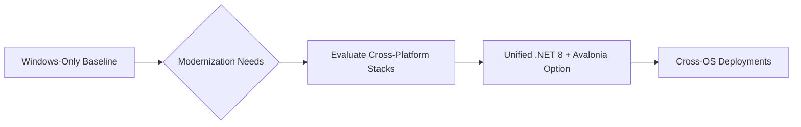
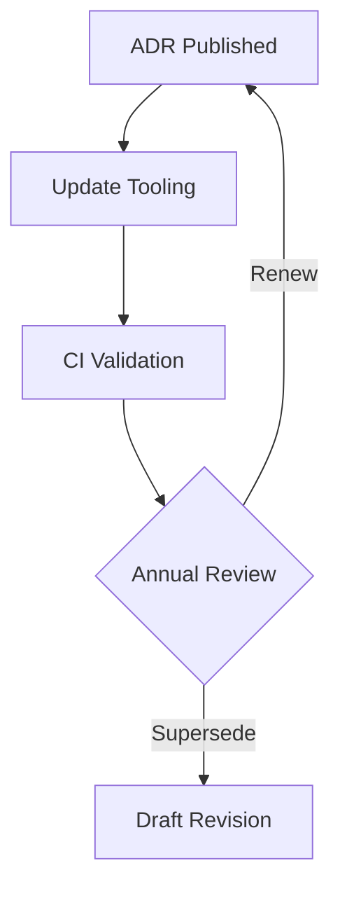

# 11-ADR-001 — Adopt Unified .NET 8 Runtime & Avalonia Stack

*(Status: Proposed)*

**Authors:** Codex  
**Reviewers:** Platform Foundations Working Group  
**Created:** 2025-10-20  
**Last Updated:** 2025-10-20  
**Supersedes:** —  
**Superseded by:** —  
**Related SRS:** `11_OS_Support.md`  
**Related Options:** `11-O1_Unified_DotNet8_Avalonia.md`

---

## 1) Context

Legacy AgOpenGPS deployments ship Windows-only binaries using WinForms and vendor-specific drivers.
Community pilots demonstrate the need for Linux headless services, remote clients, and mobile companions.
Evaluated options considered keeping the Windows baseline, rewriting in native toolkits, or adopting a unified .NET stack with Avalonia UI and gRPC contracts.

Inputs include SRS Section 11 requirements, Linux Core pilot feedback, and ADR-003 (Avalonia UI) research.

---

## 2) Decision

Standardize the Nexus runtime on .NET 8 with Avalonia UI and managed AgIO backends for Windows and Linux deployments.
This decision covers desktop UI shells, AgIO hardware hosts, and shared plugin/runtime contracts.

### Decision Summary

- **Scope:** Core runtime, AgIO, UI shells, plugin manifests, and deployment tooling.
- **Boundary:** Hardware protocol semantics remain governed by respective subsystem ADRs.
- **Implementation Level:** Architecture + tooling policy; drives code and packaging workstreams.

---

## 3) Consequences

**Positive Impacts:**

- Enables dual-first Windows and Linux releases with consistent tooling.
- Reduces maintenance duplication by sharing contracts and runtime across components.
- Unlocks remote companion clients through shared gRPC APIs.

**Negative / Mitigated Impacts:**

- Requires investment in Linux packaging, CI, and GPU optimization — mitigated via dedicated validation plan.
- Demands Avalonia expertise — mitigated through training and pilot projects.

**Follow-up Actions:**

- Implement validation roadmap defined in Option 11-O1 (CI lanes, performance benchmarks, device matrix).
- Update build pipelines (Section 14) to publish signed Windows and Linux artifacts.
- Draft support matrix for officially supported OS versions and hardware tiers.

---

## 4) Rationale

Decision matrix in SRS §11.12 shows 11-O1 scoring 4.15 vs. 2.85 for the legacy baseline, driven by maintainability and roadmap alignment.
Shared runtime simplifies plugin governance, matches contributor skill sets, and satisfies mobile/remote requirements.
Alternatives either block roadmap goals or require full rewrites in less familiar stacks.

---

## 5) Alternatives Considered

| Option | Summary | Reason Not Selected |
|--------|---------|---------------------|
| Legacy Windows baseline | Retain WinForms/WPF only. | Fails Linux/mobile goals; accumulates tech debt. |
| Qt/C++ rewrite | Native cross-platform UI. | High rewrite cost, splits language/tooling expertise. |
| Electron/Web UI | Web technologies for desktop. | Hardware access latency and GPU constraints unacceptable. |

---

## 6) Implementation & Governance

- **Governance ownership:** Platform Foundations Working Group.
- **Update cadence:** Review annually or upon major .NET LTS release.
- **Documentation:** Maintain runtime version matrix, OS support tiers, and contract compatibility notes.

---

## 7) Risks & Mitigations

| ID | Risk | Impact | Mitigation / Monitoring |
|----|------|--------|-------------------------|
| R1 | Linux GPU stack regressions | High | Maintain performance dashboards; optimize fallback render paths. |
| R2 | Vendor SDK licensing limits redistribution | Medium | Negotiate distribution rights, provide gRPC shims when necessary. |
| R3 | CI resource cost for dual OS builds | Medium | Leverage containerized build lanes; monitor pipeline duration. |

---

## 8) Legacy Implementation Notes

- WinForms UI + Win32 drivers formed the operational baseline since AgOpenGPS 5.x.
- Early Linux experiments relied on community scripts without deterministic packaging.
- WPF shell prototypes improved UX but remained Windows-bound, motivating cross-platform UI investment.

---

## 9) Governance Updates

- **Review frequency:** Annual; additionally upon .NET LTS announcements.
- **Decision owner:** Platform Foundations WG chair.
- **Compliance metrics:** Windows & Linux release artifacts published; validation plan executed each release.

---

## 10) References

- **SRS Sections:** `11_OS_Support.md` — §§11.5, 11.12  
- **Option Documents:** `11-O1_Unified_DotNet8_Avalonia.md`  
- **Prior ADRs:** `docs/ADR/ADR-001-dotnet8-runtime.md`, `docs/ADR/ADR-003-avalonia-ui.md`

---

## 11) Change Log

| Date | Change | Author | PR / Issue |
|------|--------|--------|------------|
| 2025-10-20 | Initial proposal aligning SRS Section 11 to new template. | Codex | #0000 |

---

> **Lifecycle:** Proposed → Accepted → Superseded → Deprecated → Rejected  
> **Traceability:** Links to SRS Decision Matrix §11.12 and Option 11-O1.
