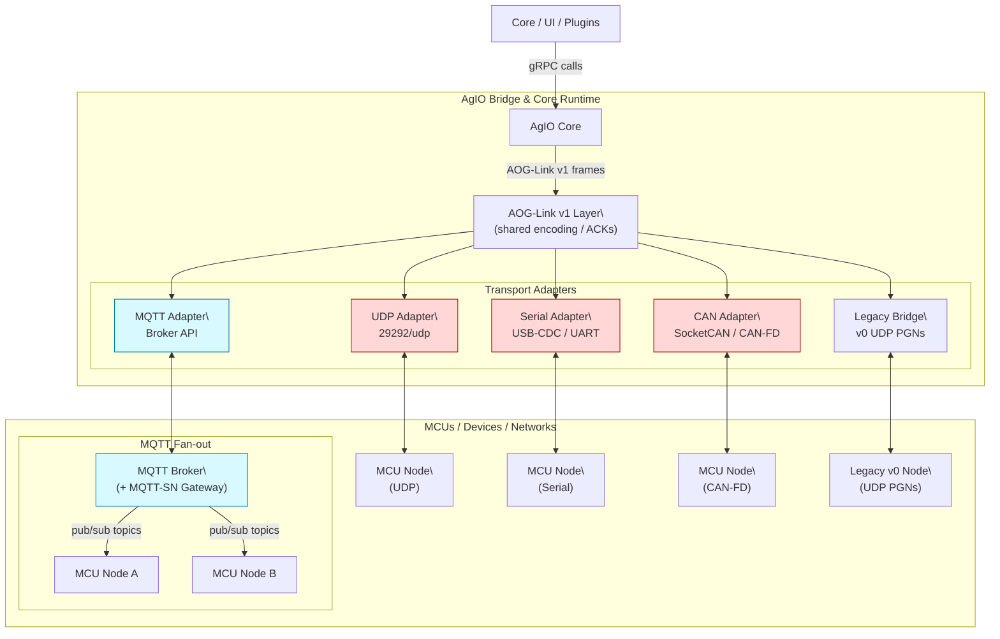

# AgIO Overview

AgIO hosts the transports, bridges, and hardware services that connect the
Core runtime to tractors, implements, and companion devices. This folder now
collects the operator runbooks and integration notes that used to live across
multiple bridge guides.

## Architecture at a glance

AgIO sits between the gRPC bus inside Core and the physical transports that
reach hardware. The bridge keeps a single implementation of the AOG-Link v1
codec and fans that logic out across adapters.

### Core responsibilities

- **Message translation.** Subscribe to the gRPC bus, map intents/telemetry into
  canonical protobuf payloads, and assign message IDs for ACK flows.
- **Adapter orchestration.** Start and supervise transport adapters, keep their
  state machines fed, and surface health counters back onto the bus.
- **Discovery & authority.** Track `MGMT.Hello`, role masks, authority tokens,
  and TTL windows so only the active controller drives actuators.
- **Reliability guardrails.** Enforce retry policies, fragmentation, rate
  shaping, and drop counters so every transport inherits the same behavior per
  the SRS contract.

### Transport guidance

| Path type            | Preferred transports                            | Notes |
|----------------------|--------------------------------------------------|-------|
| Low-latency control  | Shared memory (CM5) → Serial/CAN → UDP           | `ACK_REQUIRED` commands, steer and section loops; see SRS §53.4. |
| Fan-out telemetry    | MQTT QoS0 → UDP multicast (optional)             | GPS, IMU, status, health metrics for dashboards. |
| Legacy compatibility | Legacy bridge (v0 PGNs)                          | Keep enabled until every node advertises v1 firmware in `Hello`. |

## Deployment workflows

These condensed runbooks replace the separate bridging knowledge base. Pair
them with the detailed rollout checklist below when coaching dealers or field
technicians.

1. **Stand up a Nexus-to-Teensy bridge**
   - Confirm firmware hashes during UDP discovery before launching services.
   - Translate legacy machine profiles with the configuration CLI and validate
     steer/section parity in the generated Nexus profile.
   - Run `nexus run core` and `nexus run agio --profile <machine>` with the PGN
     bridge plugin enabled, then capture capability exchange logs for support
     tickets.
2. **Synchronise guidance and coverage data**
   - Import AB lines and coverage history through the legacy import wizard or
     coverage analytics CLI.
   - Replay legacy logs so Nexus can render coverage parity before field work.
   - Schedule nightly sync jobs (cloud relay or NAS) and record access details
     in the deployment ticket.
3. **Operate in mixed mode**
   - Document which loops stay on legacy controllers versus Nexus sections in
     the machine profile.
   - Track latency capsules to ensure section commands stay under the 30 ms
     target; trim plugins if necessary.
   - Deliver the mixed-mode operator briefing and log acknowledgements.

## Troubleshooting quick reference

| Symptom | Probable cause | Resolution |
| --- | --- | --- |
| UDP discovery succeeds but steer never engages | PGN bridge plugin disabled or firewall blocks 8888/8889 | Validate `plugins.json` and open firewall ports. |
| Sections lag behind motion | Telemetry sampling locked at 10 Hz | Increase sampling to 20 Hz in the profile and retune rate controller gains. |
| Teensy reboots on connect | Firmware hash mismatch or 5 V brownout | Reflash to the supported hash and verify a dedicated ≥1 A 5 V regulator. |
| Coverage sync shows gaps | Legacy logs missing GNSS fix quality | Inspect the replay report; request replacement logs or mark coverage as estimated. |
| Operator unsure about control transfer | Mixed-mode briefing skipped | Schedule a follow-up session and update the deployment checklist with sign-off. |

## Related documents

- [External module message & PGN guide](external-module-pgns.md)
- [AOG-Link transport rollout checklist](aog-link-transport-rollout.md)
- [CM5 integrated controller setup](cm5.md)
- [AgIO PGN baseline (legacy reference)](../development/SRS/references/AgIO_PGN_Baseline.md)
- [AOG-Link compatibility SRS](../development/SRS/sections/5X_Hardware_IO_Device_Layer/53_AOG_Link_Compatibility.md)
