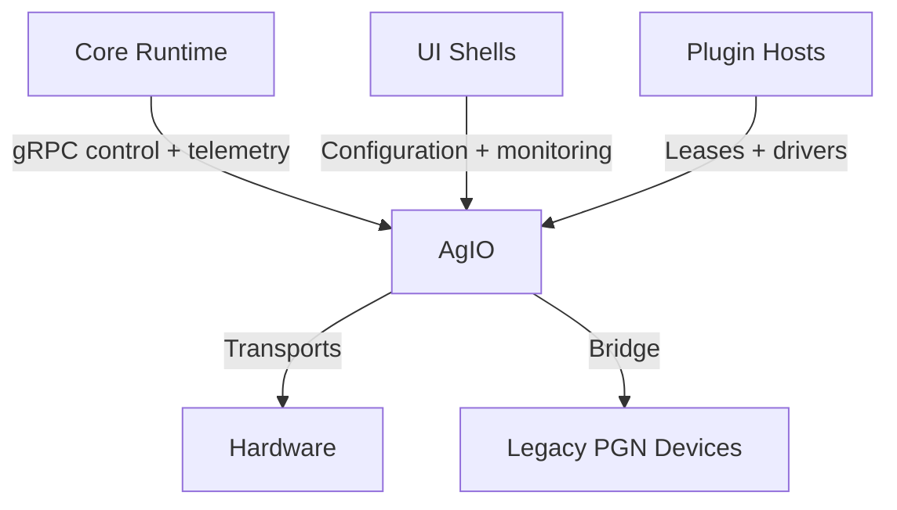

# AgIO Subsystem Overview

AgIO hosts Nexus hardware transports, bridge adapters, and compatibility
services that keep legacy PGN devices and modern gRPC clients operating
side-by-side. It arbitrates access to serial, UDP, CAN, MQTT-SN, and
AOG-Link channels while mirroring telemetry for the Core runtime and UI
shells. The runbooks in this folder document how operators deploy and
support those transports; the normative protocol and safety requirements
now live in the [SRS AOG-Link compatibility section](../SRS/sections/5X_Hardware_IO_Device_Layer/53_AOG_Link_Compatibility.md)
and the [ADR-006 transport appendix](../SRS/sections/4X_Interprocess_Communications/42-ADR-006%20-%20MCU%20communications%20over%20AOG-Link%20(nanopb).md).

## Responsibilities
- Provide deterministic access to hardware buses (serial, UDP, CAN-FD,
  MQTT-SN) and expose them through unified bridge services.
- Maintain backward-compatible PGN bridges while offering gRPC contracts
  for Core and plugin orchestration.
- Surface deployment runbooks for integrated controllers such as the CM5
  and guide staged rollouts of new transports.

### SRS breadcrumbs
- [Section 53 — AOG-Link Compatibility](../SRS/sections/5X_Hardware_IO_Device_Layer/53_AOG_Link_Compatibility.md)
- [ADR-006 — MCU communications over AOG-Link (nanopb)](../SRS/sections/4X_Interprocess_Communications/42-ADR-006%20-%20MCU%20communications%20over%20AOG-Link%20(nanopb).md)
- [Section 54 — CM5 Integrated Controller](../SRS/sections/5X_Hardware_IO_Device_Layer/54_CM5_Integrated_Controller.md)

## Feature Highlights
- **Bridge topologies:** [Pumpkin Pi fastpath and bridge
  interactions](bridge.md) show how shared-memory HALs coexist with
  legacy transport mirroring.
- **AOG-Link operations:** Deployment and staging workflows are
  documented in the [transport rollout guide](aog-link-transport-rollout.md)
  and [bridge architecture explainer](aog-link-bridge-architecture-guide.md).
- **Field operations:** The [CM5 integrated controller quick
  start](cm5.md) details scheduling, capability grants, and telemetry for
  on-box deployments.
- **Support readiness:** Troubleshooting checklists live in the
  [bridging workflow knowledge base](bridging-workflow-knowledge-base.md).

## Plugin Touchpoints
- Transport adapters such as
  [Pumpkin Pi](../plugins/pumpkin-pi.md) and
  [ISOBUS Bridge](../plugins/IsobusBridge.md) bind to AgIO leases for
  deterministic hardware access.
- Device orchestration plugins leverage discovery and inventory feeds
  published by AgIO — see the
  [Device Manager guide](../plugins/DeviceManager.md) and
  [Multi-Machine synchronization docs](../Core/multi-machine-sync.md).
- Core automation plugins depend on AgIO telemetry mirrors for health
  and authority status before issuing control outputs.

## Additional References
- [AgIO transport rollout checklist](aog-link-transport-rollout.md)
- [Bridge architecture explainer](aog-link-bridge-architecture-guide.md)
- [Bridging workflow knowledge base](bridging-workflow-knowledge-base.md)
- [CM5 integrated controller setup](cm5.md)
