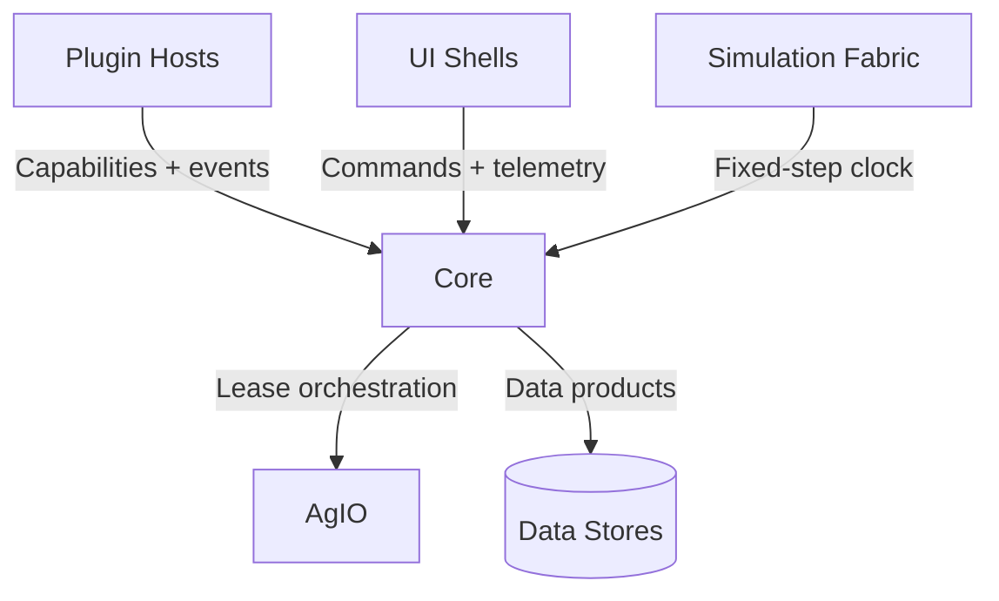

# Core Runtime Overview

The Core runtime orchestrates deterministic scheduling, capability
exchange, and orchestration services that connect plugins, UI shells, and
AgIO transports. It enforces contracts, routes telemetry, and manages the
lifecycle of simulation or hardware-backed workloads.

## Responsibilities
- Host the gRPC services, event bus, and deterministic schedulers that
  power navigation, automation, and telemetry flows.
- Broker capability negotiation between plugins, UI clients, and AgIO to
  ensure the correct leases and topics are active for each deployment.
- Provide operational guardrails, including observability dashboards and
  multi-machine coordination workflows.

## Feature Highlights
- **Data flow contracts:** The [Core data flow overview](data-flow.md)
  summarizes how pose, control, and analytics streams move between
  services.
- **Capability registry:** [Capability registry reference](capability-registry.md)
  captures the identifiers shared across Core, AgIO, and plugins.
- **Operations playbooks:** [Linux Core operations](linux-core-operations-playbook.md)
  and [performance budget dashboards](performance-budget-telemetry-dashboards.md)
  outline deployment guardrails and observability expectations.
- **Fleet coordination:** The [multi-machine sync guide](multi-machine-sync.md)
  documents how Core instances coordinate state across head units.

## Plugin Touchpoints
- [Core Lifecycle plugin](../plugins/CoreLifecycle.md) manages host
  startup, shutdown, and rolling upgrades across clusters.
- [Telemetry Logging](../plugins/TelemetryLogging.md) and
  [Automation Engine](../plugins/AutomationEngine.md) plugins rely on
  Core’s event bus and scheduling primitives.
- Guidance and control plugins such as
  [Autosteer](../plugins/Guidance.md) and
  [Rate Control](../plugins/RateControl.md) consume capability and
  telemetry feeds negotiated through Core.

## Additional References
- [Core data flow](data-flow.md)
- [Capability registry](capability-registry.md)
- [Linux operations playbook](linux-core-operations-playbook.md)
- [Multi-machine synchronization](multi-machine-sync.md)
- [Performance budget dashboards](performance-budget-telemetry-dashboards.md)
