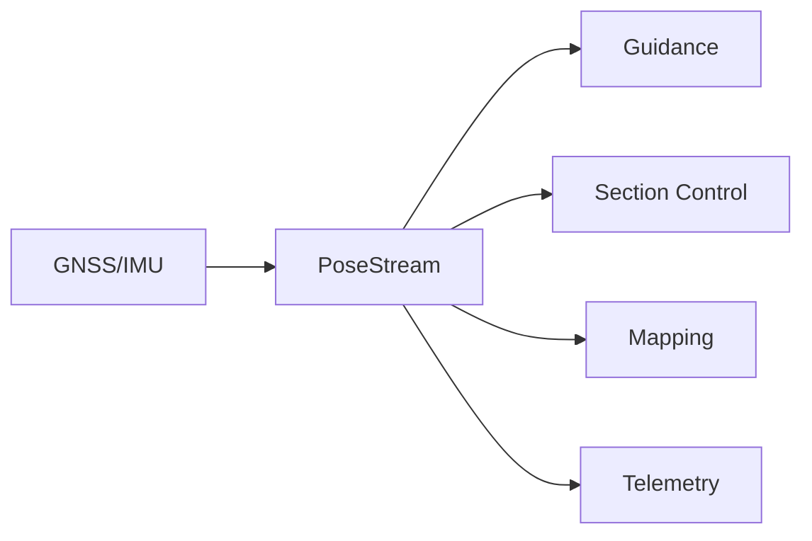
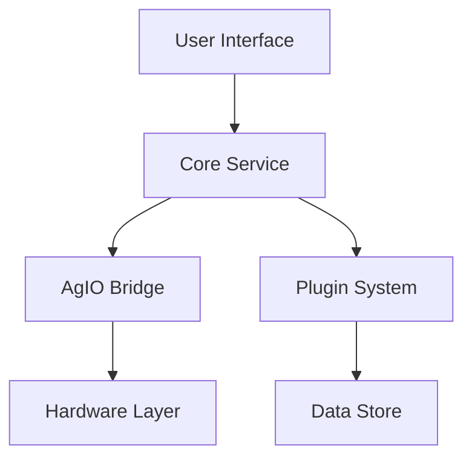

# Data Flow Architecture

<<<<<<< HEAD
This document describes how data flows through the Nexus system, as specified in [SRS Communications Requirements](../SRS/sections/4X_Interprocess_Communications/42_Transports.md) and implemented through [ADR-002: gRPC Contracts](../ADR/ADR-002-grpc-contracts.md).
=======
This document describes how data flows through the Nexus system, as specified in [SRS Communications Requirements](../SRS/sections/4X/42_Transports.md) and implemented through [ADR-002: gRPC Contracts](../ADR/ADR-002-grpc-contracts.md).
>>>>>>> origin/develop

## Core Data Streams

### PoseStream
As defined in [ADR-007: PoseStream Architecture](../ADR/ADR-007-posestream-sectionstate-architecture.md):

### Control Flow

## Key Data Types

1. **Real-Time Control Data**
   - PoseStream frames (20Hz)
   - Section states
   - Steering commands
   - Rate control values

2. **Mapping & Analytics**
   - Field boundaries
   - Coverage maps
   - As-applied data
   - Yield data

3. **Configuration & State**
   - Vehicle settings
   - Tool configurations
   - User preferences
   - Session state

## Data Storage

### Vector Tile Store
As specified in [ADR-009: Vector Tile Storage](../ADR/ADR-009-posestream-vector-tilestore-persistence.md):
- Efficient spatial indexing
- Compressed storage format
- Real-time update capability

### Session Data
Following [ADR-023: Session/Job Model](../ADR/ADR-023-session-job-model.md):
- Job records
- Equipment configurations
- Operation logs
- Analytics data

## Protocol Stack

| Layer | Protocol | Documentation |
|-------|----------|---------------|
| UI-Core | gRPC | [Contract Reference](../reference/grpc-contracts.md) |
| Core-Plugin | gRPC | [Plugin API](../plugins/reference/api.md) |
| Core-Bridge | gRPC | [Bridge Protocol](../reference/bridge-protocol.md) |
| Bridge-Hardware | AOG-Link | [AOG-Link Spec](../reference/aog-link-spec.md) |

## Data Integrity

### Validation
- Schema validation
- Constraint checking
- Type safety
- Range limits

### Persistence
- Atomic writes
- Transaction support
- Conflict resolution
- Backup strategy

## Performance Characteristics

As defined in [ADR-026: Performance Budgets](../ADR/ADR-026-performance-budgets.md):

| Metric | Target | Notes |
|--------|--------|-------|
| PoseStream Latency | <50ms | End-to-end |
| Storage Write | <100ms | 95th percentile |
| Query Response | <200ms | Complex spatial |
| Memory Usage | <2GB | Full system |

## Related Documentation

<<<<<<< HEAD
- [Communications Requirements](../SRS/sections/4X_Interprocess_Communications/42_Transports.md)
- [Data Model Requirements](../SRS/sections/3X_Data_Storage/32_Persistence_Formats.md)
- [Threading, Scheduling & Timing requirements](../SRS/sections/2X_System_Architecture/23_Threading_Scheduling_Timing.md)
=======
- [Communications Requirements](../SRS/sections/4X/42_Transports.md)
- [Data Model Requirements](../SRS/sections/3X/32_Persistence_Formats.md)
- [Threading, Scheduling & Timing requirements](../SRS/sections/2X/23_Threading_Scheduling_Timing.md)
>>>>>>> origin/develop
- [Protocol Specifications](../reference/protocols/INDEX.md)
