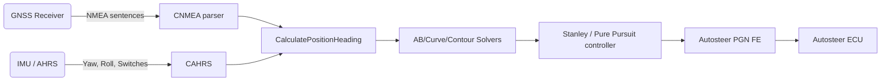

# Guidance Overview

AgOpenGPS v6 organises guidance as a coordinated loop that ingests GNSS/IMU fixes, maintains vehicle/tool pose, solves the active line, and emits autosteer targets on every fix cycle.

## Runtime loop topology

- **Update cadence** – `gpsHz` is initialised to 10 Hz and smoothed each frame; all guidance and autosteer routines are executed on that cadence within the `UpdateFixPosition` and `TheRest` pipeline.【F:Legacy SourceCode -V6/SourceCode/GPS/Forms/FormGPS.cs†L83-L168】【F:Legacy SourceCode -V6/SourceCode/GPS/Forms/Position.designer.cs†L1182-L1248】
- **Pose maintenance** – `CalculatePositionHeading` converts GNSS fixes into pivot, steer, hitch, tool, and guidance look-ahead poses while accounting for hitch configuration (rigid, trailing, tow-between-tank) and articulation limits.【F:Legacy SourceCode -V6/SourceCode/GPS/Forms/Position.designer.cs†L1251-L1340】
- **Section look-ahead & coverage** – After pose updates, `CalculateSectionLookAhead` projects each section’s left/right edges forward, records speeds, and feeds section control heuristics while boundary checks mark whether sections are inside fence/headland areas.【F:Legacy SourceCode -V6/SourceCode/GPS/Forms/Position.designer.cs†L1391-L1487】【F:Legacy SourceCode -V6/SourceCode/GPS/Forms/OpenGL.Designer.cs†L880-L921】
- **Guidance solver entry** – Depending on active track mode, `ABLine.GetCurrentABLine` or `curve.GetCurrentCurveLine` compute cross-track errors and steering setpoints (Stanley or Pure Pursuit). Contour guidance and YouTurn overrides feed the same pathway.【F:Legacy SourceCode -V6/SourceCode/GPS/Classes/CABLine.cs†L157-L332】【F:Legacy SourceCode -V6/SourceCode/GPS/Classes/CABCurve.cs†L619-L818】
- **Autosteer handshake** – After guidance calculations, `Position.designer` packages the PGN 0xFE frame with speed, status, steer angle, and guidance distance, applies safety gates (speed, reverse, dead-zone), and transmits to the autosteer module each loop.【F:Legacy SourceCode -V6/SourceCode/GPS/Forms/Position.designer.cs†L851-L1049】【F:Legacy SourceCode -V6/SourceCode/GPS/Forms/PGN.Designer.cs†L35-L124】

## High-level dataflow

- The CNMEA decoder updates `pn.fix` and timing used by pose estimation.【F:Legacy SourceCode -V6/SourceCode/GPS/Forms/FormGPS.cs†L120-L154】
- `CAHRS` supplies roll, heading, and switch data that bias steering outputs (side-hill compensation, engage/disengage).【F:Legacy SourceCode -V6/SourceCode/GPS/Forms/FormGPS.cs†L188-L198】【F:Legacy SourceCode -V6/SourceCode/GPS/Classes/CGuidance.cs†L95-L108】
- Controllers write millimetre cross-track and centi-degree steering commands into `guidanceLineDistanceOff` / `guidanceLineSteerAngle`, which are then encoded into PGN 0xFE fields before transmission.【F:Legacy SourceCode -V6/SourceCode/GPS/Classes/CABLine.cs†L329-L331】【F:Legacy SourceCode -V6/SourceCode/GPS/Forms/Position.designer.cs†L903-L1043】

## Scheduling assumptions

- Pose and guidance calculations run inline with render updates (`oglMain.Refresh`) on the UI thread; there is no separate worker loop, so heavy operations (curve offset recomputation) are gated and throttled (e.g., every 0.66 s) to avoid UI stalls.【F:Legacy SourceCode -V6/SourceCode/GPS/Classes/CABLine.cs†L78-L154】【F:Legacy SourceCode -V6/SourceCode/GPS/Classes/CABCurve.cs†L75-L138】
- Section control and autosteer packaging assume every fix is processed; timers (`section[j].sectionOnTimer`, `vehicle.deadZoneDelayCounter`) are expressed in half-cycle counts (`gpsHz/2`).【F:Legacy SourceCode -V6/SourceCode/GPS/Forms/OpenGL.Designer.cs†L960-L1155】【F:Legacy SourceCode -V6/SourceCode/GPS/Forms/Position.designer.cs†L998-L1017】

## Research Notes

- Code pointers: `FormGPS.cs`, `Position.designer.cs`, `CGuidance.cs`, `CABLine.cs`, `CABCurve.cs`, `OpenGL.Designer.cs`, `PGN.Designer.cs`.
- Open questions: pose fusion details for dual-antenna mode live in `CAHRS` and are outside this extract.
- Constants: `gpsHz` defaults to 10 Hz; dead-zone thresholds configurable via `setAS_deadZoneHeading`/`setAS_deadZoneDelay` settings.【F:Legacy SourceCode -V6/SourceCode/GPS/Forms/FormGPS.cs†L83-L168】【F:Legacy SourceCode -V6/SourceCode/GPS/Properties/Settings.cs†L264-L269】
- Dev gap: Dev branch unavailable; behaviour inferred solely from v6.
