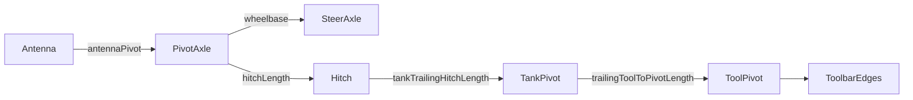

# Path Planning from Toolbar to Axles

Guidance targets are computed relative to multiple reference frames—antenna, pivot axle, steer axle, hitch, tank, and toolbar. v6 continuously reconciles these frames before feeding the controllers.

## Reference frames & offsets

- **Vehicle configuration** – `CVehicle.VehicleConfig` stores wheelbase, track width, antenna offsets, and vehicle type (tractor, harvester, articulated). Defaults are loaded from settings and cached when the vehicle object is constructed.【F:Legacy SourceCode -V6/SourceCode/GPS/Classes/CVehicle.cs†L9-L82】
- **Tool configuration** – `CTool` brings in hitch lengths, offsets, and flags indicating whether the implement is trailing, tow-between, or front/rear fixed.【F:Legacy SourceCode -V6/SourceCode/GPS/Classes/CTool.cs†L7-L71】
- **Pose synthesis** – `CalculatePositionHeading` starts from the GNSS fix (`pn.fix`) and subtracts the antenna-to-pivot offset to obtain `pivotAxlePos`. It then projects forward by the wheelbase to get `steerAxlePos` and adds configurable preview distance to compute `guidanceLookPos`. Hitch geometry is resolved next, propagating through tank and tool pivots depending on `isToolTrailing` / `isToolTBT` flags.【F:Legacy SourceCode -V6/SourceCode/GPS/Forms/Position.designer.cs†L1251-L1340】

- Preview distance is `max(tool.width * 0.5, speed * 0.277777 * guidanceLookAheadTime)`, keeping lookahead reasonable at low speeds while expanding with velocity.【F:Legacy SourceCode -V6/SourceCode/GPS/Forms/Position.designer.cs†L1265-L1269】

## Hitch and articulation handling

- **Trailing implements** – When trailing, the code computes the tank heading from the line between the hitch and previous tank position, then “springs” the tool back if it jack-knifes beyond ~109° (`over > 1.9 rad`). Tool pivots inherit the tank heading and are clamped similarly, ensuring the implement eventually aligns behind the pull point.【F:Legacy SourceCode -V6/SourceCode/GPS/Forms/Position.designer.cs†L1276-L1335】
- **Tow-between tanks** – Additional tank segment (`tankPos`) is inserted when `isToolTBT` is true; its heading is estimated the same way, then propagated to the toolbar pivot after accounting for `trailingToolToPivotLength`.【F:Legacy SourceCode -V6/SourceCode/GPS/Forms/Position.designer.cs†L1278-L1339】
- **Rigid/3‑pt implements** – If neither trailing flag is set, tool and hitch positions collapse to the vehicle hitch point, effectively locking the toolbar to the chassis centreline.【F:Legacy SourceCode -V6/SourceCode/GPS/Forms/Position.designer.cs†L1344-L1353】
- **Articulated tractors & harvesters** – Vehicle rendering uses `VehicleConfig.Type` to select different visual offsets, but the guidance math continues to rely on the same pivot/steer abstraction. Special handling for dual-steer or articulated modes is limited to display (Ackermann animation); no distinct controller geometry is applied in v6.【F:Legacy SourceCode -V6/SourceCode/GPS/Classes/CVehicle.cs†L235-L360】

## Feeding the controllers

- **Stanley mode** works with both pivot and steer references: `StanleyGuidanceABLine` computes pivot cross-track error, then offsets the steer axle line by the integral term `inty` before measuring steer cross-track and heading difference. Steer and pivot distances are blended (`pivotDistanceError`, `distanceFromCurrentLineSteer`) before conversion to degrees.【F:Legacy SourceCode -V6/SourceCode/GPS/Classes/CGuidance.cs†L120-L193】
- **Pure Pursuit mode** uses the pivot axle as the control point. After projecting the pivot onto the current pass, it computes the goal point at the configured lookahead distance (adjusted for reverse travel) and derives curvature using wheelbase and the local heading (`localHeading = 2π − fixHeading ± inty`).【F:Legacy SourceCode -V6/SourceCode/GPS/Classes/CABLine.cs†L241-L279】
- **Integral drafts** – Both Stanley and Pure Pursuit apply small lateral integrators (`inty`) proportional to pivot error to account for implement draft, effectively moving the steer line sideways before computing errors.【F:Legacy SourceCode -V6/SourceCode/GPS/Classes/CGuidance.cs†L71-L108】【F:Legacy SourceCode -V6/SourceCode/GPS/Classes/CABLine.cs†L195-L238】

## Research Notes

- Code pointers: `Position.designer.cs`, `CTool.cs`, `CVehicle.cs`, `CGuidance.cs`, `CABLine.cs`.
- Open questions: Articulated-specific steering geometries appear unimplemented in v6; Dev may add curvature scaling for dual-steer systems.
- Constants: Jack-knife reset thresholds (`over > 1.9` rad for tool, `>2.0` rad for tanks) are hard-coded; preview distance uses `guidanceLookAheadTime` from settings.【F:Legacy SourceCode -V6/SourceCode/GPS/Forms/Position.designer.cs†L1278-L1335】【F:Legacy SourceCode -V6/SourceCode/GPS/Properties/Settings.cs†L155-L220】
- Dev gap: No access to Dev-era articulated math; treat current behaviour as “single virtual pivot” guidance.
