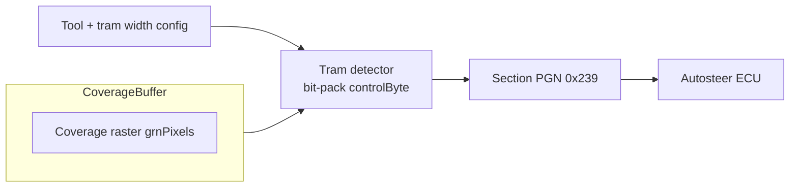

# Row Guidance and Row Alignment

AgOpenGPS v6 drives tramline-style row guidance through the `CTram` subsystem. The guidance stack keeps a virtual pair of wheel tracks aligned with recorded tram paths and exposes a control byte so autosteer and section hardware can bias to rows instead of pure coverage.

## Data structures and configuration knobs

| Component | Purpose | Key fields / defaults | Notes |
| --- | --- | --- | --- |
| `CTram` | Runtime tramline manager attached to `FormGPS`. Holds current tram polylines, boundary offsets, UI flags, and the `controlByte` published to downstream PGNs.【F:Legacy SourceCode -V6/SourceCode/GPS/Classes/CTram.cs†L7-L143】 | `tramWidth` (default 24 m), `passes`, `alpha`, `halfWheelTrack`, `displayMode`, `generateMode`, `isLeftManualOn`, `isRightManualOn`. Settings loaded from `Properties.Settings` at start.【F:Legacy SourceCode -V6/SourceCode/GPS/Classes/CTram.cs†L40-L56】【F:Legacy SourceCode -V6/SourceCode/GPS/Properties/Settings.cs†L52-L55】 | `displayMode` toggles rendering (all/lines/outer), while `generateMode` decides whether to build inner-only, outer-only, or both tram sets based on available boundary data.【F:Legacy SourceCode -V6/SourceCode/GPS/Classes/CTram.cs†L35-L143】 |
| Tram setup UI (`FormTram`) | Operator dialog to pick mode, passes, and brightness. Updates settings and rebuilds tram polylines after each change.【F:Legacy SourceCode -V6/SourceCode/GPS/Forms/Guidance/FormTram.cs†L17-L159】 | `generateMode` cycling: 0 = full tram set, 1 = linear paths only, 2 = boundary-only highlighting.【F:Legacy SourceCode -V6/SourceCode/GPS/Forms/Guidance/FormTram.cs†L55-L84】 | UI enables/disables modes depending on boundary availability and immediately calls `BuildTram()` on the active line family (AB vs curve).【F:Legacy SourceCode -V6/SourceCode/GPS/Forms/Guidance/FormTram.cs†L129-L144】 |
| Tram coverage raster | The OpenGL loop reads the coverage buffer (`grnPixels`) at offsets derived from `halfWheelTrack` to decide whether left/right wheel tracks are “on a row”.【F:Legacy SourceCode -V6/SourceCode/GPS/Forms/OpenGL.Designer.cs†L969-L1010】 | Pixel value `245` indicates a drawn tram stripe. Manual toggles (`isLeftManualOn`, `isRightManualOn`) OR into the result.【F:Legacy SourceCode -V6/SourceCode/GPS/Forms/OpenGL.Designer.cs†L969-L982】 | Detection only runs when the tool width exceeds vehicle track width and tram overlay is enabled (`displayMode > 0`).【F:Legacy SourceCode -V6/SourceCode/GPS/Forms/OpenGL.Designer.cs†L969-L982】 |

### Tram generation geometry

- Outer and inner boundary tracks are computed by offsetting the field fence normals by `±(tramWidth/2 ± halfWheelTrack)` and pruning points closer than `distSq ≈ ((tramWidth/2 ± halfWheelTrack)^2)·0.999` to avoid duplicates.【F:Legacy SourceCode -V6/SourceCode/GPS/Classes/CTram.cs†L147-L239】
- Generated arrays (`tramBndOuterArr`, `tramBndInnerArr`) are reused both for rendering and for the pixel-based detector, which traces those polylines into the coverage buffer before sampling.【F:Legacy SourceCode -V6/SourceCode/GPS/Classes/CTram.cs†L64-L128】【F:Legacy SourceCode -V6/SourceCode/GPS/Forms/OpenGL.Designer.cs†L1942-L1960】
- The runtime converts toolbar width and overlap into skip-aware offsets when row-based U-turns advance to the next pass (see below).

## Tram control byte contract

The OpenGL renderer sets `tram.controlByte` before section/steer PGNs are published:

| Bit | Meaning | Source |
| --- | --- | --- |
| `0x01` | Right wheel should follow a tram (outer or inner depending on `isOuter`). | Pixel sample at `rpWidth - halfWheelTrack·10` (outer) or center+offset (inner).【F:Legacy SourceCode -V6/SourceCode/GPS/Forms/OpenGL.Designer.cs†L969-L982】 |
| `0x02` | Left wheel should follow a tram. | Pixel sample mirrored around center line, plus manual override.【F:Legacy SourceCode -V6/SourceCode/GPS/Forms/OpenGL.Designer.cs†L969-L982】 |

The section publisher copies `controlByte` into PGN 0x239, alongside section bitmasks and tool speeds, so downstream modules (AgIO/section relays) can light indicators or automate tram-lift logic.【F:Legacy SourceCode -V6/SourceCode/GPS/Forms/Sections.Designer.cs†L520-L561】 Headland suppression zeroes `controlByte` once the tool is flagged “in headland”, preventing false tram cues during turns.【F:Legacy SourceCode -V6/SourceCode/GPS/Forms/OpenGL.Designer.cs†L1008-L1010】

## Row-based navigation cues

Row skips and alternate passes ride on the YouTurn subsystem:

- `CYouTurn.rowSkipsWidth` multiplies `(tool.width - tool.overlap)` to determine how many rows to skip when calculating the next tram-aligned pass. Left vs right turning adjusts sign based on hitch offset (`tool.offset`).【F:Legacy SourceCode -V6/SourceCode/GPS/Classes/CYouTurn.cs†L23-L117】
- Operators can set primary and secondary skip widths (`rowSkipsWidth2`, `alternateSkips`) to alternate between different skip patterns, updating `turnSkips` when toggled.【F:Legacy SourceCode -V6/SourceCode/GPS/Classes/CYouTurn.cs†L25-L29】【F:Legacy SourceCode -V6/SourceCode/GPS/Classes/CYouTurn.cs†L2331-L2364】
- When generating Dubins-based turns, the solver offsets target points by the computed `turnOffset`, ensuring the machine exits on the intended future tram.【F:Legacy SourceCode -V6/SourceCode/GPS/Classes/CYouTurn.cs†L110-L188】

This logic keeps row guidance consistent with tram spacing even if individual sections are narrower than the full tool.

## Visualisation and operator feedback

- Tram polylines are rendered twice: a thick black line for outline and a semi-transparent overlay in the configured colour, fading with `alpha` from settings.【F:Legacy SourceCode -V6/SourceCode/GPS/Classes/CTram.cs†L64-L128】
- Manual buttons on the right-hand toolbar toggle `isLeftManualOn`/`isRightManualOn`, allowing the operator to force tram guidance when coverage pixels are missing; these flags bypass the raster check during bit packing.【F:Legacy SourceCode -V6/SourceCode/GPS/Classes/CTram.cs†L27-L38】【F:Legacy SourceCode -V6/SourceCode/GPS/Forms/OpenGL.Designer.cs†L969-L982】
- A dedicated tram management dialog exposes passes, mode, and alpha sliders; closing the dialog persists settings and rebuilds tram caches for the currently active track.【F:Legacy SourceCode -V6/SourceCode/GPS/Forms/Guidance/FormTram.cs†L106-L159】

## Research Notes

- Code pointers: `CTram.cs`, `FormTram.cs`, `OpenGL.Designer.cs` (tram detector), `Sections.Designer.cs`, `CYouTurn.cs` (row skips).
- Open questions: Dev branch reportedly added vision hooks; none exist in this v6 snapshot.
- Constants: Pixel index uses `halfWheelTrack * 10` (cm-scale raster). Tram width defaults to 24 m; alpha persisted via `setTram_alpha`.
- Edge cases: Headland detection zeros the control byte; if tram display is off or tool width ≤ track width, no tram bits are set.
