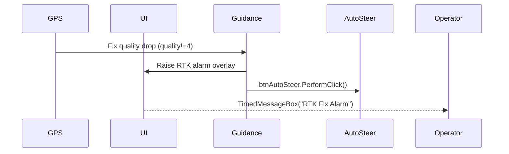

# Edge Cases and Failure Modes

AgOpenGPS v6 layers multiple guardrails around guidance and autosteer. The runtime monitors GNSS quality, vehicle speed/direction, headlands, and UI state, then falls back to manual control when thresholds are breached.

## Quick reference table

| Trigger | Detection | Reaction |
| --- | --- | --- |
| RTK fix lost while alarm enabled | `pn.fixQuality != 4` with `isRTK_AlarmOn` and `isRTK_KillAutosteer` flag set.【F:Legacy SourceCode -V6/SourceCode/GPS/Forms/OpenGL.Designer.cs†L507-L529】【F:Legacy SourceCode -V6/SourceCode/GPS/Properties/Settings.cs†L69-L103】 | Performs an AutoSteer button click, shows “RTK Fix Alarm” message, logs the event, and plays an audible alarm.【F:Legacy SourceCode -V6/SourceCode/GPS/Forms/OpenGL.Designer.cs†L513-L522】 |
| GPS stream stalls | `pn.age > pn.ageAlarm` draws an age warning overlay; `No GPS` scene renders when no sentences arrive.【F:Legacy SourceCode -V6/SourceCode/GPS/Forms/OpenGL.Designer.cs†L541-L720】 | Visual-only prompt; operator must intervene. |
| Speed above/below safe steering band | `avgSpeed > maxSteerSpeed` or persistent `avgSpeed < minSteerSpeed` (80-cycle timer).【F:Legacy SourceCode -V6/SourceCode/GPS/Forms/Position.designer.cs†L939-L959】【F:Legacy SourceCode -V6/SourceCode/GPS/Classes/CVehicle.cs†L15-L64】 | Taps AutoSteer off; on low speed displays metric/imperial warning and logs the event.【F:Legacy SourceCode -V6/SourceCode/GPS/Forms/Position.designer.cs†L941-L958】 |
| Reverse gear without permission | `isReverse` when `setAS_isSteerInReverse` is false or IMU heading invalid during direction change.【F:Legacy SourceCode -V6/SourceCode/GPS/Forms/Position.designer.cs†L988-L996】【F:Legacy SourceCode -V6/SourceCode/GPS/Properties/Settings.cs†L97-L103】 | Forces PGN status to zero, effectively disengaging autosteer.【F:Legacy SourceCode -V6/SourceCode/GPS/Forms/Position.designer.cs†L988-L996】 |
| Headland entry | `bnd.isToolInHeadland` or `bnd.isToolOuterPointsInHeadland` triggers, clearing tram bits and raising hydraulics.【F:Legacy SourceCode -V6/SourceCode/GPS/Forms/OpenGL.Designer.cs†L1008-L1034】 | Tram control bytes reset; hydraulics commanded via `SetHydPosition`. |
| Excess cross-track during YouTurn creation | `crossTrackError > 1.0 m` (≈1000 mm) while generating Dubins turn.【F:Legacy SourceCode -V6/SourceCode/GPS/Forms/Position.designer.cs†L1055-L1099】 | Resets YouTurn state, plays warning if enabled.【F:Legacy SourceCode -V6/SourceCode/GPS/Forms/Position.designer.cs†L1075-L1099】 |

## GNSS degradation paths

- **RTK kill switch** — When the optional “RTK kill autosteer” checkbox is enabled, any non-RTK quality fix during an alarm cycle triggers an immediate AutoSteer disengage plus log entry and alarm tone.【F:Legacy SourceCode -V6/SourceCode/GPS/Forms/OpenGL.Designer.cs†L507-L522】【F:Legacy SourceCode -V6/SourceCode/GPS/Properties/Settings.cs†L69-L103】 The guard relies on WinForms state (`isRTK_AlarmOn`) and does not attempt to soft-land the vehicle.
- **Stale sentences** — The renderer tracks `pn.age` versus `setGPS_ageAlarm`; exceeding the threshold overlays the age indicator, while total connection loss switches the scene to a “No GPS” billboard and freezes heading updates.【F:Legacy SourceCode -V6/SourceCode/GPS/Forms/OpenGL.Designer.cs†L541-L720】
- **Heading source switching** — Dual-antenna users can auto-switch between dual and single fix based on speed. During a direction change, if the IMU heading is invalid (`99999`), autosteer is forcibly disabled to avoid steering with stale orientation.【F:Legacy SourceCode -V6/SourceCode/GPS/Forms/Position.designer.cs†L988-L996】【F:Legacy SourceCode -V6/SourceCode/GPS/Properties/Settings.cs†L277-L278】

## Speed, direction, and dead-zone guards

- The motion gate enforces `minSteerSpeed`/`maxSteerSpeed` from vehicle settings; the 80-cycle counter (~1.6 s at 50 Hz) prevents momentary dips from tripping autosteer.【F:Legacy SourceCode -V6/SourceCode/GPS/Forms/Position.designer.cs†L939-L959】
- Dead-zone logic compares commanded vs actual steer angle (`mc.actualSteerAngleDegrees`) and delays actuator commands when the difference stays within `deadZoneHeading` for longer than `deadZoneDelay`, marking the system “in dead zone” until movement resumes.【F:Legacy SourceCode -V6/SourceCode/GPS/Forms/Position.designer.cs†L998-L1017】【F:Legacy SourceCode -V6/SourceCode/GPS/Classes/CVehicle.cs†L11-L64】
- When reverse motion is detected and reverse steering is disallowed, PGN status is zeroed before publishing, preventing the module from latching old steer angles.【F:Legacy SourceCode -V6/SourceCode/GPS/Forms/Position.designer.cs†L993-L996】

## Guidance line anomalies

- Sentinel distances (`32020`) mark “no active guidance”, ensuring downstream lightbars interpret it as out-of-range and fall back to manual cues.【F:Legacy SourceCode -V6/SourceCode/GPS/Forms/Position.designer.cs†L918-L938】
- Auto-track invalidates cached AB/curve state when the nearest track index jumps, forcing `BuildCurrentABLineList`/`BuildCurveCurrentList` to rebuild with the new line instead of clinging to a stale pass.【F:Legacy SourceCode -V6/SourceCode/GPS/Forms/Position.designer.cs†L864-L889】
- During YouTurn planning, if calculated turn shapes drift >1.3 m off track or enter forbidden zones, the solver resets and optionally plays a “U Turn Creation Failure” alert.【F:Legacy SourceCode -V6/SourceCode/GPS/Forms/Position.designer.cs†L1065-L1099】

## Hardware & UI overrides

- Manual AutoSteer button and hotkeys immediately toggle `isBtnAutoSteerOn`, bypassing guidance logic. Kill switches from the remote section controller propagate through PGN 0x234/0x239 and call the same `btnAutoSteer.PerformClick()` path.【F:Legacy SourceCode -V6/SourceCode/GPS/Forms/UDPComm.Designer.cs†L470-L471】【F:Legacy SourceCode -V6/SourceCode/GPS/Forms/Settings/FormButtonsRightPanel.cs†L53-L148】
- Section controller state machines differentiate button vs switch hardware and only honour remote commands when a job is started, guarding against unintended toggles while idle.【F:Legacy SourceCode -V6/SourceCode/GPS/Forms/Sections.Designer.cs†L565-L620】

## Machine geometry considerations

- Vehicle types (tractor, harvester, articulated) primarily affect rendering; guidance equations still assume a single steering axle. There are no dedicated articulated or tracked compensations beyond visual textures in this version.【F:Legacy SourceCode -V6/SourceCode/GPS/Classes/CVehicle.cs†L320-L451】 Document this limitation when planning Nexus parity.
- U-turn compensation leverages tool offsets and row skips but does not dynamically adjust for slip/drift; the recorded path module similarly assumes consistent track width when computing curvature radii.【F:Legacy SourceCode -V6/SourceCode/GPS/Classes/CYouTurn.cs†L110-L188】【F:Legacy SourceCode -V6/SourceCode/GPS/Classes/CRecordedPath.cs†L430-L607】

## Research Notes

- Code pointers: `OpenGL.Designer.cs` (alarms, tram/headland suppression), `Position.designer.cs` (autosteer gatekeeping), `Sections.Designer.cs`, `CYouTurn.cs`, `CVehicle.cs`.
- Open questions: RTK alarm logic depends on WinForms flags; Dev branch may tie it to AgIO PGNs—verify when accessible.
- Constants: `minSteerSpeedTimer > 80` (~1.6 s) for low-speed shutoff; cross-track 1.0 m abort threshold for turn creation.
- Edge cases: Articulated vehicles lack bespoke kinematics; `No GPS` scene halts updates but leaves last-known steer commands until external kill logic fires.
