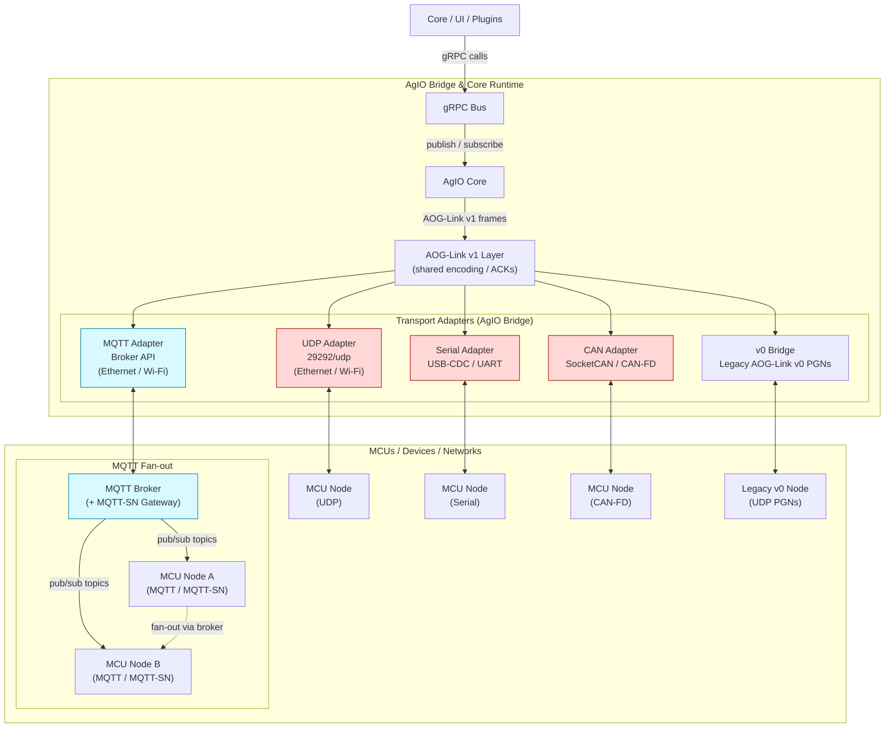

# Section 3A — AOG-Link v1 Wire Protocol Specification (Status: Draft)

> Task: NX-115 AOG-Link protocol specification and reference flows.

## 1. Scope and goals

AOG-Link v1 ("AOG-Link/Next") replaces the legacy UDP-only framing with a
transport-agnostic wire protocol that runs over UDP, USB-CDC serial, CAN(FD),
and optionally MQTT fan-out. The spec defines a single protobuf package
(`aoglink.v1`) carried inside a compact binary frame header so MCUs and the
Bridge can exchange typed commands and telemetry with low latency and minimal
CPU overhead. Security is explicitly out of scope for this release; deployments
rely on existing network isolation.

Key goals:

- Provide one set of payload schemas and message semantics independent of the
  physical transport.
- Maintain low-jitter control paths suitable for steering loops while still
  offering pub/sub fan-out when many consumers exist.
- Allow coexistence with AOG-Link v0 via a bridge that translates legacy UDP
  PGNs into the new payloads.
- Offer semver-negotiated capability discovery so firmware and host processes
  can evolve without breaking existing nodes.

## 2. Terminology

- **AOG-Link v0 / AOG-Link Classic** — Existing UDP datagrams already deployed.
- **AOG-Link v1 / AOG-Link Next** — The protocol defined in this document.
- **Service (svc)** — One-byte namespace grouping related RPC-style methods.
- **Method (mth)** — One-byte identifier for a specific command or telemetry
  message within a service.
- **Frame** — Header + payload unit transported over UDP, serial, CAN(FD), or
  other bindings. Serial and CAN(FD) variants append a CRC-16.
- **Role** — A node’s advertised function(s). One device may expose multiple
  roles simultaneously: `HOST` (runs Core/gRPC, broker, bridges), `CTRL`
  (executes time-critical control loops), `SENSOR` (publishes GPS/IMU/etc.),
  `ACTUATOR` (drives valves/motors), `BRIDGE` (v0/v1 or transport bridging).

## 3. Message catalogue

All payloads live in the `aoglink.v1` protobuf package. Nanopb is the MCU code
generator, while hosts use standard protobuf toolchains. Initial service map:

| Service ID | Name    | Methods (examples)                                           |
|------------|---------|--------------------------------------------------------------|
| 0x01       | NAV     | `SetSteerTarget`, `SetABLine`, `Pause`, `Resume`              |
| 0x02       | SENSORS | `GpsFix`, `ImuSample`, `WheelTicks`                           |
| 0x03       | CTRL    | `SteerStatus`, `SectionStatus`                                |
| 0x04       | MGMT    | `Hello`, `Health`, `FwChunk`, `Ack`                           |

Service/method IDs deliberately mirror the higher-level gRPC services for easy
bridging. Additional services expand the catalogue but must remain additive in
minor versions.

`MGMT.Hello` advertises `roles_mask` so peers know whether the node can host,
control, sense, actuate, or bridge transports (see Section 7).

`MGMT.Health` reports rx/tx counters per transport, last-ack RTT, drop counts,
input supply voltage, MCU temperature, and the most recent authority state to
aid diagnosis when loops misbehave.

## 4. Frame format

Every frame starts with a fixed 9-byte header followed by the protobuf payload
and (when required) a CRC-16-CCITT trailer.

```
+--------+-----+-------+---------+---------+------+------+
| PFX    | VER | FLAGS | MSG_ID  | LEN     | SVC  | MTH  |
| 0xA5   | 0x1 | 1 byte| 2 bytes | 2 bytes | 1 b  | 1 b  |
+--------+-----+-------+---------+---------+------+------+
```

Field definitions:

- **PFX** — Fixed sync byte (0xA5) shared across transports.
- **VER** — Wire-format major version (0x1 for v1.x.y). Used to reject
  incompatible frames.
- **FLAGS** — Bitfield described below. For CAN(FD) segmentation the upper nibble
  is overloaded with a 4-bit segment index.
- **MSG_ID** — Caller-provided identifier used to correlate ACKs and retries.
- **LEN** — Payload length in bytes (0–1023 typical, transport dependent).
- **SVC** — Service identifier.
- **MTH** — Method identifier within the service.

Serial and CAN(FD) bindings append a CRC16-CCITT of the header and payload.
Serial links additionally wrap frames in COBS with a `0x00` delimiter.

### 4.1 Flags

`FLAGS` reserves the following low bits:

- **b0 ACK_REQUIRED** — Sender expects an `Ack` response; receiver must reply
  with the same `MSG_ID`.
- **b1 ACK** — Frame is an acknowledgement.
- **b2 LAST** — Marks the final segment of a multi-frame CAN(FD) transmission.
- **b3–b7** — Reserved for future use. On CAN(FD) transports the high nibble may
  encode a segment index when fragmentation is required.

## 5. Reliability model

- **Telemetry** — Fire-and-forget. Payloads include their own sequence counter
  and `monotonic_us` timestamp for loss detection.
- **Commands/configuration** — Set `ACK_REQUIRED`. Receivers respond with
  `Ack{msg_id}`; senders retry with exponential backoff until either an ack
  arrives or a transport-specific timeout expires.
- **Serial framing** — COBS + CRC16 ensures delimiter safety and data integrity.
- **CAN(FD) segmentation** — Large payloads spread across sequential frames.
  Receivers track `segIdx` (from the high nibble or first payload byte) and use
  `FLAGS.LAST` to signal completion.

## 6. Transport bindings

Figure 1 illustrates how the internal gRPC bus feeds the shared AOG-Link v1
layer, which is then fanned out by transport-specific adapters. Within the
bridge, **AgIO Core** is the orchestration service that maps gRPC intents into
wire frames, manages adapter lifecycles, tracks discovery/authority state, and
enforces reliability policies (ACK retries, segmentation, rate guards). UDP,
Serial, and CAN carry the low-latency control paths, MQTT handles high-fan-out
telemetry, and the v0 bridge remains the sole producer of legacy PGNs.
Multiple MCU nodes can also exchange telemetry or commands with each other via
the shared MQTT broker, as depicted by the fan-out between MCU nodes A and B.



### 6.1 UDP (Ethernet/Wi-Fi)

- One frame per datagram.
- Default port `29292/udp`.
- Discovery multicast `239.10.20.30:29293` broadcasts availability.
- Commands use unicast with retry; telemetry may use multicast as appropriate.

### 6.2 USB-CDC serial / UART

- Frames encoded via COBS with trailing CRC16.
- Target throughput 1–3 Mbaud when using raw UART; unlimited on USB bulk.
- Host initiates retries for ACK-protected commands.

### 6.3 CAN and CAN-FD

- Base CAN-ID encodes service priority; the second byte carries the lower bits
  of `nodeId` or channel.
- CAN-FD preferred for payloads exceeding classical CAN limits; fall back to
  segmentation as noted in Section 5.

### 6.4 MQTT / MQTT-SN (optional)

- Used for local pub/sub fan-out; header omitted (payload is protobuf only).
- Topic templates:
  - `aog/v1/{nodeId}/state/gps`, `…/state/imu` — QoS 0 telemetry.
  - `aog/v1/bus/nav/steer_target` — QoS 1 retained control intents.
  - `aog/v1/{nodeId}/cmd/*` — QoS 1 command channels.
- MCU-class hardware can participate via MQTT-SN gateways using the same topic
  tree.

## 7. Discovery and bring-up

- **UDP** — Hosts send `WhoIs`; devices reply with `Hello`.
- **mDNS** — Advertise `_aoglink._udp` and `_mqtt._tcp` for discovery.
- **USB** — Devices print `AOG-LINK v1 <nodeId> <fwVer>` on boot.
- **CAN(FD)** — Nodes emit `Hello` on power-up with their static `nodeId`.

`Hello` and `HelloAck` payloads:

```
message Hello {
  uint32 node_id;
  string wire_semver;        // 1.x.y
  string fw_version;
  string hw_version;
  uint64 caps_mask;          // feature bits (e.g., supports CAN-FD, PPS, etc.)
  uint64 roles_mask;         // HOST, CTRL, SENSOR, ACTUATOR, BRIDGE (bitwise)
  repeated Transport transports;
  repeated RateSpec rates;   // e.g., imu@100Hz, gps@10Hz, steer@50Hz
  optional string hostname;
}

message HelloAck {
  uint64 feature_flags;
  repeated RateSpec required_ranges;
  optional uint32 preferred_ctrl_period_us;   // controller loop hint
  optional uint32 setpoint_ttl_ms;            // default setpoint validity window
}
```

Nodes should persist stable `node_id` assignments (EEPROM or `/etc/aoglink/node_id`)
and reserve identifiers such as `cm5`, `cm5-h`, and `cm5-c` for integrated
controllers.

## 8. Messaging patterns

- **Pub/sub fan-out** — MQTT brokers (local to Windows or CM5 installs) handle
  multi-consumer telemetry. GPS, IMU, and status payloads publish once and fan
  out to any listeners.
- **RPC-style control** — UDP/Serial/CAN transports carry low-latency control
  commands such as steer targets and valve setpoints. Nodes advertising a fast
  transport receive direct frames even when telemetry mirrors onto MQTT.
- **Dual-path steering** — `steer_target` publishes to `aog/v1/bus/nav/steer_target`
  while simultaneously unicast-delivering via the fastest available transport.
- **Integrated CM5 fast-path** — When CM5 acts as both NAV and CTRL, the primary
  path for `SteerTarget` is shared memory (or an in-process queue) with MQTT
  mirroring for transparency. If an external CTRL holds authority, NAV also
  publishes to `aog/v1/{ctrlNodeId}/cmd/steer_target` (QoS 1) alongside the bus
  topic for observers.

Preferred transport order for control paths: shared memory (same process),
Serial/CAN framed RPC, UDP RPC, then MQTT QoS1. Telemetry favours MQTT QoS0
fan-out, falling back to UDP multicast when additional reach is required.

## 8A. CM5 “Integrated Controller” mode

The CM5 may simultaneously advertise `HOST`, `CTRL`, `SENSOR`, and `ACTUATOR`
roles, running AOG Core, the broker, adapters, and control loops on a single
box while remaining interoperable with external MCUs.

### 8A.1 Process layout (single CM5)

- **HOST/BRIDGE roles (user space)** — AOG Core (gRPC), `mqtt-adapter`,
  UDP/serial/CAN adapters, `v0-bridge`, Mosquitto (loopback).
- **CTRL/SENSOR/ACTUATOR roles (user space, RT-tuned)** — `gps-ingest`
  (SENSOR) → publishes `aog/v1/cm5/state/gps`; `imu-ingest` (SENSOR) → publishes
  `…/state/imu`; `steer-ctrl` (CTRL/ACTUATOR) → subscribes setpoints, drives
  actuators, publishes status; `section-ctrl` covers additional implements.

### 8A.2 Data paths

- **Pub/sub fan-out** — GPS/IMU publish once to the local broker so NAV, Planter,
  and Logger consume without extra wiring.
- **Control fast-path** — NAV writes the latest `SteerTarget` to a shared-memory
  ring (or UNIX socket) consumed by `steer-ctrl` with <2 ms p50 latency. The same
  target mirrors to MQTT (`aog/v1/bus/nav/steer_target`) for visibility and for
  any external CTRL nodes.

### 8A.3 Coexistence with other MCUs

External MCUs advertise roles via `Hello`, subscribe to the standard topics, and
join any fast-path transports they support. The CM5 remains controller of record
unless authority is reassigned (Section 8A.4). External MCUs can observe NAV
setpoints, take over specific actuator groups, or both.

### 8A.4 Authority & arbitration

- **Authority token** — `aog/v1/{group}/ctrl/authority` (QoS1, retained) carries
  `{holder_node_id, expires_ms}`. CM5 is the default holder when alone.
- **Handoff** — Nodes with the `CTRL` role request authority via
  `MGMT.RequestAuthority{group, ttl_ms}`. The current holder acknowledges and
  republishes the token. Controllers act only when holding current authority or
  when the token is absent and they are the default.
- **Setpoint TTL** — Controllers ignore retained `SteerTarget` older than
  `setpoint_ttl_ms` (from `HelloAck`, default 250 ms) and enter a safe mode if
  none arrive.

### 8A.5 Scheduling & RT hints (CM5)

- Prefer a PREEMPT_RT kernel; pin `steer-ctrl` to an isolated core with
  `SCHED_FIFO` priority above UI processes.
- Use hardware-timed peripherals (SPI/I²C/PWM); avoid software bit-banging in
  control loops.
- Keep ISR work minimal; enqueue frames into lock-free rings and run protobuf
  encoding/decoding in task context.

### 8A.6 Failure behavior

- If the authority token expires or 1 Hz health heartbeats miss three intervals,
  the next eligible controller (typically CM5) claims authority and drives safe
  defaults until NAV resumes.
- Broker restarts restore retained authority/setpoints; controllers validate
  TTLs before acting.

## 9. Backward compatibility

A dedicated v0 bridge preserves existing deployments:

- **Inbound** — Legacy UDP PGNs translate into v1 protobuf payloads that feed the
  Bridge's gRPC/MQTT surfaces.
- **Outbound** — v1 topics mirror onto legacy PGNs for classic firmware.
- Bridge metrics tag flows as `AOG-Link v0` to simplify phased retirement.

## 10. Reference deployment scenarios

| Scenario                         | Components                                                        | Notes |
|----------------------------------|--------------------------------------------------------------------|-------|
| Windows PC only                  | AOG core (gRPC), Mosquitto broker                                 | Everything talks loopback MQTT/gRPC. |
| Windows + MCUs (mixed transports)| + `udp-adapter`, `v0-bridge`, `serial` / `can` adapters as needed   | New MCUs use v1; legacy nodes via bridge. |
| CM5 standalone                   | Same stack on arm64                                                | Optional shared-memory fast path between navigation and steering. |
| CM5 + MCUs                       | Add adapters per transport, optional MQTT-SN gateway               | Devices select transport; broker fans out streams. |
| CM5 combined with controllers    | `gps-ingest`, `imu`, `nav`, `steer-ctrl`, adapters                 | Navigation publishes `steer_target`; steer control consumes via fast path. |
| CM5 integrated (HOST+CTRL) with optional MCUs | CM5 runs Core, broker, adapters, gps/imu-ingest, steer-ctrl; MCUs may join as SENSOR/ACTUATOR/CTRL | CM5 holds authority via token unless reassigned; externals assume groups without schema changes. |

## 11. Starter implementation plan

Initial deliverables:

1. `aoglink_v1.proto` defining `Hello`, `Ack`, `Health`, `GpsFix`, `ImuSample`,
   `SteerTarget`, `SteerStatus`, and `FwChunk` messages.
2. Shared header/codec library (~200 LOC) handling frame pack/unpack,
   COBS/CRC, and retry helpers.
3. Host adapters:
   - `udp-adapter` — UDP socket ⇄ gRPC bridge.
   - `serial-adapter` — USB-CDC ⇄ gRPC, using the shared codec.
   - `can-adapter` — SocketCAN ⇄ gRPC with segmentation.
   - `mqtt-adapter` — gRPC ⇄ MQTT for fan-out and cloud relays.
   - `v0-bridge` — Legacy UDP PGNs ⇄ v1 payloads.
4. MCU stubs (ESP32/Teensy) for UDP, serial, and CAN(FD) transports.

## 12. Performance targets

- **Loopback (single host)** — GPS → NAV → `steer_target` → CTRL apply: ≤5 ms p50,
  ≤12 ms p95 using MQTT only; ≤3 ms p50, ≤8 ms p95 with UDP fast path.
- **UDP command RTT** — ≤3 ms p50 over wired LAN.
- **Serial** — 100 Hz IMU with <2% packet loss at 1–3 Mbaud.
- **CAN(FD)** — ≤2 frames per update at 50 Hz steady-state.
- **Integrated fast-path (CM5 only)** — Shared-memory `SteerTarget` →
  `steer-ctrl` apply: ≤2 ms p50, ≤5 ms p95.
- **Authority handoff** — Request → token update → new CTRL active: ≤150 ms
  on-device, ≤300 ms over LAN.

## 13. Versioning and documentation

- Store artifacts under `wire/aoglink/v1/` including `SPEC.md`, the `.proto`
  files, adapters, and the legacy bridge.
- Tag releases as `aoglink-v1.0.0`, `aoglink-v1.1.0`, etc. Only additive protobuf
  changes are allowed between minor versions.
- `Hello` includes `wire_semver` (`1.x.y`) so hosts can reject incompatible
  firmware or enable features based on negotiated capabilities.

## 14. Open issues

- Define the precise mapping between service IDs and gRPC method names for all
  future payloads.
- Document authentication/encryption strategy for environments that require it.
- Determine how optional MQTT fan-out integrates with remote/cloud telemetry
  when brokers are unavailable.
- Define authority groups (steer, planter, boom, auger, …) and default holders
  per deployment profile.
- Specify the shared-memory ring ABI (struct layout, cacheline alignment,
  `eventfd` semantics) and provide a gRPC fallback when shared memory is
  unavailable.
