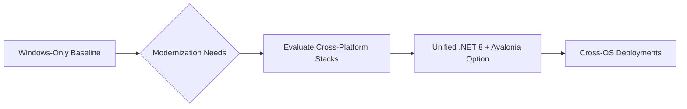
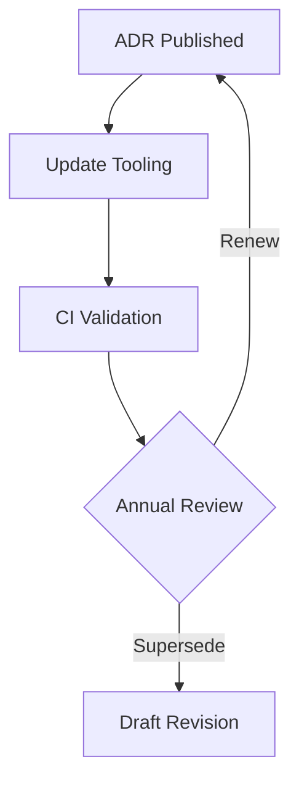

# 11-ADR-001 — Adopt Unified .NET 8 Runtime & Avalonia Stack

> **Plain-language summary:** Every Nexus runtime component—Core, AgIO, plugins, simulation, and the Avalonia UI—ships on the same .NET 8 toolchain so Windows and Linux releases stay in lockstep.

**Status:** Accepted  
**Authors:** Codex  
**Reviewers:** Platform Foundations Working Group  
**Created:** 2025-10-20  
**Last Updated:** 2025-10-20  
**Supersedes:** —  
**Superseded by:** —  
**Related SRS:** `11_OS_Support.md`  
**Related Options:** `11-O1_Unified_DotNet8_Avalonia.md`

---

## 1) Context

Nexus needs a unified language and runtime spanning the core guidance engine, AgIO backends, plugins, simulation, and the desktop UI to satisfy the System Slices that demand dual-first Windows and Linux delivery with minimal divergence.【F:docs/SRS/sections/1X_Platform_Foundations/11_OS_Support.md†L4-L55】【F:docs/SRS/sections/1X_Platform_Foundations/11-O1_Unified_DotNet8_Avalonia.md†L1-L47】 Community sentiment already leans toward shared contracts and tooling across Windows x64 and Linux ARM64 without abandoning existing operators.【F:docs/SRS/sections/1X_Platform_Foundations/11_OS_Support.md†L57-L63】

Legacy AgOpenGPS deployments ship Windows-only binaries using WinForms and vendor-specific drivers. Community pilots demonstrate the need for Linux headless services, remote companions, and mobile clients. Evaluated options considered keeping the Windows baseline, rewriting in native toolkits, or adopting a unified .NET stack with Avalonia UI and gRPC contracts.

Inputs include SRS Section 11 requirements, Linux Core pilot feedback, and ADR-003 (Avalonia UI) research.

---

## 2) Decision

Standardize the Nexus codebase on C# targeting .NET 8 for every first-party component (Core, AgIO, plugins, simulation, and UI). Platform-specific hardware integrations remain encapsulated inside AgIO backends that surface shared abstractions through the `Aog.Abstractions` contracts package. All contributors develop, test, and ship against this single runtime.

### Decision Summary

- **Scope:** Core runtime, AgIO, UI shells, plugin manifests, simulation services, and deployment tooling.
- **Boundary:** Hardware protocol semantics remain governed by respective subsystem ADRs; native SDKs are wrapped by AgIO backends.
- **Implementation Level:** Architecture + tooling policy that drives code, packaging, and validation workstreams.
- **Executive recap:** One runtime, one toolchain, so releases land together and new contributors install a single SDK.

---

## 3) Consequences

### Positive impacts

- Common tooling, language expertise, and dependency management across all projects.
- Simplifies cross-platform CI by focusing on .NET 8 builds for Windows x64 and Linux (x64/ARM64).
- Enables shared simulation, plugin infrastructure, and remote companion clients without bridging multiple runtimes.

### Negative or mitigated impacts

- Requires coordinated upgrades when the .NET LTS cycle advances; mitigated via ADR reviews and annual governance checkpoints.
- Demands investment in Linux packaging, CI, GPU optimization, and Avalonia expertise—addressed by dedicated validation plans and pilot projects.
- Vendor SDK licensing can lag cross-platform support; mitigated through AgIO shims and vendor engagement.

### Follow-up actions

- Scaffold the `Aog.Abstractions` package with generated protobuf contracts (NX-003).
- Implement validation roadmap defined in Option 11-O1 (CI lanes, performance benchmarks, device matrix) and publish runtime compatibility snapshots each quarter.
- Update build pipelines (Section 14) to publish signed Windows and Linux artifacts and maintain a support matrix for officially supported OS versions and hardware tiers.

### Operator-facing pros and cons

| What improves | What stays hard |
|---------------|-----------------|
| Single installer flow for Windows and Linux releases. | Native driver shims still require platform-specific testing. |
| Plugin authors compile once and run anywhere we support. | Contributors must coordinate when Microsoft ships new LTS releases. |
| Simulation tooling and diagnostics reuse the same runtime. | Legacy-only hardware may need extra wrappers before it works cross-platform. |

### What could go wrong—and mitigations

- **Linux GPU stack regresses:** Operators might notice sluggish UI updates on Pi/CM5. Mitigation: keep Avalonia fallbacks ready and monitor benchmark dashboards weekly.
- **Vendor SDKs lag behind:** A CAN adapter without Linux drivers means Linux rigs lose functionality. Mitigation: run those adapters through AgIO shims so Windows keeps working while we lobby vendors or ship bridge services.
- **Runtime upgrade breaks plugins:** If .NET updates introduce incompatible JIT behavior, we freeze upgrades, repost the prior runtime bundle, and publish guidance in release notes so operators know which download to use.
- **CI resource costs grow:** Leverage containerized build lanes and monitor pipeline duration to keep dual OS builds sustainable.

---

## 4) Rationale

Decision matrix in SRS §11.12 shows Option 11-O1 scoring 4.15 vs. 2.85 for the legacy baseline, driven by maintainability and roadmap alignment. Shared runtime simplifies plugin governance, matches contributor skill sets, and satisfies mobile/remote requirements. Alternatives either block roadmap goals or require full rewrites in less familiar stacks.

---

## 5) Alternatives Considered

| Option | Summary | Reason Not Selected |
|--------|---------|---------------------|
| Legacy Windows baseline | Retain WinForms/WPF only. | Fails Linux/mobile goals; accumulates tech debt. |
| Qt/C++ rewrite | Native cross-platform UI. | High rewrite cost, splits language/tooling expertise. |
| Electron/Web UI | Web technologies for desktop. | Hardware access latency and GPU constraints unacceptable. |

---

## 6) Implementation & Governance

- **Governance ownership:** Platform Foundations Working Group.
- **Update cadence:** Review annually or upon major .NET LTS release; publish readiness scorecard each June covering Core, AgIO, plugins, and tooling.
- **Documentation:** Maintain runtime version matrix, OS support tiers, and contract compatibility notes; pre-bake manifests for the next LTS (currently .NET 10 preview) and record go/no-go decisions 90 days before Microsoft GA.
- **Compatibility smoke regimen:** QA owns an annual matrix that runs desktop, NativeAOT, and containerized builds across Windows x64, Linux x64/ARM64, and supported SBC images. February and August cycles gate feature freeze, while monthly spot checks ensure NuGet dependency drifts stay inside the signed roster.
- **Back-out playbook:** If a runtime uplift regresses hardware integrations, AgIO locks roll-forward, re-issues the prior runtime bundle, and coordinates with Plugin and Firmware owners to certify patched drivers within two weeks. Production rollbacks require communicating operator impact and re-running compatibility smokes before reopening the upgrade window.

---

## 7) Risks & Mitigations

| ID | Risk | Impact | Mitigation / Monitoring |
|----|------|--------|-------------------------|
| R1 | Linux GPU stack regressions | High | Maintain performance dashboards; optimize fallback render paths. |
| R2 | Vendor SDK licensing limits redistribution | Medium | Negotiate distribution rights, provide gRPC shims when necessary. |
| R3 | CI resource cost for dual OS builds | Medium | Containerize lanes, monitor duration, scale runners as adoption grows. |

---

## 8) Legacy Implementation Notes

### AgOpenGPS v6
- Windows remains the only supported runtime, with WinForms and WPF projects compiled as Windows desktop executables, tying the stack to the .NET Framework toolchain and lacking cross-platform parity today.【F:docs/SRS/sections/1X_Platform_Foundations/11_OS_Support.md†L6-L13】【F:docs/SRS/sections/1X_Platform_Foundations/13_UI_Framework_UX.md†L6-L17】

### Legacy Dev Branch
- The community dev branch follows the same Windows-only WinForms/WPF approach, reflecting the status-quo option of incremental modernization without a shared cross-platform runtime or packaging story.【F:docs/SRS/sections/1X_Platform_Foundations/11_OS_Support.md†L6-L13】【F:docs/SRS/sections/1X_Platform_Foundations/13_UI_Framework_UX.md†L16-L29】

### Early Linux Experiments
- Relied on community scripts without deterministic packaging, reinforcing the need for an officially supported cross-platform runtime stack.

---

## 9) Governance Updates

- **Review frequency:** Annual; additionally upon .NET LTS announcements.
- **Decision owner:** Platform Foundations Working Group chair.
- **Compliance metrics:** Windows & Linux release artifacts published; validation plan executed each release.
- **Reader tip:** Install the .NET 8 SDK listed here, run the smoke commands, and you are on the supported path—no parallel toolchains required.

---

## 10) References

- **SRS Sections:** `11_OS_Support.md` — §§11.5, 11.12; `13_UI_Framework_UX.md` — §§13.1–13.4
- **Option Documents:** `11-O1_Unified_DotNet8_Avalonia.md`
- **Related ADRs:** `13-ADR-003 - Use Avalonia for the cross-platform Nexus UI shell.md`

---

## 11) Change Log

| Date | Change | Author | PR / Issue |
|------|--------|--------|------------|
| 2025-10-20 | Initial proposal aligning SRS Section 11 to new template. | Codex | #0000 |
| 2025-10-20 | Accepted and merged legacy ADR content into unified record. | Codex | #0000 |

> **Lifecycle:** Proposed → Accepted → Superseded → Deprecated → Rejected  
> **Traceability:** Links to SRS Decision Matrix §11.12 and Option 11-O1.
