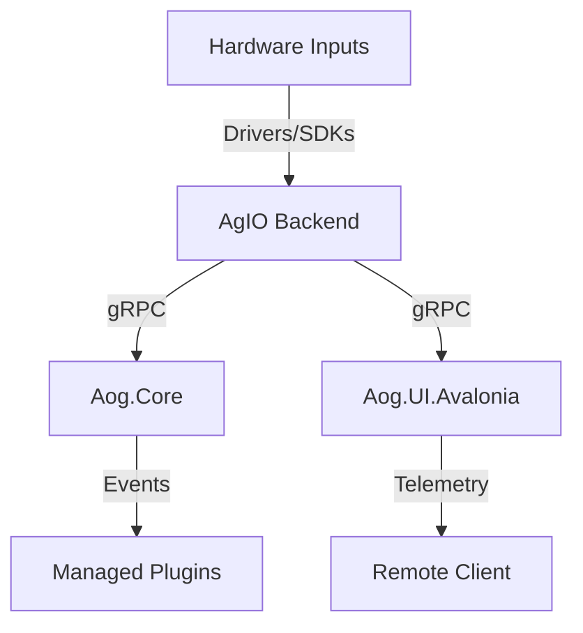
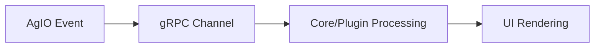
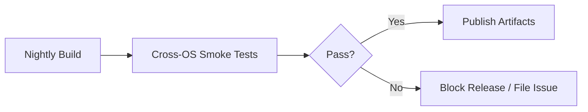

# 11-O1 — Unified .NET 8 + Avalonia Cross-Platform Stack

> **In plain terms:** We keep one C# codebase for everything—Windows cab PCs,
> Linux headless boxes, and future tablets—so teams install the same features on
> every machine without juggling separate projects.

*(Status: Proposed)*

**Option ID:** 11-O1  
**Section ID:** 11 — OS Support  
**Version:** 0.1.0  
**Authors:** Codex  
**Reviewers:** Platform Foundations Working Group  
**Created:** 2025-10-20  
**Last Updated:** 2025-10-20  
**Related SRS:** `11_OS_Support.md`
**Related ADRs:** `11-ADR-001 - Adopt Unified .NET 8 Runtime & Avalonia Stack.md`

---

## 1) Summary

Adopt a unified C#/.NET 8 runtime with Avalonia UI so Nexus ships one stack across Windows 10/11 x64 and Linux (x86_64, ARM64).
AgIO becomes the shared hardware abstraction host exposing gRPC contracts consumed by Core, plugins, and UI clients.

---

## 2) Problem, Goals, and Non-Goals

**Problem:**
Windows-only tooling locks modernization efforts and makes Linux headless deployments ad-hoc. A cohesive cross-platform plan is required.

**Goals:**

- Satisfies **R-OS-000**, **R-OS-001**, **R-OS-004**, **R-OS-006**, **R-OS-007**.
- Addresses **C1**, **C2**, **C3**, **C4**, **C5** from SRS §11.9.

**Non-Goals:**

- Does not redefine hardware-specific protocol behavior (handled by AgIO backends).
- Does not select the mobile packaging story; focuses on enabling companion clients.
- Does not replace specialized vendor SDK integrations where gRPC shims are impractical.

---

## 3) Architecture Overview

- **Core concept:** Share one managed runtime and UI toolkit between Windows and Linux.
- **Primary components:**
  - `Aog.Core` guidance engine consuming AgIO gRPC services.
  - `Aog.Agio` host process with Windows, Linux, and Simulation backends.
  - `Aog.UI.Avalonia` shell reusing common view models and theming.
  - Managed plugin catalog (`Aog.Plugins`) loaded via manifests and `AssemblyLoadContext`.
- **Data flow:** Hardware inputs land in AgIO backend → published over gRPC/protobuf → consumed by Core/UI/plugins.
- **Integration context:** Works with remote companions (Android/iOS) via gRPC-Web bridge or proxy.

**How the pieces connect (at a glance):**

- **Devices** feed **AgIO** regardless of OS.
- **AgIO** streams data to **Core** for guidance math and to the **Avalonia UI** for dashboards.
- **Plugins** tap into the same streams, so adding features doesn’t depend on the OS you compiled for.
- **Remote companions** subscribe to the Core/UI feeds over the network, using the same contracts.

---

## 4) Interfaces & Contracts

- gRPC/protobuf contracts packaged via `Aog.Abstractions` NuGet.
- Plugin manifests declare capabilities and required streams; runtime enforces version compatibility.
- AgIO backend contracts hide OS-specific APIs behind dependency-injected interfaces.
- Requirement linkage: R-OS-001 (hardware abstraction), R-OS-004 (Linux packaging), R-OS-007 (mobile parity).

---

## 5) Dependencies & Constraints

- Requires .NET 8 SDK and runtime across Windows and Linux hosts.
- Depends on Avalonia UI 11 LTS (or current stable) with GPU acceleration tuned for Pi/CM5.
- Windows-specific drivers (e.g., PCAN, Kvaser) must ship alongside Linux SocketCAN equivalents.
- Container base images maintained for CI and headless deployment parity.

---

## 6) Security, Privacy, and Compliance

- Code signing for Windows installers, NuGet packages, and plugin bundles.
- TLS (mTLS optional) for AgIO gRPC endpoints when accessed remotely.
- Secrets for device credentials or telemetry endpoints stored in OS vaults or secure files.
- Aligns with Section 14 policies for build signing and credential hygiene.

---

## 7) Performance & Sizing Targets

- UI rendering ≥ 60 FPS on target hardware (Windows x64, Linux ARM64 Pi/CM5).
- AgIO message latency ≤ 50 ms end-to-end for GNSS/CAN telemetry.
- Plugin load overhead ≤ 500 ms per plugin during startup on reference hardware.

---

## 8) Operability

- Structured logging via `Serilog` with OS-specific sinks (EventLog vs. journald).
- Metrics endpoints per process (`/metrics` with Prometheus exporters where feasible).
- Configuration stored in shared profile directories with environment overrides.
- Crash dumps and trace logs captured uniformly across OSes for triage.

---

## 9) Packaging & Distribution

- Windows MSI/EXE installers with automatic driver detection and code signing.
- Linux Debian packages + systemd unit files, plus optional container images/AppImage bundles.
- Publish nightly artifacts for Windows and Linux to validate portability.

---

## 10) Migration, Rollout, and Backout

- Stage migration: maintain legacy WinForms/WPF flows while introducing Avalonia UI in preview.
- Roll out Linux Core as opt-in preview before default inclusion in release builds.
- Backout: retain ability to ship Windows-only release if Linux parity blockers appear; revert via feature flags.

**Rollout checkpoints:**

1. **Stabilize Windows UI (Phase 1):** Ship Avalonia side-by-side with WinForms so operators can compare without risk.
2. **Preview Linux Core (Phase 2):** Publish systemd packages and document the smoke checklist for Pi/CM5 rigs.
3. **Expand to companions (Phase 3):** Exercise Android/iOS remote flows once Core/AgIO parity is proven.
4. **Consolidate tooling (Phase 4):** Retire duplicate Windows-only build scripts after Linux packaging becomes default.

---

## 11) Risks & Failure Modes

| ID | Risk / Failure Mode | Likelihood | Impact | Mitigation / Trigger |
| -- | ------------------- | ---------- | ------ | -------------------- |
| R1 | Linux GPU drivers underperform on Pi/CM5. | Medium | High | Maintain benchmark lab, optimize rendering fallbacks. |
| R2 | Vendor CAN/GNSS SDKs unavailable on Linux. | Medium | High | Develop gRPC shims; prioritize vendor outreach. |
| R3 | Avalonia theming/performance gaps hinder operator adoption. | Medium | Medium | Run UX pilots, keep WinForms shell as safety net. |

---

## 12) Alternatives Considered

| Option | Summary | Reason Not Selected |
|--------|---------|---------------------|
| Windows-only baseline | Continue shipping WinForms/WPF only. | Blocks Linux/mobile roadmap; maintenance debt. |
| Native Qt/C++ stack | Cross-platform UI without .NET. | Splits language/tooling; high rewrite cost. |
| Electron/Web stack | Leverage web talent for UI. | Latency and hardware integration gaps for CAN/GNSS. |

---

## 13) Validation Plan

**Success criteria:** Demonstrate cross-platform builds, device parity, and UI performance targets.

1. Build nightly Windows + Linux artifacts and execute smoke suite (`dotnet build`, `dotnet test`, `nexus sim smoke`).
2. Benchmark GNSS/CAN latency across OS backends with hardware-in-loop rigs.
3. Run UI rendering performance tests on Windows x64 and Linux ARM64 (Pi/CM5) hitting ≥ 60 FPS.
4. Exercise remote client flows (Android/iOS) via gRPC/gRPC-Web proxy.

---

## 14) Effort and Complexity

| Area | Effort | Notes |
|------|--------|-------|
| Interfaces | Medium | Requires contract versioning and DI abstractions. |
| Implementation | Medium | Shared runtime but multiple backend bindings. |
| Testing | High | Dual-OS CI, hardware-in-loop coverage. |
| Packaging | High | Parallel installer + Debian packaging + containers. |

---

## 15) Community and Ecosystem Impact

- Leverages existing C# contributor base, easing onboarding.
- Opens Linux ARM64 participation, enabling lower-cost rigs.
- Establishes consistent plugin/runtime story, benefiting third-party developers.

---

## 16) References

- **SRS:** `11_OS_Support.md`
- **ADRs:** `11-ADR-001 - Adopt Unified .NET 8 Runtime & Avalonia Stack.md`
- **Prior work:** `docs/SRS/sections/1X_Platform_Foundations/11-ADR-001 - Adopt .NET 8 C stack for Nexus runtime.md`, `docs/SRS/sections/1X_Platform_Foundations/13-ADR-003 - Use Avalonia for the cross-platform Nexus UI shell.md`

---

## 17) Change Log

| Date | Change | Author | PR / Issue |
|------|--------|--------|------------|
| 2025-10-20 | Initial draft aligned with standardized template. | Codex | #0000 |

---

## 18) Review Checklist

- [ ] Requirements traced and complete.
- [ ] Interfaces and contracts defined.
- [ ] Security and performance covered.
- [ ] Validation plan with metrics.
- [ ] Risks and mitigations documented.
- [ ] References linked.

---

> **Lifecycle:** Proposed → Favored → In Review → Approved → Deprecated  
> **Cross-link:** Supports Decision Matrix §11.12 in the parent SRS.
