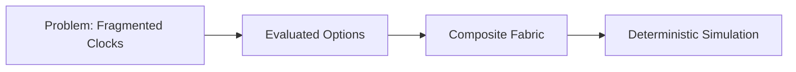
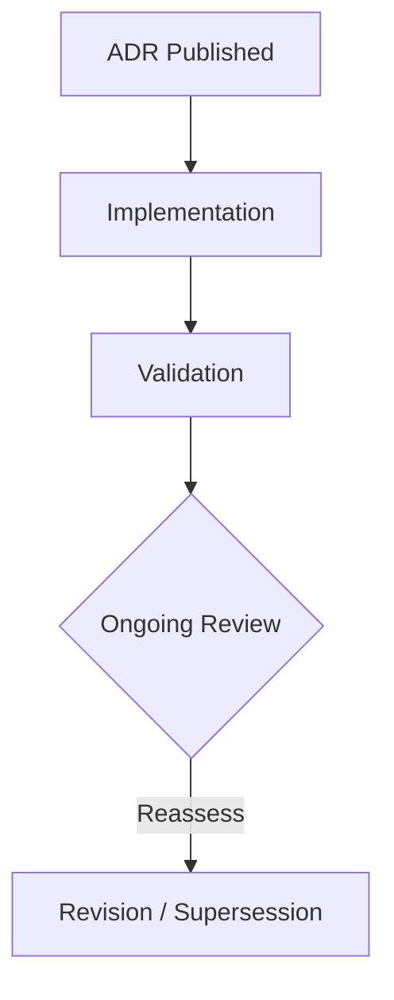

# 21-ADR-004 — Establish the Composite Simulation Fabric (SimClock + SimBus)

*(Status: Accepted)*

**Authors:** @simulation-wg
**Reviewers:** @nexus-specs, @core-architects
**Created:** 2024-08-22
**Last Updated:** 2025-02-14
**Supersedes:** —
**Superseded by:** —
**Related SRS:** `21_System_Decomposition_Boundaries.md`
**Related Options:** `21-O5 - Layer controllers with aggregation pipelines.md`

---

## 1) Context

Nexus modernization requires deterministic simulation for CI, operator training, and plugin validation.
Legacy executables managed their own clocks and message pumps, leading to drift, replay inconsistency, and duplicated routing logic.
SRS §21 identifies the need for a composite simulation fabric where Core owns the authoritative clock, plugins publish to a shared bus, and hardware inputs can pre-empt simulated data without breaking determinism.【F:docs/SRS/sections/2X_System_Architecture/21_System_Decomposition_Boundaries.md†L1-L120】【F:docs/SRS/sections/9X_Frontends_Ops/94_Extensibility_Packaging_Updates.md†L17-L71】
Option 11-O1 aligns by positioning AgIO’s simulation backend alongside Windows and Linux backends using common contracts.【F:docs/SRS/sections/1X_Platform_Foundations/11-O1_Unified_DotNet8_Avalonia.md†L9-L47】

---

## 2) Decision

Adopt a composite simulation fabric governed by the Core service:

### Decision Summary

* **Scope:** Applies to Core runtime, plugins, and tooling that participate in simulation, replay, or hardware-in-the-loop.
* **Boundary:** UI visualization specifics remain out of scope; transport protocols covered separately.
* **Implementation Level:** Design + code policy codified in Core runtime libraries.

The fabric consists of:

* **SimClock** — fixed-step, seekable clock (default 10 ms) driving Core processing, replay, and plugin simulators.
* **SimBus** — typed publish/subscribe channel with last-value caching for canonical topics (pose, IMU, sections, telemetry) shared by hardware and simulated producers.
* **Source routing** — Core-owned priority rules choosing hardware, simulation, or replay producers per topic to guarantee deterministic overrides.
* **Seeded randomness** — Plugins respect deterministic seeds to ensure reproducible outputs across machines and CI lanes.

---

## 3) Consequences

**Positive Impacts:**

* Provides deterministic replay for CI and training scenarios.【F:docs/SRS/sections/2X_System_Architecture/23_Threading_Scheduling_Timing.md†L1-L120】
* Simplifies plugin development via shared timing primitives.
* Enables automated regression detection for coverage math and control loops.

**Negative / Mitigated Impacts:**

* Requires refactoring legacy streamers to publish through SimBus — mitigated by 21-O5 adoption.
* Increases complexity of Core runtime initialization — mitigated with DI registration templates and documentation.

**Follow-up Actions:**

* Implement SimClock/SimBus libraries within Core service.
* Update plugin SDKs and replay tooling to use new interfaces.
* Create deterministic replay CI suite verifying canonical scenarios.

---

## 4) Rationale

Composite fabric outperformed alternatives by offering deterministic scheduling, simplified routing, and shared telemetry.
Other options (per-plugin clocks, ad-hoc replay loops) failed to guarantee reproducibility or required duplicating infrastructure.
Weighted scoring in SRS §21.12 ranked deterministic shared contracts highest for maintainability and roadmap alignment.

---

## 5) Alternatives Considered

| Option | Summary | Reason Not Selected |
|--------|---------|---------------------|
| Maintain per-executable clocks | Each app manages its own timing loop. | Drift between processes and inconsistent replay fidelity. |
| Ad-hoc message bus per plugin | Plugins own their buses and priorities. | Fragmented routing, no deterministic overrides. |
| External simulation orchestrator | Separate process controls timing. | Adds deployment complexity; reduces Core authority. |

---

## 6) Implementation & Governance

* **Governance ownership:** Simulation working group maintains fabric contracts and coordinates changes.
* **Update cadence:** Review quarterly or when major plugin frameworks evolve.
* **Documentation:** Keep SRS §21, option 21-O5, and plugin SDK docs synchronized with SimClock/SimBus contract changes.

---

## 7) Risks & Mitigations

| ID | Risk | Impact | Mitigation / Monitoring |
|----|------|--------|-------------------------|
| R1 | SimBus backlog causes latency spikes. | Medium | Instrument queue depth; enforce bounded channels and telemetry alerts. |
| R2 | Plugins bypass SimClock for custom timing. | High | SDK validators and CI tests ensure compliant usage. |

---

## 8) Legacy Implementation Notes

* Legacy streamers directly pulled system time and updated UI threads, limiting determinism.
* Replay tooling lacked standardized routing, requiring manual data merges.
* These limitations motivated unified clock and bus abstraction.

---

## 9) Governance Updates

* **Review frequency:** Annual or after major release.
* **Decision owner:** Simulation working group.
* **Compliance metrics:** Replay CI pass rate, telemetry drift metrics staying within ±2 ms.

---

## 10) References

* **SRS Sections:** `21_System_Decomposition_Boundaries.md` — §21.5, §21.12; `23_Threading_Scheduling_Timing.md` — §23.5.
* **Option Documents:** `21-O5 - Layer controllers with aggregation pipelines.md`
* **Prior ADRs:** None.
* **External References:** Replay datasets 2024-H2, Simulation WG minutes (2024-09-18).

---

## 11) Change Log

| Date | Change | Author | PR / Issue |
|------|--------|--------|------------|
| 2024-08-22 | Initial decision drafted. | @simulation-wg | #0000 |
| 2025-02-14 | Reformatted to ADR template; added governance details. | @simulation-wg | #0000 |

---

> **Lifecycle:** Proposed → Accepted → Superseded → Deprecated → Rejected
> **Traceability:** Links to SRS Decision Matrix § 21.12 and option 21-O5.
