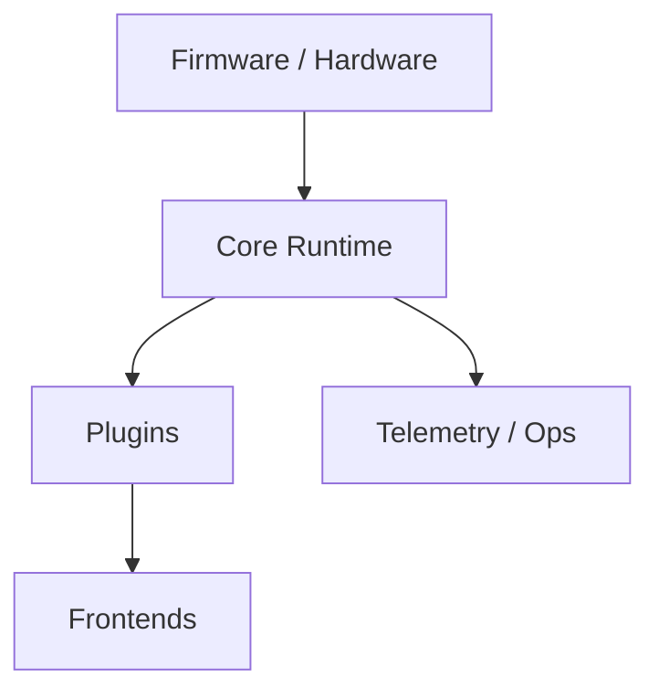
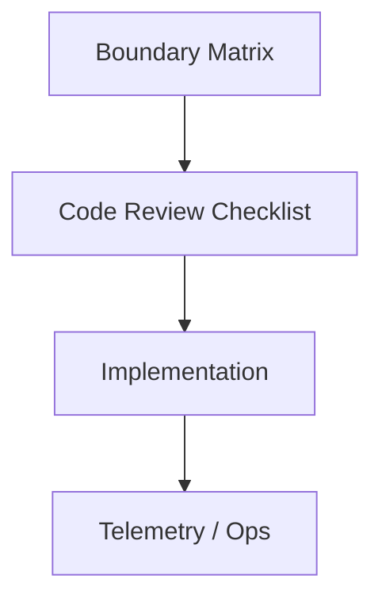

# 21-ADR-028 — Nexus Stack Responsibilities & Handoff Boundaries

*(Status: Accepted)*

**Authors:** @architecture-wg
**Reviewers:** @nexus-specs, @core-wg
**Created:** 2024-09-30
**Last Updated:** 2025-02-14
**Supersedes:** —
**Superseded by:** —
**Related SRS:** `21_System_Decomposition_Boundaries.md`
**Related Options:** `21-O5 - Layer controllers with aggregation pipelines.md`, `21-O6 - Linux Core service with remote frontends.md`

---

## 1) Context

Contributors requested a single reference mapping how firmware, hardware services, the Core runtime, and feature plugins divide responsibilities so new features land without blurring safety and contract boundaries.
Existing SRS sections already define transports, hardware governance, and plugin lifecycle, but they are scattered, leading to duplicated work or misplaced functionality.【F:docs/SRS/sections/4X_Interprocess_Communications/42_Transports.md†L3-L35】【F:docs/SRS/sections/5X_Hardware_IO_Device_Layer/51_Sensor_Actuator_Abstractions.md†L3-L116】【F:docs/SRS/sections/9X_Frontends_Ops/94_Extensibility_Packaging_Updates.md†L17-L211】
Linux Core pilots (§21-O6) and layer controller modernization (§21-O5) require explicit boundaries to guarantee determinism, observability, and safe extensibility across OS platforms.

---

## 2) Decision

Document authoritative handoff boundaries for the Nexus stack and require new features to declare which layer they affect.

### Decision Summary

* **Scope:** Applies to Core runtime, plugins, frontends, and supporting services.
* **Boundary:** Hardware firmware and third-party cloud services remain governed by respective specs; this ADR focuses on Nexus-owned components.
* **Implementation Level:** Policy + design guidance enforced in SRS and code reviews.

Boundaries include:

* **Firmware vs Hardware Services:** Firmware handles low-level IO; hardware services translate to Core topics and enforce safety interlocks.
* **Core Runtime vs Plugins:** Core owns deterministic scheduling, configuration policy, and contract enforcement; plugins supply optional capabilities via approved interfaces.
* **Core vs Frontends:** Core exposes APIs and telemetry; frontends render state and gather operator input without reimplementing business logic.

---

## 3) Consequences

**Positive Impacts:**

* Aligns modernization efforts (layer controllers, Linux Core) around shared expectations, reducing integration churn.【F:docs/SRS/sections/2X_System_Architecture/21_System_Decomposition_Boundaries.md†L58-L146】
* Clarifies safety ownership, enabling faster ADR review cycles.
* Facilitates documentation updates and onboarding for new contributors.

**Negative / Mitigated Impacts:**

* Requires ongoing governance to keep boundaries current — mitigated through quarterly reviews.
* May slow experimental prototypes until boundary exemptions documented.

**Follow-up Actions:**

* Update SRS sections (21–24) with boundary tables and traceability entries.
* Create review checklist ensuring ADRs specify impacted layers.
* Coordinate with plugin maintainers to align extension points.

---

## 4) Rationale

A single authoritative boundary document reduces ambiguity and prevents cross-layer regressions.
Alternative approaches (duplicated guidance per project or ad-hoc reviews) failed to scale with contributors and OS targets.
Centralizing expectations within the SRS ensures modernization tracks share assumptions and reduces merge conflicts between UI, Core, and plugin teams.

---

## 5) Alternatives Considered

| Option | Summary | Reason Not Selected |
|--------|---------|---------------------|
| Status-quo documentation | Keep guidance scattered across sections. | Contributors repeatedly misapplied responsibilities. |
| Plugin-first governance | Let plugin ADRs define boundaries. | Ignores Core responsibilities and hardware constraints. |
| Tooling enforcement only | Rely on CI linting to detect boundary violations. | Hard to encode nuanced architectural rules in automation. |

---

## 6) Implementation & Governance

* **Governance ownership:** Architecture working group maintains boundary matrix and review checklist.
* **Update cadence:** Review boundaries each release or after major ADR approvals.
* **Documentation:** Update SRS §21–§24, plugin SDK guidelines, and deployment docs whenever boundaries shift.

---

## 7) Risks & Mitigations

| ID | Risk | Impact | Mitigation / Monitoring |
|----|------|--------|-------------------------|
| R1 | Boundaries fall out of sync with actual implementation. | Medium | Schedule quarterly audits; link SRS updates to code changes. |
| R2 | Teams bypass boundaries for expediency. | Medium | Require ADR waivers and document temporary exceptions. |

---

## 8) Legacy Implementation Notes

* Legacy AgOpenGPS blurred UI and Core responsibilities, with business logic tied to WinForms presenters.
* Hardware integrations often lived inside UI assemblies, complicating portability.
* Lack of explicit boundaries contributed to regressions during plugin experiments.

---

## 9) Governance Updates

* **Review frequency:** Quarterly plus whenever significant ADR lands in sections 4X–9X.
* **Decision owner:** Architecture working group.
* **Compliance metrics:** Code review checklist usage rate; reduction in cross-layer bug reports.

---

## 10) References

* **SRS Sections:** `21_System_Decomposition_Boundaries.md` — §21.5, §21.12; `22_Process_Model_Deployment.md` — §22.5; `24_Configuration_Environment.md` — §24.5.
* **Option Documents:** `21-O5 - Layer controllers with aggregation pipelines.md`, `21-O6 - Linux Core service with remote frontends.md`
* **Prior ADRs:** `21-ADR-004 - Establish the composite simulation fabric (SimClock + SimBus).md`
* **External References:** Architecture WG minutes (2024-09-30), Plugin API governance doc (2024-Q4).

---

## 11) Change Log

| Date | Change | Author | PR / Issue |
|------|--------|--------|------------|
| 2024-09-30 | Initial decision drafted. | @architecture-wg | #0000 |
| 2025-02-14 | Reformatted to ADR template; added governance guidance. | @architecture-wg | #0000 |

---

> **Lifecycle:** Proposed → Accepted → Superseded → Deprecated → Rejected
> **Traceability:** Links to SRS Decision Matrix § 21.12 and options 21-O5, 21-O6.
