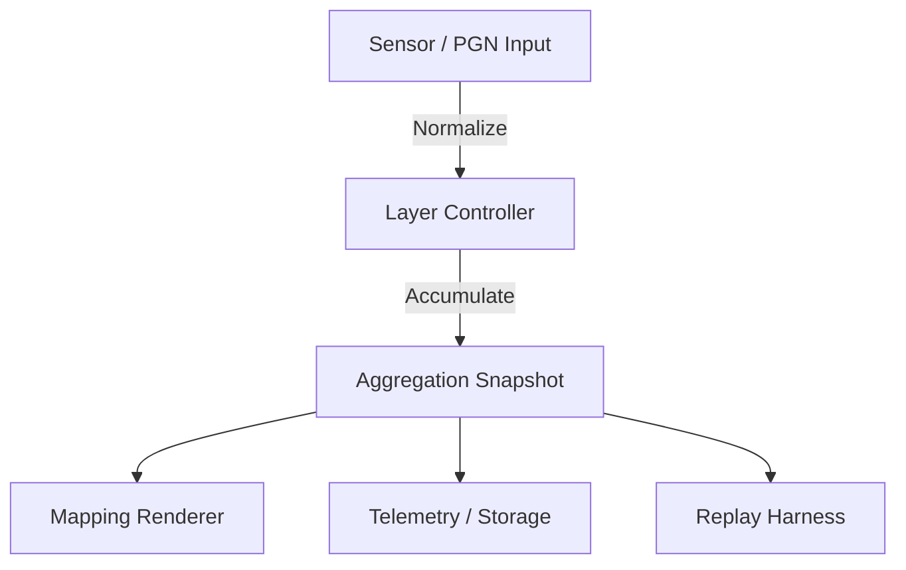
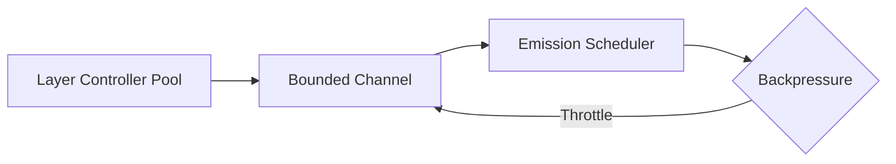
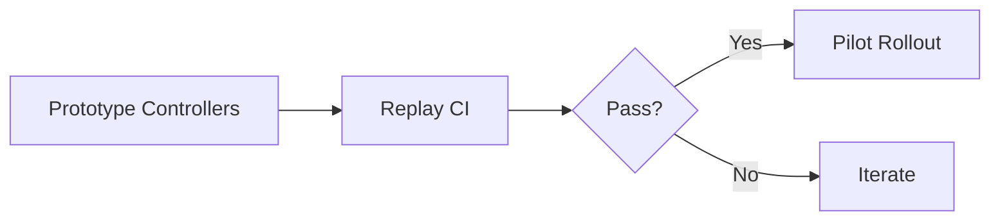

# 21-O5 — Layer Controllers with Aggregation Pipelines

*(Status: Favored)*

**Option ID:** 21-O5
**Section ID:** 21 — System Decomposition & Boundaries
**Version:** 0.2.0
**Authors:** @layer-wg
**Reviewers:** @nexus-specs, @simulation-wg
**Created:** 2024-10-12
**Last Updated:** 2025-02-14
**Related SRS:** `sections/2X_System_Architecture/21_System_Decomposition_Boundaries.md`
**Related ADRs:** `21-ADR-068 - Layer Controllers & Aggregation Runtime.md`

---

## 1) Summary

Refactors backend navigation and mapping into per-section layer controllers that normalize raw sensor feeds, buffer samples between GNSS fixes, and emit aggregated geometry snapshots for rendering, dashboards, and storage.
The pipeline introduces deterministic emission cadence, derived metrics, and immutable snapshots to keep guidance, replay, and analytics in sync.【F:docs/SRS/sections/2X_System_Architecture/21_System_Decomposition_Boundaries.md†L27-L84】

---

## 2) Problem, Goals, and Non-Goals

**Problem:**
Legacy streamers couple sensor ingestion with rendering and analytics, making overlap math hard to validate and limiting telemetry observability.

**Goals:**

* Satisfies **R-BE-010**, **R-BE-011**, **R-TIME-001**, **R-TIME-002** by formalizing deterministic aggregation and telemetry hooks.
* Addresses **C1** (determinism), **C2** (replay fidelity), and **C3** (observability) from SRS §21.12.

**Non-Goals:**

* Does not redesign UI visualization or agronomic analytics logic.
* Does not replace PGN compatibility layers (covered by 21-O6) or field data schemas (covered in 6X sections).

---

## 3) Architecture Overview

* **Core concept:** Each implement block contains layer controllers that accumulate coverage, rate, and quality metrics from raw inputs.
* **Primary components / boundaries:** Input adapters → layer controllers → aggregation snapshot emitter → mapping/UI consumers.
* **Process / data flow summary:** Sensor events feed controllers via bounded channels; controllers coalesce data and emit immutable snapshots consumed by renderers and telemetry sinks.
* **Integration context:** Runs inside Core service with plugin extension points for additional layer processors.

---

## 4) Interfaces & Contracts

* **Public contracts:**
  * `ILayerController` interface exposing `OnSample`, `EmitSnapshot`, and `GetDiagnostics` methods.
  * Snapshot schema containing normalized value, engineering value, quality, and derived metrics.
* **Compatibility policy:** Backed by semantic versioning; snapshots include schema version to maintain replay compatibility.
* **Discovery / registration:** Controllers registered via dependency injection and configuration manifest entries.

> **Trace:** R-BE-010, R-BE-011, R-TIME-001, R-TIME-002.

---

## 5) Dependencies & Constraints

* Requires deterministic SimClock/SimBus integration to schedule emission cadence.【F:docs/SRS/sections/2X_System_Architecture/21-ADR-004 - Establish the composite simulation fabric (SimClock + SimBus).md†L14-L46】
* Depends on telemetry infrastructure to surface layer diagnostics (§64).
* Must respect configuration schemas defined in §24 for layer registration and overrides.

---

## 6) Security, Privacy, and Compliance

* Telemetry derived from sensor data inherits privacy requirements for field operations logs.
* Configuration manifests storing controller bindings must avoid embedding credentials; they reference logical keys per §24.
* No new personally identifiable information is introduced beyond existing telemetry streams.

---

## 7) Performance & Sizing Targets

* **Latency:** Snapshot emission cadence configurable (default 10 Hz) with p95 processing latency ≤5 ms per controller.
* **Resource budgets:** Controllers reuse buffer pools to limit additional memory to ≤50 MB across 48 sections on reference hardware.
* **Scalability:** Supports dozens of controllers by using bounded channels and asynchronous emission.

---

## 8) Operability

* Structured logs emit per-layer diagnostics (min/max, rateNA flags, quality metrics).
* Metrics exported via telemetry (CPU, queue depth, coverage error) with alert thresholds defined in §64.
* Configuration reloads supported through immutable snapshot factories; controllers restart gracefully when profiles change.

---

## 9) Packaging & Distribution

* Ships within Core service binaries; no separate package required.
* Configuration manifests distributed alongside Core deployments (Windows installer, Debian package, containers).
* Replay harness includes sample datasets demonstrating deterministic coverage outputs.

---

## 10) Migration, Rollout, and Backout

* **Migration path:** Gradually replace legacy streamers with controllers behind feature flag; run replay comparisons to validate.
* **Rollout plan:** Enable on pilot rigs with telemetry monitoring before enabling across fleet.
* **Backout plan:** Feature flag disables controllers and reverts to legacy streamer pipeline while capturing diff telemetry.

---

## 11) Risks & Failure Modes

| ID | Risk / Failure Mode | Likelihood | Impact | Mitigation / Trigger |
| -- | ------------------- | ---------- | ------ | -------------------- |
| R1 | Incorrect aggregation math causes rate overshoot. | Medium | High | Replay regression suite plus unit tests for each controller. |
| R2 | Snapshot emission stalls due to backlog. | Low | Medium | Bounded channels + watchdog telemetry alert on queue depth. |
| R3 | Plugins emit incompatible controller extensions. | Medium | Medium | Versioned contracts and schema validation at startup. |

---

## 12) Alternatives Considered

| Option | Summary | Reason Not Selected |
|--------|---------|---------------------|
| 21-O0 | Maintain legacy streamers. | Lacks deterministic telemetry and replay fidelity. |
| 21-O2 | Full microservice aggregation. | Adds network latency and operational complexity without near-term benefit. |
| 21-O4 | Scriptable aggregation via Lua/Python. | Safety and determinism risks for field operations. |

---

## 13) Validation Plan

**Success criteria:** Replay harness demonstrates ≤1% coverage error versus baseline; telemetry dashboards show queue depth and latency within thresholds.

**Validation steps:**

1. Implement controller prototype for rate and coverage layers.
2. Run replay-driven CI comparing legacy outputs to controller snapshots.
3. Execute field pilot measuring telemetry latency, quality metrics, and operator feedback.

---

## 14) Effort and Complexity

| Area | Effort | Notes |
|------|--------|-------|
| Interfaces | Medium | Define controller contracts and configuration schemas. |
| Implementation | High | Replace legacy streamers and implement new math engines. |
| Testing | High | Replay suite, unit tests, hardware-in-the-loop validation. |
| Packaging | Medium | Update configuration manifests and installers. |

---

## 15) Community and Ecosystem Impact

* Enables richer telemetry dashboards and replay analysis without firmware changes.
* Simplifies plugin extensibility by isolating sensor normalization logic.
* Provides deterministic snapshots that downstream tools (analytics, reporting) can reuse.

---

## 16) References

* **SRS:** `21_System_Decomposition_Boundaries.md`
* **ADRs:** `21-ADR-068 - Layer Controllers & Aggregation Runtime.md`
* **Prior work:** Legacy `FieldStreamer` implementation, replay datasets from 2024 harvest season.

---

## 17) Change Log

| Date | Change | Author | PR / Issue |
|------|--------|--------|------------|
| 2024-10-12 | Initial draft | @layer-wg | #0000 |
| 2025-02-14 | Reformatted to option template; added validation plan. | @layer-wg | #0000 |

---

## 18) Review Checklist

* [x] Requirements traced and complete.
* [x] Interfaces and contracts defined.
* [x] Security and performance covered.
* [x] Validation plan with metrics.
* [x] Risks and mitigations documented.
* [x] References linked.

---

> **Lifecycle:** Proposed → Favored → In Review → Approved → Deprecated
> **Cross-link:** Supports Decision Matrix § 21.12 in parent SRS.
