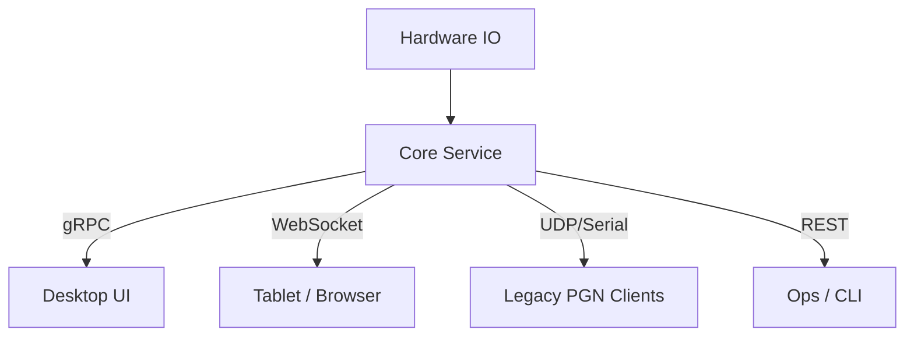
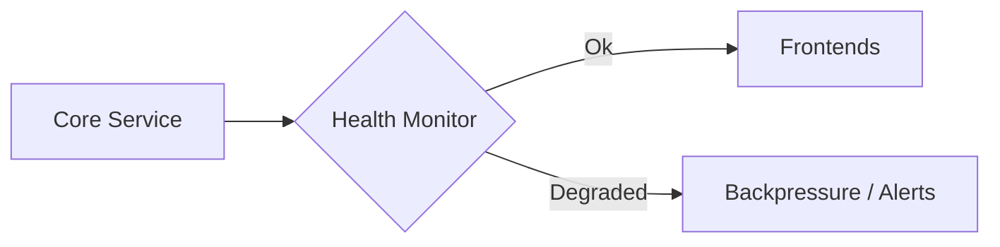
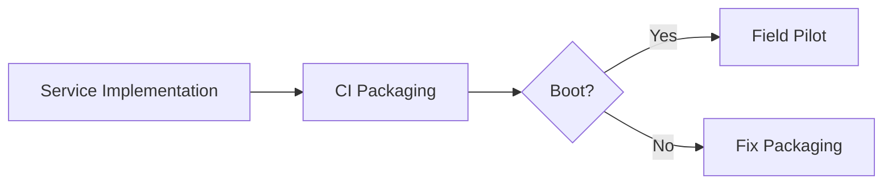

# 21-O6 — Linux Core Service with Remote Frontends

*(Status: In Review)*

**Option ID:** 21-O6
**Section ID:** 21 — System Decomposition & Boundaries
**Version:** 0.2.0
**Authors:** @core-wg
**Reviewers:** @nexus-specs, @deployment-wg
**Created:** 2024-11-05
**Last Updated:** 2025-02-14
**Related SRS:** `sections/2X_System_Architecture/21_System_Decomposition_Boundaries.md`
**Related ADRs:** `21-ADR-028 - Nexus stack responsibilities & handoff boundaries.md`

---

## 1) Summary

Split AgOpenGPS into a headless “Core” that runs on Linux (SBC/PC) and exposes APIs for multiple frontends.
The Core owns guidance, mapping, section control, PGN compatibility, and data storage while remote frontends (desktop, web, tablet) connect over gRPC/WebSocket to visualize and control the system.【F:docs/SRS/sections/2X_System_Architecture/21_System_Decomposition_Boundaries.md†L58-L112】

---

## 2) Problem, Goals, and Non-Goals

**Problem:**
Legacy Windows-centric deployment couples UI lifecycle with guidance-critical services, blocking Linux adoption and remote displays.

**Goals:**

* Satisfies **R-BE-004**, **R-BE-012**, **R-PROC-001**, **R-PROC-002**, **R-PROC-003** by extracting Core logic into a service with defined APIs and packaging.
* Addresses **C1** (cross-OS parity), **C2** (remote supervision), and **C4** (observability) from SRS §21.12.

**Non-Goals:**

* Does not mandate web UI rewrite; desktop frontends remain supported.
* Does not replace AgIO PGN baseline; instead hosts adapters for compatibility.

---

## 3) Architecture Overview

* **Core concept:** Headless daemon providing deterministic guidance runtime, telemetry, and storage.
* **Primary components / boundaries:** Core service → API gateway → remote frontends / plugins.
* **Process / data flow summary:** Hardware drivers feed Core; Core publishes gRPC streams and WebSocket updates; frontends issue commands via authenticated APIs.
* **Integration context:** Runs on CM5, industrial PCs, or containers with systemd supervision.

---

## 4) Interfaces & Contracts

* **Public contracts:** gRPC service definitions for control/config/telemetry, WebSocket JSON feed, REST health endpoints, UDP/serial PGN bridge.
* **Compatibility policy:** Semantic versioning with backwards-compatible endpoints; PGN bridge maintains parity with legacy AgIO baseline.
* **Discovery / registration:** Frontends authenticate via configuration-managed credentials; service advertises capabilities via manifest endpoint.

> **Trace:** R-BE-004, R-BE-012, R-PROC-001, R-PROC-002, R-PROC-003.

---

## 5) Dependencies & Constraints

* Requires .NET 8 runtime and systemd supervision on Linux targets.【F:docs/SRS/sections/1X_Platform_Foundations/11_OS_Support.md†L14-L45】
* Depends on SimClock/SimBus for deterministic timing (§21-ADR-004).
* Must integrate with configuration/secrets policy defined in §24.

---

## 6) Security, Privacy, and Compliance

* API endpoints secured via mutual TLS or token-based authentication depending on deployment profile.
* Secrets (RTK credentials, API keys) stored using platform keyrings (libsecret, Vault) with leases per §24.
* Telemetry exports must comply with farm data governance policies; anonymization configurable for fleet monitoring.

---

## 7) Performance & Sizing Targets

* **Latency:** Control command round-trip ≤50 ms on local network; reconnection handshake ≤500 ms.
* **Resource budgets:** Core idle CPU <20% and memory <500 MB on CM5 hardware; restart <30 s with persisted state replay.
* **Scalability:** Supports 3+ concurrent frontends plus automation clients without degrading guidance loops.

---

## 8) Operability

* Structured JSONL logs and `/metrics` endpoint for Prometheus scraping.
* `/healthz` and `/readyz` endpoints expose service state; watchers restart service on failure.
* CLI tooling manages start/stop/status and configuration reloads.

---

## 9) Packaging & Distribution

* Deb packages for Debian/Ubuntu with systemd unit (`aog-core.service`).
* Docker/Podman images for managed deployments; optional AppImage bundling UI + Core for desktop pilots.
* Windows installer continues to ship in-process mode until parity established; gRPC host reused via shared contracts.

---

## 10) Migration, Rollout, and Backout

* **Migration path:** Stand up Core service alongside existing desktop host; route PGN traffic through bridge while validating telemetry.
* **Rollout plan:** Pilot on CM5 rigs with operator training and telemetry monitoring; expand to farm servers after stability confirmed.
* **Backout plan:** Stop Core service and revert to legacy in-process host; maintain configuration parity for fast rollback.

---

## 11) Risks & Failure Modes

| ID | Risk / Failure Mode | Likelihood | Impact | Mitigation / Trigger |
| -- | ------------------- | ---------- | ------ | -------------------- |
| R1 | API regression breaks legacy plugins. | Medium | High | Contract tests + PGN bridge conformance suite. |
| R2 | Network outages disrupt guidance. | Medium | High | Local caching + watchdog triggers manual override mode. |
| R3 | Packaging misconfiguration prevents service startup. | Low | Medium | CI packaging smoke tests and install checklists. |

---

## 12) Alternatives Considered

| Option | Summary | Reason Not Selected |
|--------|---------|---------------------|
| 21-O0 | Keep in-process Windows host only. | Blocks Linux adoption and remote displays. |
| 21-O1 | Modular worker services without headless Core. | Retains UI coupling; limited Linux story. |
| 21-O2 | Full microservices per subsystem. | Complexity too high for field operations; determinism risk. |

---

## 13) Validation Plan

**Success criteria:** Core service passes packaging smoke tests, remote frontends reconnect within SLA, and PGN bridge matches legacy telemetry during replay.

**Validation steps:**

1. Build gRPC/REST endpoints and PGN adapters; run contract tests.
2. Package deb/docker artifacts and execute CI smoke environment boots.
3. Conduct field pilot with remote frontend while monitoring telemetry jitter and reconnection behavior.

---

## 14) Effort and Complexity

| Area | Effort | Notes |
|------|--------|-------|
| Interfaces | High | Define gRPC, WebSocket, REST contracts and compatibility policy. |
| Implementation | High | Extract Core runtime, implement PGN bridge, manage lifecycle. |
| Testing | High | Contract tests, replay comparisons, failover drills. |
| Packaging | High | Create deb/docker builds, systemd units, installer updates. |

---

## 15) Community and Ecosystem Impact

* Unlocks Linux deployments and remote supervision without duplicating logic.
* Simplifies plugin distribution via shared NuGet contracts across OS platforms.【F:docs/SRS/sections/1X_Platform_Foundations/11-O1_Unified_DotNet8_Avalonia.md†L9-L79】
* Requires documentation and operator training for managing headless services.

---

## 16) References

* **SRS:** `21_System_Decomposition_Boundaries.md`
* **ADRs:** `21-ADR-028 - Nexus stack responsibilities & handoff boundaries.md`
* **Prior work:** AgIO PGN baseline notes, Linux Core prototype logs (2024-Q4).

---

## 17) Change Log

| Date | Change | Author | PR / Issue |
|------|--------|--------|------------|
| 2024-11-05 | Initial draft | @core-wg | #0000 |
| 2025-02-14 | Reformatted to option template; added validation & risk tables. | @core-wg | #0000 |

---

## 18) Review Checklist

* [x] Requirements traced and complete.
* [x] Interfaces and contracts defined.
* [x] Security and performance covered.
* [x] Validation plan with metrics.
* [x] Risks and mitigations documented.
* [x] References linked.

---

> **Lifecycle:** Proposed → Favored → In Review → Approved → Deprecated
> **Cross-link:** Supports Decision Matrix § 21.12 in parent SRS.
