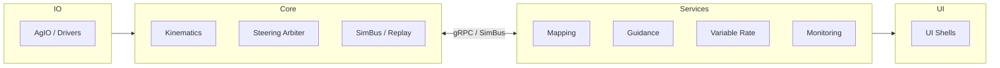

# 21 — System Decomposition & Boundaries
*(Status: Drafting — Option-Neutral Overview)*

**Author:** Codex  
**Created:** 2025-10-20  
**Version:** 0.3.0  
**Editors:** @nexus-specs, @layer-wg  
**Last Updated:** 2025-10-21  

---

## 21.1 Purpose & Scope

This section defines how the Nexus system is functionally decomposed into **logical domains** (e.g., guidance, mapping, I/O, automation) and how those domains may be **partitioned across process boundaries** such as Core, AgIO, UI hosts, or runtime-loaded modules.

It does **not prescribe** one final architecture. Instead, it establishes the **reference topology** from which subsequent Options (§21.12) evaluate specific splits (e.g., Plugin Runtime, Modular Monolith, or Monolithic Core).

---

## 21.2 Current State (Legacy Reference)

Historically, **AgOpenGPS (V6 / ROC)** operated as a **single-process monolith**:
- `ApplicationCore` managed guidance, steering, mapping, and PGN I/O within one thread space.
- WinForms and AgIO shared direct references, no explicit API seams.
- Simulation and telemetry replay required ad-hoc stubs.
- Timing, UI rendering, and logic loops were all interleaved.

This baseline remains functional and deterministic but is difficult to maintain, extend across OSes, or isolate faults.

---

## 21.3 Functional Domains

| Domain | Description | Key Responsibilities | Typical Timing Requirements |
|---------|--------------|----------------------|-----------------------------|
| **Kinematics** | Vehicle model, IMU/GNSS fusion, speed/heading output | Pose stream @50–100 Hz, deterministic | Hard-real-time |
| **Guidance** | Path generation, headland logic, coverage targets | Plan updates @5–10 Hz | Soft-real-time |
| **Autosteer** | Steering control loop and actuator outputs | Command update @20–50 Hz | Hard-real-time |
| **Mapping** | Layer editing, visualization, field geometry | User interactions, background tile render | Non-real-time |
| **Variable Mapping / Rate** | Attribute-based map layers, control setpoints | Background rate resolver | Soft-real-time |
| **Monitoring** | Planter/yield sensors, alarms | Poll inputs @1–10 Hz | Soft |
| **AgIO (I/O Layer)** | CAN, serial, UDP, USB, etc. | PGN framing, socket control | Real-time I/O |
| **Radiobridge** | RTK, radio telemetry | Link state, corrections | Soft |
| **UI Shells** | Display, configuration, operator interaction | Rendering @30–60 Hz | Visual only |
| **Simulation / Replay** | Deterministic time and state journals | SimClock, SimBus | Deterministic offline |

---

## 21.4 Structural Models Considered

| Model | Description | Process Boundaries | Deployment Example |
|--------|-------------|--------------------|--------------------|
| **A — Monolithic Core** | All logic compiled into one executable. | None (single process) | Windows WinForms legacy |
| **B — Modular Monolith** | Logical modules separated by clean interfaces but still in one process. | None (in-proc only) | Avalonia host with modular namespaces |
| **C — Plugin Runtime** | Core, AgIO, and domain services separated into individual services or dynamically loaded modules. | Process or gRPC boundaries | Linux Core + detachable plugins |

---

## 21.5 Domain-to-Model Mapping

| Domain | In Model A | In Model B | In Model C | Timing Risk if Separated | Typical Interfaces |
|---------|-------------|------------|-------------|---------------------------|--------------------|
| Kinematics | Core | Core | Core | High | SimBus / gRPC |
| Autosteer | Core | Core | Core (hard loop) | High | SimBus / gRPC |
| Guidance | Core | Internal module | External plugin | Medium | gRPC / Contracts.Guidance |
| Mapping | Core (tied to UI) | Module (MVVM) | Plugin | Low | Contracts.Mapping |
| Variable Mapping | Core | Module | Plugin | Low | Contracts.Mapping |
| Variable Rate | Core | Module | Plugin | Low | Contracts.Rate |
| Monitoring | Core | Module | Plugin | Low | Contracts.Monitor |
| AgIO | Core | Shared service | Sidecar | Medium | Contracts.PGN |
| Radiobridge | Core | Module | Plugin | Low | Contracts.Radio |
| Simulation | None / ad-hoc | Integrated | Shared service | Low | SimBus |
| UI Shells | WinForms host | Avalonia host | Remote clients | Low | WebSocket / gRPC |

---

## 21.6 Comparative Evaluation

| Criterion | Model A — Monolithic | Model B — Modular Monolith | Model C — Plugin Runtime |
|------------|----------------------|-----------------------------|---------------------------|
| **Performance** | No IPC overhead | Minor abstraction cost | ≤1 ms IPC overhead (target) |
| **Determinism** | Simple timing | Deterministic if SimClock central | Deterministic with explicit SimBus |
| **Reliability** | Shared fault domain | Partial isolation | Full fault isolation (process) |
| **Maintainability** | Tight coupling | Moderate | High — clear contracts |
| **Cross-OS Portability** | Low | Medium | High |
| **Community Extensibility** | Low | Medium | High |
| **Testing & Simulation** | Manual | Replay harnesses possible | Fully deterministic replay |
| **Deployment Complexity** | Simple | Simple | Higher (service mgmt) |

---

## 21.7 Current Boundaries

```mermaid
flowchart LR
  subgraph Core
    KIN[Kinematics]
    ST[Steering Loop]
    GUI[Guidance]
    MAP[Mapping]
    IO[AgIO]
  end

  subgraph UI
    UI[WinForms/Avalonia]
  end

  UI <-- direct refs --> Core
  IO --> Core
```

### Limitations
- No stable contracts for external modules.  
- Any device driver crash can terminate Core.  
- UI and business logic are inseparable.

---

## 21.8 Candidate Future Boundary Diagram (Conceptual)



---

## 21.9 Trade-Offs Summary

| Aspect | Tighter Coupling (Monolith) | Looser Coupling (Modular / Plugin) |
|---------|-----------------------------|------------------------------------|
| **Latency** | Lowest possible | Slight IPC cost (<1 ms target) |
| **Fault Isolation** | None | Restartable modules |
| **Complexity** | Simple | Requires supervision tools |
| **Cross-Platform** | Windows-biased | Works on Linux / headless |
| **Testability** | Limited | Replay & simulation ready |
| **Contribution Model** | Centralized | Distributed (per domain) |
| **Upgrade Path** | Single package | Versioned contracts |
| **Risk** | Core regressions cascade | Interface drift if unmanaged |

---

## 21.10 Determinism Constraints

- All timing originates from a single **SimClock** reference.
- Data interchange between processes must include timestamps and sequence numbers.
- Hard-real-time loops (Steering, Kinematics) **must remain in-process** with Core.
- gRPC/IPC targets: **p95 ≤ 1 ms**, **p99 ≤ 3 ms** for intra-host links.

---

## 21.11 Open Questions

| ID | Question | Current Thinking | Owner |
|----|-----------|------------------|--------|
| Q-21-1 | Should AgIO be part of Core or run as a sidecar? | Split for isolation, see ADR-028 | Core WG |
| Q-21-2 | Can mapping remain cross-platform without Avalonia dependency? | Yes, via SDK contracts | UI WG |
| Q-21-3 | What minimum SDK granularity keeps developer friction low? | 4–5 contracts (Pose, LayerSnapshot, Target, Setpoint, Health) | SDK WG |
| Q-21-4 | How to guarantee deterministic replay when services are split? | Shared SimBus / sequence journal | Simulation WG |

---

## 21.12 Option References

Subsequent subsections (21-O1 … 21-O7) define concrete architecture proposals.  
For example:
- **21-O1:** Maintain Monolithic Core  
- **21-O4:** Modular Monolith  
- **21-O7:** Plugin Runtime (AgIO + Core + Plugins via SDK)

Each option will include quantitative scoring (determinism, maintainability, latency, complexity) and updated ADR references.

---

## 21.13 Verification & Traceability

Verification ensures architectural integrity regardless of model selection:
- Deterministic replay (SimBus jitter ≤ 2 ms p95)
- Regression replay equivalence (geometry ± 1%)
- Health endpoints operational (< 30 s startup)
- Cross-OS contract parity (Core/AgIO/SDK)

---

## 21.14 Summary

This section defines *where the system’s seams could be*.  
It acknowledges that the **Plugin Runtime** model offers long-term agility, but leaves adoption to a formal Option decision.  
Future ADRs and options will compare measurable trade-offs in determinism, latency, and maintainability while preserving a unified SimBus-driven Core.
