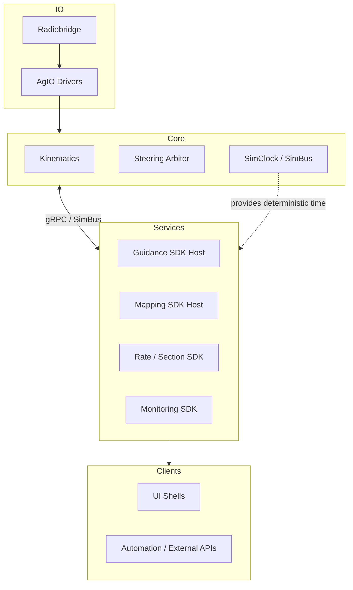

# 21 — System Decomposition & Boundaries
*(Status: Drafting — Option-Neutral Overview)*

**Author:** Codex  
**Created:** 2025-10-20  
**Version:** 0.3.0  
**Editors:** @nexus-specs, @layer-wg  
**Last Updated:** 2025-10-21

---

## 21.1 Purpose & Scope

This section establishes how Nexus decomposes into **logical feature domains** (guidance, mapping, I/O, automation, simulation) and how those domains may be **partitioned across deployment boundaries** (Core, AgIO, UI hosts, SDK-driven plugins).

It remains **decision neutral**: later Option subsections (§21.14) evaluate concrete stack shapes. The material here gives every option a shared vocabulary, clarifies why plugin support matters, and dispels concerns that a modular stack is prohibitively complex or slow.

---

## 21.2 Legacy Baseline (Context Only)

Historically, **AgOpenGPS (V6 / ROC)** operated as a **single-process monolith**:

- `ApplicationCore` managed guidance, steering, mapping, and PGN I/O within one thread space.
- WinForms and AgIO shared direct references without API seams.
- Simulation and telemetry replay relied on bespoke stubs.
- Timing, UI rendering, and logic loops were tightly interleaved.

This architecture is deterministic but resists cross-platform delivery, fault isolation, and community-driven extensions.

---

## 21.3 Feature Inventory & Task Alignment

The table below inventories the major Nexus feature domains, notes representative backlog tickets, and highlights where those capabilities can live inside a decomposed stack. Use this as the quick “what runs where” reference when reasoning about plugins, SDKs, or process splits.

| Feature Domain | Representative Tickets (tasks.md) | Nexus Stack Default | Alternative Partition Options | Notes |
|----------------|------------------------------------|---------------------|------------------------------|-------|
| **Kinematics / Pose** | NX-215…NX-220 (layer controllers), NX-166 (Fusion plugin GA) | Core hard-real-time loop | Simulation plugin for replay-only contexts | Deterministic timebase; cannot tolerate IPC jitter for live control. |
| **Autosteer Control** | NX-160 (AutoSteer plugin GA), NX-214 (Constraint gate) | Core loop + plugin arbitration | Externalized safety monitor, hardware assist MCU | Requires ≤20 ms loop. Plugin extension points govern strategies, not the actuator pump. |
| **Guidance & Planning** | NX-161 (Mapping plugin GA), NX-170 (Job Tasks), NX-235 (Cross-track replay) | Plugin via Guidance SDK | Integrated module for single-process targets | Works well across gRPC; benefits from independent release cadence. |
| **Mapping & Variable Layers** | NX-161…NX-165 (official plugins), NX-613 (layer registry) | Plugin hosted via Mapping SDK | UI-coupled module for kiosk builds | Heavy UI affinity but no hard timing; ideal plugin candidate. |
| **Rate & Section Control** | NX-163 (Rate Control), NX-162 (Sections) | Plugin feeding Core contracts | Integrated when device count is tiny | Shares contracts with AgIO for deterministic command fan-out. |
| **Monitoring & Telemetry** | NX-171 (Telemetry logging), NX-226…NX-229 (mesh services) | Plugin with telemetry service SDK | Bundled inside Core for embedded bundles | Primarily event driven; plugin keeps optional sensors out of Core. |
| **AgIO Hardware Layer** | NX-020…NX-029 (host/backends), NX-462 (Linux packaging) | Dedicated AgIO process communicating via SDK | Embedded inside Core for constrained OSes | Sidecar isolates crashes and eases OS-specific builds. |
| **Radiobridge / Communications** | NX-236…NX-245 (RadioBridge rollout) | Plugin running next to AgIO | Core-hosted radio for fixed rigs | Shares diagnostics with AgIO; optional for offline sims. |
| **UI Shells** | NX-154 (Avalonia companion), NX-341 (packaging) | Avalonia/remote clients | Web/mobile thin clients via gRPC | UI consumes SDKs; no timing guarantees required. |
| **Simulation & Replay** | NX-035 (Replay plugin), NX-155 (Sim fabric), NX-401 (Sim catalog) | Core SimClock + plugin providers | External orchestrator for cloud sims | Time authority stays in Core; providers plug in through contracts. |

The presence of ticket identifiers reassures contributors that “building it modular” aligns with tracked work, not a speculative rewrite.

---

## 21.4 SDK & Contract Overview

Nexus exposes **five primary SDK surfaces** for optional services:

1. **Pose & Telemetry** — deterministic timebase access, streaming pose snapshots.
2. **Layer Snapshot** — map/layer queries, edits, and change journals.
3. **Target & Coverage** — guidance intents, headlands, and tasking metadata.
4. **Setpoint & Commands** — rate/section requests delivered to AgIO.
5. **Health & Diagnostics** — heartbeats, watchdogs, and recoverability contracts.

Each SDK is gRPC-first with generated client helpers. Plugins may also load in-process (shared memory) without changing the contract surface. This means developers start with gRPC-hosted samples and progressively optimize without rewriting business logic.

---

## 21.5 Reference Stack Overview

### 21.5.1 Legacy Coupling Diagram

```mermaid
flowchart LR
  subgraph Core
    KIN[Kinematics]
    ST[Steering Loop]
    GUI[Guidance]
    MAP[Mapping]
    IO[AgIO]
  end

  subgraph UI
    UI[WinForms/Avalonia]
  end

  UI <-- direct refs --> Core
  IO --> Core
```

**Limitations**

- No stable contracts for external modules.
- Any device driver crash can terminate Core.
- UI and business logic are inseparable.

### 21.5.2 Nexus Stack (Preferred Default for Options Analysis)



This layout mirrors the Nexus prototype deployments: Core owns hard-real-time workloads, AgIO isolates device drivers, and optional capabilities live as SDK-hosted services. Everything can still be co-hosted for small form factors because the contracts stay identical.

---

## 21.6 Partition Decision Drivers

When deciding whether a capability belongs in Core or a plugin, weigh the following:

- **Timing** — loops tighter than ~10 ms stay in Core; everything else can tolerate IPC.
- **Fault Isolation** — safety-critical IO benefits from AgIO being restartable.
- **Release Cadence** — community plugins evolve faster when decoupled from Core releases.
- **Operational Boundaries** — OS-specific drivers fit better in AgIO sidecars.
- **Simulation Parity** — services that need SimClock/SimBus should use SDKs rather than bespoke shims.
- **Team Ownership** — domain-specific working groups can iterate independently via plugins.

---

## 21.7 Domain-Specific Pros & Cons

| Domain | Keep in Core | Externalize as Plugin / Service |
|--------|--------------|---------------------------------|
| **Kinematics** | ✅ Zero-copy access to sensors, deterministic scheduling. | ❌ IPC adds unacceptable latency; only replicate for offline replay. |
| **Autosteer** | ✅ Guarantees ≤20 ms command loop, integrates safety interlocks. | ⚠️ Plugin may add flexibility but must still run within Core process to avoid lag. |
| **Guidance** | ⚠️ Tight coupling eases debugging but slows community innovation. | ✅ Services can be swapped (e.g., headland algorithms) with negligible latency (<1 ms gRPC). |
| **Mapping** | ⚠️ Simplifies UI integration but pulls Avalonia into Core. | ✅ Plugins keep UI optional, enable headless map processors, and limit OS dependencies. |
| **Variable Rate / Sections** | ⚠️ Direct access to actuator bus but mixes deterministic and slow loops. | ✅ Plugin calculates targets; Core merely enforces timing, keeping latency minimal. |
| **Monitoring** | ⚠️ Shared fault domain with Core controllers. | ✅ Plugins restart independently, making sensor integrations community-friendly. |
| **AgIO** | ✅ Simplifies deployment on single-OS rigs. | ✅ Sidecar avoids Core restarts when drivers crash and lets Windows/Linux diverge where needed. |
| **Radiobridge** | ⚠️ Fewer moving parts if built-in. | ✅ Plugin aligns with optional hardware and enables alternate radios without touching Core. |
| **Simulation** | ⚠️ Embedding providers in Core complicates release cadence. | ✅ Providers plug into SimBus; deterministic time stays centralized. |
| **UI Shells** | ⚠️ Classic monolith experience. | ✅ Any UI (Avalonia, web, mobile) can attach via SDKs without altering Core. |

This framing emphasises why the plugin-first approach is **feasible**: only the hard-real-time loops demand in-process hosting.

---

## 21.8 OS & Deployment Considerations

- **AgIO Sidecar** — Running AgIO separately allows distinct packaging for Windows (`NX-022`, `NX-023`) and Linux (`NX-024`, `NX-029`, `NX-462`). The Core binary stays OS-neutral while drivers ship with their dependencies.
- **Combined Core + AgIO** — Embedded deployments may still merge them to reduce service management overhead. Contracts remain consistent, so swapping between modes is operational, not architectural.
- **UI Hosting** — Avalonia desktop, remote web views, or mobile shells all consume the same SDK endpoints. Keeping UI outside Core ensures kiosk builds and headless rigs share business logic.
- **Deployment Complexity** — Supervisors (systemd, Windows Service Control Manager) handle restart semantics. The gRPC boundary adds <1 ms latency in practice and supports in-proc hosting for constrained environments.

---

## 21.9 Simulation & Replay Flow

Simulation is a first-class citizen regardless of partitioning:

1. **SimClock** in Core defines deterministic time slices shared via SimBus.
2. **Providers** (auto-steer, sensors, crop models) plug in through the Simulation SDK (`NX-035`, `NX-155`, `NX-401`).
3. **UI / Automation** clients observe or interact via the same gRPC contracts used in production.
4. **AgIO** can be replaced by simulated driver plugins, keeping telemetry identical to field runs.

Because plugins and services speak the same contracts as production, developers avoid bespoke sim code. IPC overhead stays negligible; replay runs at faster-than-real-time when CPU allows.

---

## 21.10 Comparative Architecture Models

| Model | Description | Process Boundaries | Deployment Example |
|--------|-------------|--------------------|--------------------|
| **A — Monolithic Core** | All logic compiled into one executable. | None (single process) | Windows WinForms legacy |
| **B — Modular Monolith** | Logical modules separated by clean interfaces but still in one process. | None (in-proc only) | Avalonia host with modular namespaces |
| **C — Plugin Runtime** | Core, AgIO, and domain services separated into individual services or dynamically loaded modules. | Process or gRPC boundaries | Linux Core + detachable plugins |

### 21.10.1 Domain Placement by Model

| Domain | In Model A | In Model B | In Model C | Timing Risk if Separated | Typical Interfaces |
|---------|-------------|------------|-------------|---------------------------|--------------------|
| Kinematics | Core | Core | Core | High | SimBus / gRPC |
| Autosteer | Core | Core | Core (hard loop) | High | SimBus / gRPC |
| Guidance | Core | Internal module | External plugin | Medium | gRPC / Contracts.Guidance |
| Mapping | Core (tied to UI) | Module (MVVM) | Plugin | Low | Contracts.Mapping |
| Variable Mapping | Core | Module | Plugin | Low | Contracts.Mapping |
| Variable Rate | Core | Module | Plugin | Low | Contracts.Rate |
| Monitoring | Core | Module | Plugin | Low | Contracts.Monitor |
| AgIO | Core | Shared service | Sidecar | Medium | Contracts.PGN |
| Radiobridge | Core | Module | Plugin | Low | Contracts.Radio |
| Simulation | None / ad-hoc | Integrated | Shared service | Low | SimBus |
| UI Shells | WinForms host | Avalonia host | Remote clients | Low | WebSocket / gRPC |

### 21.10.2 Evaluation Matrix

| Criterion | Model A — Monolithic | Model B — Modular Monolith | Model C — Plugin Runtime |
|------------|----------------------|-----------------------------|---------------------------|
| **Performance** | No IPC overhead | Minor abstraction cost | ≤1 ms IPC overhead (target) |
| **Determinism** | Simple timing | Deterministic if SimClock central | Deterministic with explicit SimBus |
| **Reliability** | Shared fault domain | Partial isolation | Full fault isolation (process) |
| **Maintainability** | Tight coupling | Moderate | High — clear contracts |
| **Cross-OS Portability** | Low | Medium | High |
| **Community Extensibility** | Low | Medium | High |
| **Testing & Simulation** | Manual | Replay harnesses possible | Fully deterministic replay |
| **Deployment Complexity** | Simple | Simple | Higher (service mgmt) |

These comparisons show why the plugin-first stack is attractive: most benefits accrue without sacrificing determinism or adding noticeable latency.

---

## 21.11 Latency & Complexity Considerations

- **IPC Budget** — Intra-host gRPC calls with protobuf payloads stay under **1 ms p95**; bulk transfers (maps, tiles) rely on async streaming to avoid blocking loops.
- **Developer Ergonomics** — SDK templates scaffold command-line hosts and test harnesses. Contributors can build plugins in isolation, backed by CI compatibility gates (`NX-039`).
- **Operational Simplicity** — For compact installations, services may be co-hosted in one process. Contracts remain unchanged, so separation is a deployment decision, not a coding burden.

---

## 21.12 Determinism Constraints

- All timing originates from a single **SimClock** reference.
- Data interchange between processes must include timestamps and sequence numbers.
- Hard-real-time loops (Steering, Kinematics) **remain in-process** with Core.
- gRPC/IPC targets: **p95 ≤ 1 ms**, **p99 ≤ 3 ms** for intra-host links.

---

## 21.13 Open Questions

| ID | Question | Current Thinking | Owner |
|----|-----------|------------------|--------|
| Q-21-1 | Should AgIO be part of Core or run as a sidecar? | Split for isolation, see ADR-028 | Core WG |
| Q-21-2 | Can mapping remain cross-platform without Avalonia dependency? | Yes, via SDK contracts | UI WG |
| Q-21-3 | What minimum SDK granularity keeps developer friction low? | 4–5 contracts (Pose, LayerSnapshot, Target, Setpoint, Health) | SDK WG |
| Q-21-4 | How to guarantee deterministic replay when services are split? | Shared SimBus / sequence journal | Simulation WG |

---

## 21.14 Option References

Subsections (21-O1 … 21-O7) define concrete architecture proposals. Examples:

- **21-O1:** Maintain Monolithic Core.
- **21-O4:** Modular Monolith.
- **21-O7:** Plugin Runtime (AgIO + Core + Plugins via SDK).

Each option includes quantitative scoring (determinism, maintainability, latency, complexity) and ADR linkages.

---

## 21.15 Verification & Traceability

Verification ensures architectural integrity regardless of model selection:

- Deterministic replay (SimBus jitter ≤ 2 ms p95).
- Regression replay equivalence (geometry ± 1%).
- Health endpoints operational (< 30 s startup).
- Cross-OS contract parity (Core/AgIO/SDK).

---

