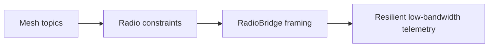

# 42-ADR-048 — RadioBridge for ELRS/LoRa Telemetry
*(Status: Proposed)*

**Author:** Codex
**Reviewers:** Nexus Architecture Guild
**Created:** 2025-10-20
**Last Updated:** 2025-10-20
**Status:** Proposed
**Version:** 0.1.0
**Supersedes:** _None_
**Superseded by:** _None_
**Related SRS:** [42 — Transports](42_Transports.md)
**Related Considerations:** [C5 - Timebase & Telemetry Mesh Governance](42_Transports.md#c5---timebase--telemetry-mesh-governance)

---

## 1) Context

Rural deployments frequently rely on low-bandwidth radios (ELRS, LoRa) for inter-machine communication. These transports require
binary framing, retransmission policies, and bandwidth shaping tuned to agricultural operations. The Live Telemetry Mesh (ADR-047)
needs a bridge that adapts mesh topics to radio-friendly frames with predictable latency and resilience.【F:docs/SRS/sections/4X_Interprocess_Communications/42_Transports.md†L205-L229】

---

## 2) Decision

Implement a RadioBridge module encapsulating binary framing, encryption, acknowledgement, and replay rules for ELRS/LoRa links.
The bridge exposes a pluggable transport interface so additional radio stacks can be supported without changing mesh semantics.

### Decision Summary

* **Scope:** Radio adaptation of mesh topics including presence, coverage, trails, and alerts.
* **Boundary:** Mesh service semantics defined in ADR-047; this ADR focuses on radio framing and reliability.
* **Implementation Level:** Design + code; radio drivers, framing layer, telemetry counters, and configuration tooling.

---

## 3) Consequences

**Positive Impacts:**

* Provides deterministic behavior for low-bandwidth collaboration while remaining extensible to future radios.
* Integrates encryption, acknowledgements, and replay windows tuned for rural conditions.
* Surfaces telemetry counters (latency, retries, drop rate) for operator diagnostics.

**Negative / Mitigated Impacts:**

* Requires provisioning workflows for keys and topic registries — mitigated by manifest governance and tooling.
* Adds configuration complexity — addressed via UI guidance and automation.
* Selective repeat and FEC introduce processing overhead — balanced by configurable profiles.

**Follow-up Actions:**

* Maintain topic ID registries in manifest bundles with signed diffs and replay fixtures.
* Publish compatibility manifests listing supported firmware revisions and handshake features.
* Document quarterly key rotation rehearsals with telemetry evidence of successful rollover.

---

## 4) Rationale

RadioBridge’s framing layer (`version`, `topicHash`, `payloadType`, `sequence`, `ackId`) plus CRC and compression enables reliable
transfer on constrained links. Selective-repeat ARQ with adaptive resend intervals and optional FEC maintains continuity, while
AES-CCM encryption and ACLs protect sensitive data.

---

## 5) Alternatives Considered

| Option | Summary | Reason Not Selected |
|--------|---------|---------------------|
| TCP over cellular modems | Use cellular networks for inter-machine telemetry. | Unreliable coverage, higher operating cost. |
| UDP broadcast without bridge | Broadcast mesh topics raw over radios. | Lacks retransmission, encryption, and bandwidth governance. |
| Third-party industrial radio stack | Adopt proprietary telemetry platforms. | Locks Nexus into vendor ecosystems and limits extensibility. |

