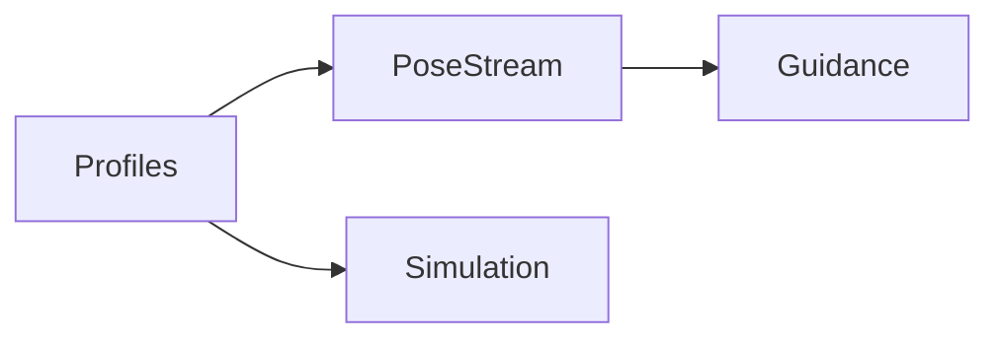

# 61-ADR-017 — Equipment Profiles and Kinematics

*(Status: Proposed)*

**Author:** Codex
**Reviewers:** Guidance & Kinematics Working Group
**Created:** 2025-10-20
**Last Updated:** 2025-10-20
**Status:** Proposed
**Version:** 0.1.0
**Supersedes:** —
**Superseded by:** —
**Related SRS:** `61_Kinematics_Pose_Fusion.md`
**Related Options:** `61-O2`, `61-O3`

---

## 1) Context

Accurate guidance and control require kinematic models that describe tractor, implement,
and hitch behavior. Legacy profiles provide limited geometry, yielding inconsistent
PoseStream projections and autosteer hand-offs. This ADR defines profile schemas,
kinematic models, and sensor fusion expectations so guidance, hierarchy, and control
share a consistent foundation.【F:docs/SRS/sections/6X_Core_Domain_Services/61-ADR-017 - Equipment profiles and kinematics.md†L9-L21】

---

## 2) Decision

Establish profile schemas capturing hitch linkages, attachment points, toolbar placement,
and sensor locations for multi-steer rigs. Provide kinematic models and simulation utilities
translating PoseStream inputs into steering commands and lookahead points. Define fusion
strategies for multiple pose sources (IMU, GNSS, implement sensors) with convergence
expectations and oscillation limits. Deliver an operator-facing profile editor with
validation logic and deterministic JSON exports.【F:docs/SRS/sections/6X_Core_Domain_Services/61-ADR-017 - Equipment profiles and kinematics.md†L12-L24】

### Decision Summary

* **Scope:** Equipment profile schemas, kinematic simulation utilities, sensor fusion contracts.
* **Boundary:** Does not dictate hardware-specific calibration tooling; focuses on schema and runtime contracts.
* **Implementation Level:** Design + tooling deliverables for profile authoring and validation.

---

## 3) Consequences

**Positive Impacts:**

* Guidance planner and control systems gain reliable geometry, improving accuracy and stability.
* Detailed profiles enable richer simulation, diagnostics, and analytics.
* Session snapshots reference applied profiles, providing provenance for replay and profit analytics.【F:docs/SRS/sections/6X_Core_Domain_Services/61-ADR-017 - Equipment profiles and kinematics.md†L24-L37】

**Negative / Mitigated Impacts:**

* Maintaining detailed profiles increases setup effort — mitigated by guided editors and presets.
* Sensor fusion complexity demands regression fixtures — mitigated through correlation testing with hardware logs.

**Follow-up Actions:**

* Emit calibration bundles (raw logs, solved parameters, notes) alongside profile versions.
* Compare simulation outputs against hardware logs per profile update; block release on drift beyond tolerance.
* Track profile lifecycle with effective dates and deprecation notices.

---

## 4) Rationale

Unified profiles ensure PoseStream, guidance, and control share identical geometry assumptions.
Alternatives relying on sparse metadata could not deliver deterministic autosteer hand-offs
or reproducible replay across rigs.

---

## 5) Alternatives Considered

| Option | Summary | Reason Not Selected |
|--------|---------|---------------------|
| Legacy minimal profiles | Retain existing limited geometry data. | Inconsistent pose projections and autosteer errors. |
| Plugin-specific models | Allow each plugin to define geometry. | Breaks cross-service consistency and complicates maintenance. |
| Manual-only calibration logs | Skip structured schemas. | Impossible to automate validation or share across crews. |

---

## 6) Implementation Notes

* Profile editor enforces attachment constraints and exports deterministic JSON validated via schema tests.
* Calibration sessions produce signed bundles stored with profile versions.
* Device Manager surfaces session-linked profile history for operator review.
* Telemetry mesh broadcasts profile hashes so collaborating rigs confirm compatibility before exchanging coverage.

---

## 7) Verification

* Kinematic simulations track hitch articulation within ≤ 2 cm error over 100 m paths versus motion-capture baselines.
* Multi-steer fusion converges within five cycles after switching pose sources while avoiding > 1° yaw oscillations.
* Profile editor unit tests validate deterministic export and schema conformance.【F:docs/SRS/sections/6X_Core_Domain_Services/61-ADR-017 - Equipment profiles and kinematics.md†L39-L48】

---

## 8) References

* [Interprocess API requirements](../4X_Interprocess_Communications/41_Inter_Application_API.md)
* [Control & automation requirements](61_Kinematics_Pose_Fusion.md)
* [ADR-008 — Equipment hierarchy](61-ADR-008%20-%20Equipment%20Implement%20Toolbar%20Section%20hierarchy.md)
* [ADR-033 — Guidance planner and autosteer orchestration](../6X_Core_Domain_Services/61-ADR-033%20-%20Guidance%20planner%20and%20autosteer%20orchestration.md)
