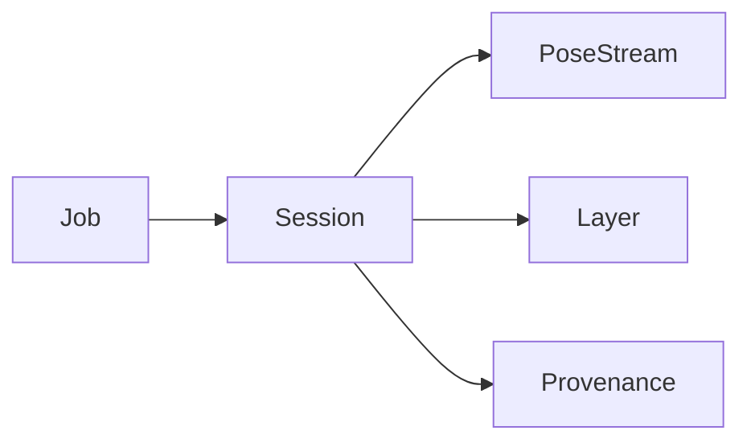

# 62-ADR-023 — Session and Job Model with Provenance Graph

*(Status: Proposed)*

**Author:** Codex
**Reviewers:** Lifecycle & Provenance Working Group
**Created:** 2025-10-20
**Last Updated:** 2025-10-20
**Status:** Proposed
**Version:** 0.1.0
**Supersedes:** —
**Superseded by:** —
**Related SRS:** `62_Job_Lifecycle.md`
**Related Options:** `62-O2`, `62-O3`

---

## 1) Context

Nexus must relate jobs, sessions, PoseStreams, and derived artifacts so provenance and lifecycle
services operate consistently. Legacy flows treated sessions as ad-hoc folders without stable
identifiers, hindering provenance and automation. This ADR defines lifecycle semantics, identifiers,
and graph relationships tying jobs, equipment snapshots, PoseStreams, and derived outputs together.【F:docs/SRS/sections/6X_Core_Domain_Services/62-ADR-023 - Session and job model with provenance graph.md†L9-L20】

---

## 2) Decision

Establish session lifecycle phases (create, resume, switch, close) with deterministic identifiers and
state transitions tied to JobsService. Capture equipment and profile snapshots for each session,
ensuring compatibility with kinematics ADRs. Define how PoseStreams, layers, and derived artifacts
attach to sessions within the provenance graph shared with ADR-019. Provide APIs, storage schemas, and
UI hooks for managing sessions, including integrity checks preventing orphaned references.【F:docs/SRS/sections/6X_Core_Domain_Services/62-ADR-023 - Session and job model with provenance graph.md†L20-L30】

### Decision Summary

* **Scope:** Session lifecycle orchestration, provenance graph modeling, snapshot storage.
* **Boundary:** Does not dictate UI layout beyond session awareness or analytics algorithms.
* **Implementation Level:** Design + service contracts and storage schema definitions.

---

## 3) Consequences

**Positive Impacts:**

* Provenance and analytics systems traverse session graphs to understand context, improving auditability.
* Deterministic sessions enable resume flows and multi-stream management across plugins.
* Crop and genetics metadata attaches directly to sessions for analytics alignment.【F:docs/SRS/sections/6X_Core_Domain_Services/62-ADR-023 - Session and job model with provenance graph.md†L30-L43】

**Negative / Mitigated Impacts:**

* Session orchestration adds coordination overhead — mitigated by transactional journaling and CLI repair tools.
* UI must surface session awareness — mitigated by shared component library updates.

**Follow-up Actions:**

* Implement two-phase commit journaling between session state and storage backends with crash recovery.
* Ship consistency tooling that scans provenance graphs for orphaned edges and guides repairs.
* Publish operational playbooks delivering monthly drift and reconciliation reports.

---

## 4) Rationale

A structured session model provides reproducibility, enables automation gating, and aligns provenance.
Alternatives that rely on loose folders cannot guarantee referential integrity or deterministic resume
behavior.

---

## 5) Alternatives Considered

| Option | Summary | Reason Not Selected |
|--------|---------|---------------------|
| Legacy folder model | Continue storing session artifacts without IDs. | Fails provenance and resume requirements. |
| Per-plugin session handling | Let each plugin track sessions independently. | Breaks consistency and introduces conflicts. |
| Immutable job-only history | Avoid session entities. | Loses multi-session context and real-time telemetry alignment. |

---

## 6) Implementation Notes

* Normalize terminology to “Session” across Core, UI, telemetry, and documentation.
* Record crop type and genetics references within session metadata for analytics alignment.
* Propagate multi-field job envelopes into session records for per-field rollups.

---

## 7) Verification

* Lifecycle tests demonstrate create/resume/switch flows maintaining referential integrity without orphaned references.
* Snapshot storage persists equipment state with < 500 ms serialization latency and ≤ 5% overhead versus raw configs.
* Provenance graph builder emits DAGs validated against schema, rejecting cycles and invalid attachments in integration tests.【F:docs/SRS/sections/6X_Core_Domain_Services/62-ADR-023 - Session and job model with provenance graph.md†L45-L55】

---

## 8) References

* [System decomposition boundaries](../2X_System_Architecture/21_System_Decomposition_Boundaries.md)
* [Persistence formats](../3X_Data_Storage/32_Persistence_Formats.md)
* [Control & automation requirements](../6X_Core_Domain_Services/61_Kinematics_Pose_Fusion.md)
* [ADR-019 — Provenance, audit, and QA governance](64-ADR-019%20-%20Provenance%20audit%20and%20QA%20governance.md)
* [ADR-030 — Field job sessions and lifecycle services](62-ADR-030%20-%20Field%20job%20sessions%20and%20lifecycle%20services.md)
