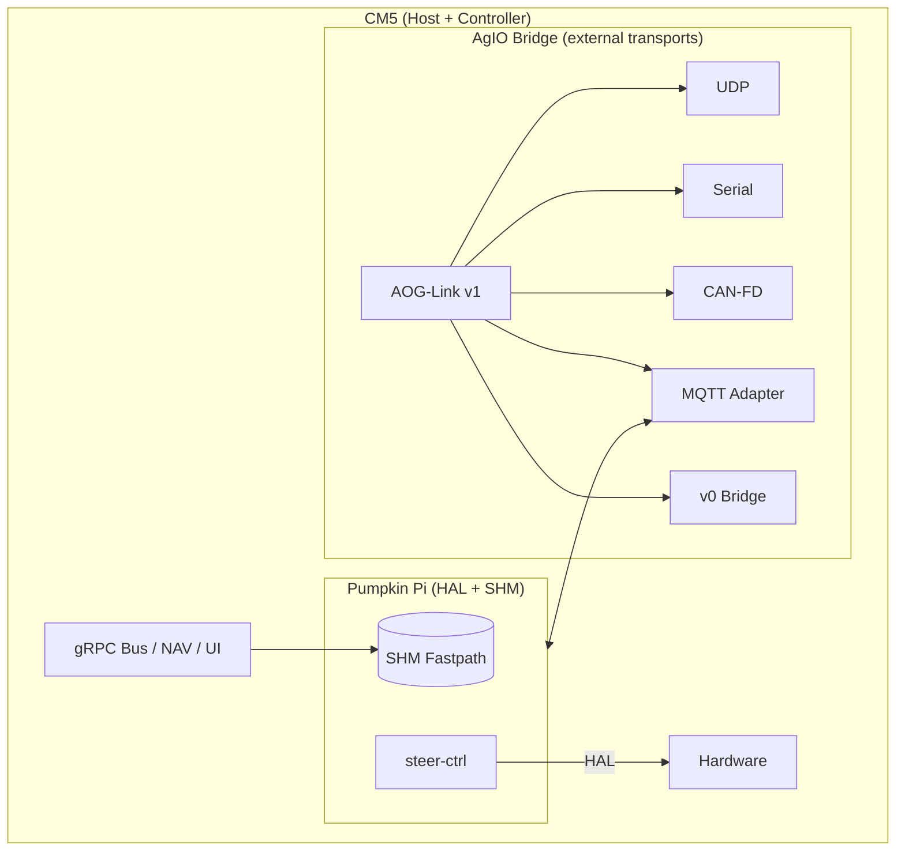

# Bridge Topology with Pumpkin Pi Fastpath

Pumpkin Pi introduces a CM5-local control loop while keeping AgIO Bridge available for legacy or external modules.

Key behaviors:
- SHM fastpath handles NAV ⇄ steer-ctrl setpoints under 5 ms p95.
- AgIO Bridge still mirrors MQTT retained topics for UI and observers.
- External transports continue to route through AgIO to preserve arbitration and compatibility.
