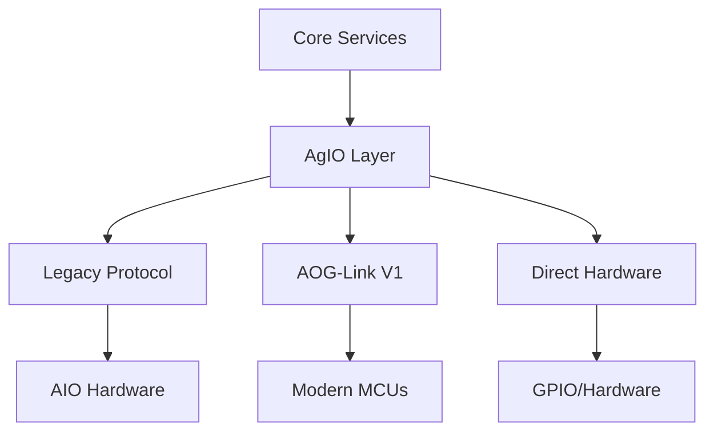

# Hardware Integration Patterns

This document outlines the hardware integration patterns used in Nexus, mapping directly to the requirements specified in the [OS Support Requirements](../development/SRS/sections/1X_Platform_Foundations/11_OS_Support.md) and implemented through [ADR-006: AOG-Link MCU Communications](../development/SRS/sections/4X_Interprocess_Communications/42-ADR-006 - MCU communications over AOG-Link (nanopb).md).

## Integration Models

### 1. CM5/Pi5 Direct Integration
As defined in [ADR-001](../development/SRS/sections/1X_Platform_Foundations/11-ADR-001 - Adopt .NET 8 C stack for Nexus runtime.md), the CM5/Pi5 deployment model enables:
- Direct GPIO control for steering and sections
- Native serial/CAN communication
- Hardware-accelerated display support
- Single-board solution for complete system

### 2. Legacy AIO Compatibility
Maintains compatibility with existing hardware through:
- USB serial connections
- Ethernet/UDP communication
- Legacy PGN protocol support
See [ADR-002: gRPC Contracts](../development/SRS/sections/4X_Interprocess_Communications/41-ADR-002 - Expose Nexus services over gRPC protobuf contracts.md) for protocol details.

### 3. Hybrid Deployments
Supports mixed hardware configurations:
- Remote section controllers
- Distributed sensor networks
- ISOBUS integration
- MQTT/MQTT-SN connectivity

## Hardware Abstraction



## Protocol Support

| Protocol | Transport | Use Case | Documentation |
|----------|-----------|-----------|---------------|
| PGN V0 | UDP | Legacy AIO | [Legacy PGN baseline](../development/SRS/references/AgIO_PGN_Baseline.md) |
| AOG-Link V1 | Serial/CAN | Modern MCUs | [AOG-Link bridge architecture](../AgIO/aog-link-bridge-architecture-guide.md) |
| MQTT-SN | Network | Remote Devices | [Bridge workflow knowledge base](../AgIO/bridging-workflow-knowledge-base.md) |

## Configuration Examples

### CM5 Direct Control
```json
{
  "hardware": {
    "type": "cm5-direct",
    "interfaces": {
      "steering": "gpio",
      "sections": "gpio",
      "sensors": "i2c"
    }
  }
}
```

### Legacy AIO
```json
{
  "hardware": {
    "type": "aio-legacy",
    "connection": {
      "type": "serial",
      "port": "COM3",
      "baud": 38400
    }
  }
}
```

## Safety Considerations

1. **Fail-Safe Defaults**
   - All outputs default to safe state
   - Watchdog timers on critical systems
   - Automatic disengagement on errors

2. **Connection Management**
   - Heartbeat monitoring
   - Connection loss handling
   - Graceful degradation

3. **Physical Safety**
   - Emergency stop integration
   - Mechanical overrides
   - Operator presence detection

## Performance Requirements

As specified in [Threading, Scheduling & Timing requirements](../development/SRS/sections/2X_System_Architecture/23_Threading_Scheduling_Timing.md):

- Maximum latency: 100ms
- Minimum update rate: 10Hz
- Reliability: 99.99% uptime

## Related Documentation

- [OS Support Requirements](../development/SRS/sections/1X_Platform_Foundations/11_OS_Support.md)
- [Communications Requirements](../development/SRS/sections/4X_Interprocess_Communications/42_Transports.md)
- [ADR-006: AOG-Link Protocol](../development/SRS/sections/4X_Interprocess_Communications/42-ADR-006 - MCU communications over AOG-Link (nanopb).md)
- [AgIO transport rollout](../AgIO/aog-link-transport-rollout.md)
- [Hardware platform overview](../development/SRS/references/AgOpenGPS_Hardware_Platforms.md)
