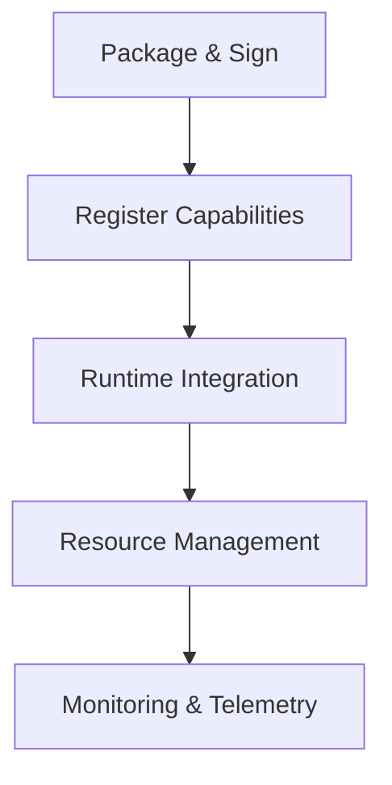
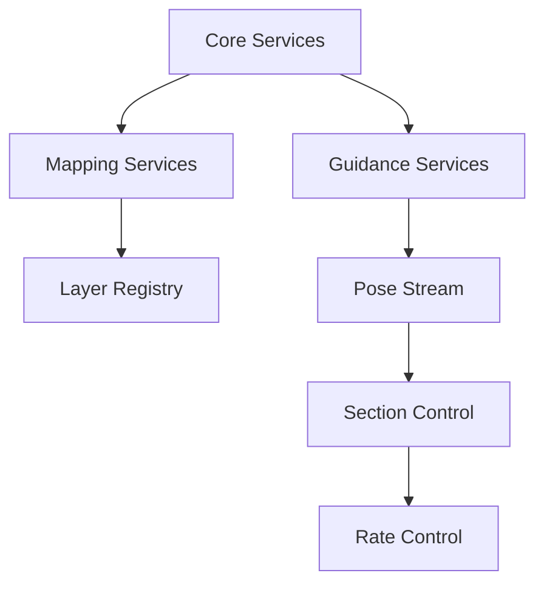

# Plugin System Overview

The Nexus plugin system enables extensible functionality while maintaining security, stability, and performance. This document provides a high-level overview of the plugin architecture.

## Key Concepts

### Plugin Architecture
- **Contract-First Design**: All plugins communicate through well-defined gRPC contracts
- **Capability-Based Security**: Plugins declare required permissions in manifests
- **Deterministic Execution**: Support for replay and automated testing
- **Resource Management**: Performance budgets and isolation

### Core Plugin Types
1. **Guidance & Control**
   - AutoSteer
   - Section Control
   - Rate Control
2. **Data & Analytics**
   - Mapping
   - Telemetry
   - Reporting
3. **Hardware Integration**
   - ISOBUS
   - Device Management
   - Custom Hardware

## Plugin Lifecycle

## Development Guide

### Quick Start
1. [Setting Up the Development Environment](../development/setup.md)
2. [Creating Your First Plugin](../plugins/tutorials/first-plugin.md)
3. [Testing and Validation](../plugins/tutorials/testing.md)

### Key Resources
- [Plugin Manifest Reference](../reference/plugin-manifest.md)
- [Security Guidelines](../plugins/security.md)
- [Performance Budgets](../plugins/performance.md)
- [Deployment Guide](../plugins/deployment.md)

## Plugin Dependencies

The following diagram shows how different plugin types interact:

## Related Documentation
- [ADR-018: Plugin API Architecture](../ADR/ADR-018-plugin-api.md)
- [Plugin Contribution Guide](../CONTRIBUTING-PLUGINS.md)
- [Layer Registry Guide](../plugins/layer-registry.md)
- [Performance Guidelines](../reference/performance.md)