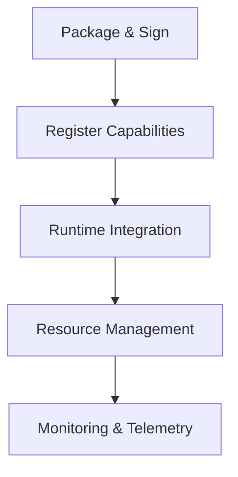
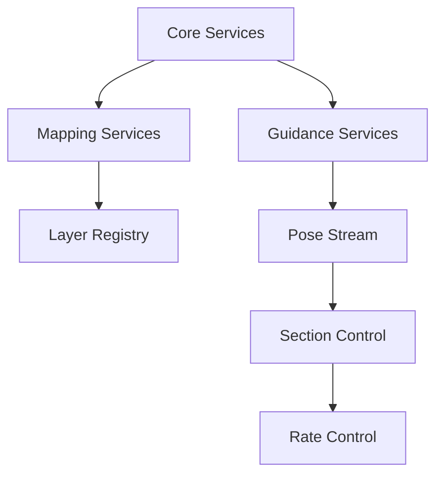

# Plugin System Overview

The Nexus plugin system enables extensible functionality while maintaining security, stability, and performance. This document provides a high-level overview of the plugin architecture.

## Key Concepts

### Plugin Architecture
- **Zip Packages**: Plugins are distributed as zip archives containing `manifest.json`, managed assemblies, and optional assets. See the [Zip Plugin Architecture](../plugins/architecture.md) for the authoritative contract.
- **Contract-First Design**: All plugins communicate through protobuf/gRPC contracts shipped with the Nexus SDK.
- **Capability-Based Security**: Plugins declare leases, permissions, and dependency requirements in the manifest so the host can enforce policy before activation.
- **Deterministic Execution**: Simulation and replay harnesses guarantee deterministic outcomes for automated testing.
- **Resource Management**: Plugins operate inside collectible `AssemblyLoadContext` instances to enforce isolation and support live enable/disable flows.

### Core Plugin Bands
1. **Guidance & Control** – AutoSteer, Section Control, Rate Control.
2. **Data & Analytics** – Mapping, Telemetry Logging, Crop/Coverage analytics.
3. **Hardware Integration** – ISOBUS Bridge, Device Manager, AgIO sidecars.
4. **Operational Workflows** – Job Tasks, File IO, Compatibility Evaluator.

## Plugin Lifecycle

## Development Guide

### Quick Start
1. [Setting Up the Development Environment](../development/setup.md)
2. [Creating Your First Plugin](../plugins/tutorials/first-plugin.md)
3. [Testing and Validation](../plugins/tutorials/testing.md)
4. [Packaging & Distribution](../plugins/architecture.md#packaging-checklist)

### Key Resources
- [Zip Plugin Architecture](../plugins/architecture.md)
- [Core Integration Guide](../../Nexus SourceCode/src/Aog.Core/PLUGINS.md)
- [UI Integration Guide](../../Nexus SourceCode/src/Aog.UI.Avalonia/PLUGINS.md)
- [Official Plugin Cards](../plugins/official/README.md)
- [Plugin Manifest Reference](../reference/plugin-manifest.md)
- [Security Guidelines](../plugins/security.md)
- [Performance Budgets](../plugins/performance.md)

## Plugin Dependencies

The following diagram shows how different plugin types interact:

## Related Documentation
- [Zip Plugin Architecture ADR (forthcoming)](../ADR/)
- [Plugin Contribution Guide](../CONTRIBUTING-PLUGINS.md)
- [Layer Registry Guide](../plugins/layer-registry.md)
- [Performance Guidelines](../reference/performance.md)
- [Official Plugin Cards](../plugins/official/README.md)
