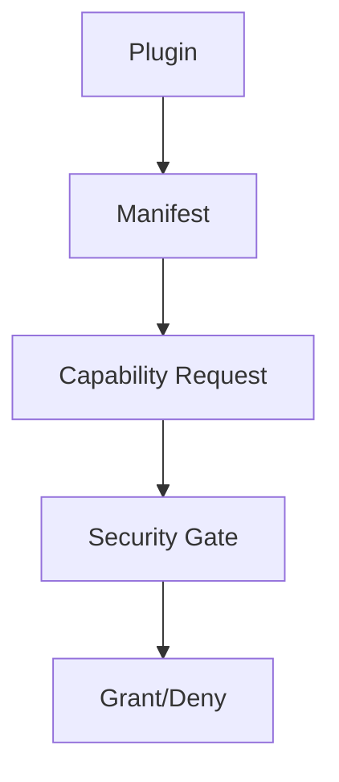

# Security Model

This document outlines Nexus's security architecture and implementation, following the requirements specified in our [Security & Permissions requirements](../SRS/sections/9X/95_Security_Permissions.md).

## Core Security Principles

### 1. Capability-Based Access
As defined in [ADR-018: Plugin API](../ADR/ADR-018-plugin-api.md):



### 2. Hardware Control Safety
Following [ADR-024: Discovery & Identity](../ADR/ADR-024-discovery-identity.md):

- Authenticated device identity
- Signed command validation
- Watchdog monitoring
- Fail-safe defaults

## Permission Model

### Capability Types
1. **Hardware Control**
   - `steering.command`
   - `section.control`
   - `rate.control`
   
2. **Data Access**
   - `pose.read`
   - `map.write`
   - `telemetry.collect`

3. **Configuration**
   - `settings.read`
   - `settings.write`
   - `plugin.manage`

### Permission Levels

| Level | Description | Use Case |
|-------|-------------|----------|
| Monitor | Read-only access | Remote viewing |
| Operate | Basic controls | Normal operation |
| Configure | System settings | Setup/calibration |
| Manage | Full system access | Administration |

## Authentication & Authorization

### Local Access
- Role-based access control
- Hardware security keys
- Operating system integration

### Remote Access
- Certificate-based authentication
- OAuth 2.0 / OpenID Connect
- Session management

## Data Protection

### Storage Security
- Encrypted configuration
- Secure credential storage
- Protected memory regions

### Communication Security
- TLS for all network traffic
- Signed messages
- Secure boot sequence

## Audit & Monitoring

### Logging
As specified in [ADR-019: Provenance & Audit](../ADR/ADR-019-provenance-audit-qa.md):
- Security events
- Access attempts
- Configuration changes
- Hardware commands

### Alerting
- Security violations
- Authentication failures
- Hardware anomalies
- System integrity issues

## Implementation Guidelines

### Plugin Security
```json
{
  "manifest": {
    "capabilities": {
      "required": [
        "pose.read",
        "map.write"
      ],
      "optional": [
        "telemetry.collect"
      ]
    },
    "security": {
      "signing": "required",
      "integrity": "verify"
    }
  }
}
```

### Hardware Security
```json
{
  "hardware": {
    "authentication": "required",
    "signing": "required",
    "watchdog": {
      "timeout": "1000ms",
      "action": "safe_stop"
    }
  }
}
```

## Security Testing

1. **Automated Testing**
   - Penetration testing
   - Fuzzing
   - Vulnerability scanning
   - Compliance checks

2. **Manual Review**
   - Code review
   - Configuration audit
   - Hardware testing
   - Incident response

## Related Documentation

- [Security & Permissions requirements](../SRS/sections/9X/95_Security_Permissions.md)
- [Plugin Security Guide](../plugins/security.md)
- [Hardware Security](../deployment/security.md)
- [Security Compliance](../reference/security-compliance.md)