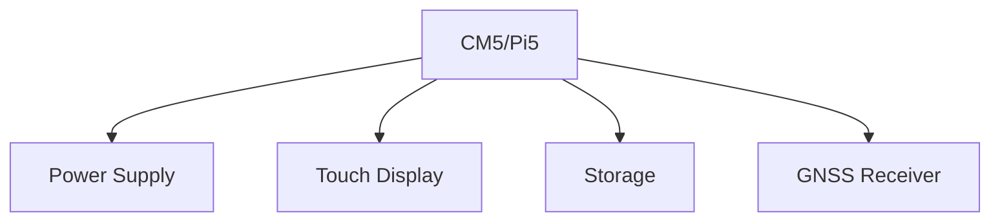

# CM5/Pi5 Quick Start Guide

This guide walks through setting up a Compute Module 5 or Raspberry Pi 5 deployment of Nexus. For detailed hardware requirements, see [OS Support Requirements](../../SRS/sections/1X/11_OS_Support.md).

## Hardware Requirements

### Core Components
- Raspberry Pi CM5/Pi 5
- Power supply (12-24V vehicle input)
- 7" or 10" DSI/HDMI touch display
- GNSS receiver (supported models below)
- Storage (minimum 32GB)

### Optional Components
- CAN interface
- Additional serial ports
- GPIO expansion board
- Cellular modem

## Assembly Guide

### 1. Base Assembly


### 2. Interface Connections
Following [ADR-006: AOG-Link MCU](../../ADR/ADR-006-aog-link-mcu-communications.md):

| Interface | Connection | Usage |
|-----------|------------|--------|
| UART0 | GNSS | Position data |
| UART1 | Rate control | Product flow |
| SPI0 | Section control | Output control |
| I2C1 | Sensors | Environmental data |
| CAN | ISOBUS | Equipment control |

## Software Installation

### 1. Base System
```bash
# Flash official Raspberry Pi OS
rpi-imager --cli nexus-cm5-image.img

# First boot configuration
sudo nexus-config --initial
```

### 2. Nexus Stack
```bash
# Install Nexus components
sudo nexus-install --deployment=cm5

# Configure hardware
sudo nexus-config --hardware
```

### 3. Plugin Selection
```bash
# Install core plugins
nexus-plugin install autosteer
nexus-plugin install section-control
nexus-plugin install rate-control
```

## Configuration

### 1. Hardware Setup
```json
{
  "hardware": {
    "gnss": {
      "port": "/dev/ttyAMA0",
      "baud": 115200
    },
    "steering": {
      "interface": "gpio",
      "pins": {
        "enable": 18,
        "direction": 23,
        "pulse": 24
      }
    }
  }
}
```

### 2. Vehicle Configuration
See [Vehicle Setup Guide](../../user/configuration/vehicle.md) for detailed steps.

## Testing & Validation

### 1. Hardware Tests
```bash
# Test GPIO
nexus-test gpio

# Test serial ports
nexus-test serial

# Test CAN bus
nexus-test can
```

### 2. System Tests
```bash
# Run system checks
nexus-test system

# Validate plugins
nexus-test plugins
```

## Troubleshooting

### Common Issues
1. **Display Issues**
   - Check DSI/HDMI connection
   - Verify touch calibration
   - Update video drivers

2. **GNSS Problems**
   - Verify port settings
   - Check antenna connection
   - Validate NMEA data

3. **Performance Issues**
   - Check CPU temperature
   - Monitor memory usage
   - Verify storage speed

### Diagnostics
```bash
# System diagnostics
nexus-diag system

# Hardware diagnostics
nexus-diag hardware

# Generate report
nexus-diag report
```

## Performance Optimization

As specified in [ADR-026: Performance Budgets](../../ADR/ADR-026-performance-budgets.md):

1. **CPU Settings**
   - Governor: performance
   - Frequency: 2.4GHz
   - Temperature limit: 80°C

2. **Memory Configuration**
   - GPU memory: 128MB
   - Swap: 2GB
   - CMA: 256MB

## Safety Considerations

1. **Physical Safety**
   - Proper enclosure ventilation
   - Surge protection
   - Backup power system

2. **Data Safety**
   - Regular backups
   - Redundant storage
   - Failure recovery

## Related Documentation

- [Hardware Requirements](../../SRS/sections/1X/11_OS_Support.md)
- [Threading, Scheduling & Timing requirements](../../SRS/sections/2X/23_Threading_Scheduling_Timing.md)
- [Safety Guidelines](../../user/safety/INDEX.md)
- [Maintenance Guide](../../user/maintenance/cm5.md)