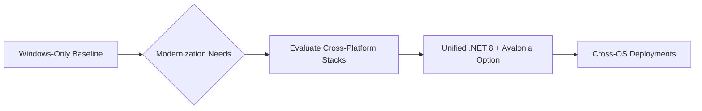
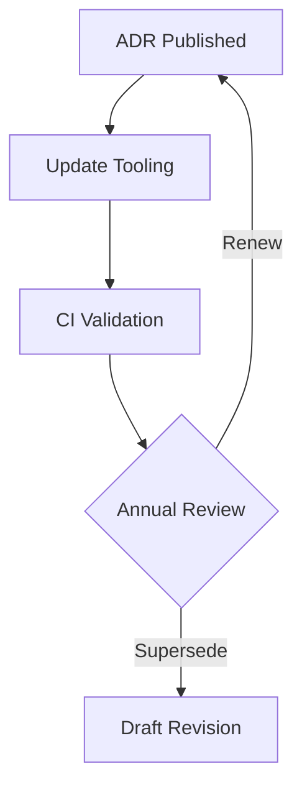

# 11-ADR-001 — Adopt Unified .NET 8 Runtime & Avalonia Stack

*(Status: Accepted — 2025-10-20)*

**Authors:** Codex  
**Reviewers:** Platform Foundations Working Group  
**Created:** 2025-10-20  
**Last Updated:** 2025-10-20  
**Supersedes:** —  
**Superseded by:** —  
**Related SRS:** `11_OS_Support.md`  
**Related Options:** `11-O1_Unified_DotNet8_Avalonia.md`

---

## 1) Context

Legacy AgOpenGPS deployments ship Windows-only binaries using WinForms and vendor-specific drivers.
Community pilots demonstrate the need for Linux headless services, remote clients, and mobile companions.
Nexus therefore needs a unified language and runtime that spans the Core guidance engine, AgIO backends, plugins, simulation, and the desktop UI so Windows and Linux releases land together.【F:docs/development/SRS/sections/1X_Platform_Foundations/11_OS_Support.md†L4-L63】【F:docs/development/SRS/sections/1X_Platform_Foundations/11-O1_Unified_DotNet8_Avalonia.md†L1-L47】
Evaluated options considered keeping the Windows baseline, rewriting in native toolkits, or adopting a unified .NET stack with Avalonia UI and gRPC contracts.

Inputs include SRS Section 11 requirements, Linux Core pilot feedback, ADR-003 (Avalonia UI) research, and community sentiment favouring shared tooling across Windows x64 and Linux ARM64 without abandoning existing operators.【F:docs/development/SRS/sections/1X_Platform_Foundations/11_OS_Support.md†L57-L63】

---

## 2) Decision

Standardize the Nexus runtime on .NET 8 with Avalonia UI and managed AgIO backends for Windows and Linux deployments.
This decision covers desktop UI shells, AgIO hardware hosts, and shared plugin/runtime contracts, ensuring every first-party component (Core, AgIO, plugins, simulation, and UI) targets the same runtime and SDK.

**Executive recap:** One runtime, one toolchain, so releases land together and new contributors install a single SDK.

### Decision Summary

- **Scope:** Core runtime, AgIO, UI shells, plugin manifests, and deployment tooling.
- **Boundary:** Hardware protocol semantics remain governed by respective subsystem ADRs.
- **Implementation Level:** Architecture + tooling policy; drives code and packaging workstreams.

---

## 3) Consequences

**Positive Impacts:**

- Enables dual-first Windows and Linux releases with consistent tooling.
- Reduces maintenance duplication by sharing contracts and runtime across components.
- Unlocks remote companion clients through shared gRPC APIs.
- Simplifies cross-platform CI by focusing on .NET 8 builds for Windows x64 and Linux (x64/ARM64).
- Enables shared simulation and plugin infrastructure without bridging multiple runtimes.

**Negative / Mitigated Impacts:**

- Requires investment in Linux packaging, CI, and GPU optimization — mitigated via dedicated validation plan.
- Demands Avalonia expertise — mitigated through training and pilot projects.
- Requires coordinated upgrades when the .NET LTS cycle advances; mitigated via scheduled ADR reviews and compatibility scorecards.
- Demands discipline when wrapping native SDKs; addressed by confining them to AgIO backends.

**Operator-Facing Pros & Cons:**

| What improves | What stays hard |
|---------------|-----------------|
| Single installer flow for Windows and Linux releases. | Native driver shims still require platform-specific testing. |
| Plugin authors compile once and run anywhere we support. | Contributors must coordinate when Microsoft ships new LTS releases. |
| Simulation tooling and diagnostics reuse the same runtime. | Legacy-only hardware may need extra wrappers before it works cross-platform. |

**What could go wrong — and how we explain it:**

- **Linux GPU stack regresses:** Operators might notice sluggish UI updates on Pi/CM5. Mitigation: keep Avalonia fallbacks ready and monitor benchmark dashboards weekly.
- **Vendor SDKs lag behind:** A CAN adapter without Linux drivers means Linux rigs lose functionality. Mitigation: run those adapters through AgIO shims so Windows keeps working while we lobby vendors or ship bridge services.
- **Runtime upgrade breaks plugins:** If .NET updates introduce incompatible JIT behavior, we freeze upgrades, repost the prior runtime bundle, and publish guidance in release notes so operators know which download to use.

**Follow-up Actions:**

- Implement validation roadmap defined in Option 11-O1 (CI lanes, performance benchmarks, device matrix).
- Update build pipelines (Section 14) to publish signed Windows and Linux artifacts.
- Draft support matrix for officially supported OS versions and hardware tiers.
- Scaffold the `Aog.Abstractions` package with generated protobuf contracts (NX-003).
- Define CI lanes that validate Windows and Linux builds for .NET 8 targets (NX-006).

---

## 4) Rationale

Decision matrix in SRS §11.12 shows 11-O1 scoring 4.15 vs. 2.85 for the legacy baseline, driven by maintainability and roadmap alignment.
Shared runtime simplifies plugin governance, matches contributor skill sets, and satisfies mobile/remote requirements.
Alternatives either block roadmap goals or require full rewrites in less familiar stacks.
Plain-language impact: Teams can keep helping operators even if a runtime upgrade misbehaves because the rollback plan keeps the previous .NET bundle ready.

---

## 5) Alternatives Considered

| Option | Summary | Reason Not Selected |
|--------|---------|---------------------|
| Legacy Windows baseline | Retain WinForms only with no cross-platform plan. | Fails Linux/mobile goals; accumulates tech debt. |
| Qt/C++ rewrite | Native cross-platform UI. | High rewrite cost, splits language/tooling expertise. |
| Electron/Web UI | Web technologies for desktop. | Hardware access latency and GPU constraints unacceptable. |

---

## 6) Implementation & Governance

- **Governance ownership:** Platform Foundations Working Group.
- **Update cadence:** Review annually or upon major .NET LTS release.
- **Documentation:** Maintain runtime version matrix, OS support tiers, and contract compatibility notes.

### Governance Updates

- **Supported runtime roster:** Nexus ships on .NET 8 through November 2026 with quarterly compatibility snapshots. Engineering pre-bakes manifests for the next LTS (currently .NET 10 preview) and publishes a readiness scorecard each June covering Core, AgIO, plugins, and tooling. A go/no-go decision is recorded 90 days before Microsoft GA so dependent teams can stage migrations without fire drills.
- **Compatibility smoke regimen:** QA owns an annual matrix that runs desktop, NativeAOT, and containerised builds across Windows x64, Linux x64/ARM64, and the supported SBC images. The February and August cycles gate feature freeze, while monthly spot checks ensure NuGet dependency drifts stay inside the signed roster.
- **Back-out playbook:** If a runtime uplift regresses hardware integrations, AgIO locks roll-forward, re-issues the prior runtime bundle, and coordinates with Plugin and Firmware owners to certify patched drivers within two weeks. Production rollbacks require communicating operator impact and re-running compatibility smokes before reopening the upgrade window.

---

## 7) Risks & Mitigations

| ID | Risk | Impact | Mitigation / Monitoring |
|----|------|--------|-------------------------|
| R1 | Linux GPU stack regressions | High | Maintain performance dashboards; optimize fallback render paths. |
| R2 | Vendor SDK licensing limits redistribution | Medium | Negotiate distribution rights, provide gRPC shims when necessary. |
| R3 | CI resource cost for dual OS builds | Medium | Leverage containerized build lanes; monitor pipeline duration. |
| R4 | Runtime upgrade breaks plugins | Medium | Publish rollback guidance, keep previous .NET bundles signed and available. |

---

## 8) Legacy Implementation Notes

- WinForms UI + Win32 drivers formed the operational baseline since AgOpenGPS 5.x.
- Early Linux experiments relied on community scripts without deterministic packaging.
- WPF shell prototypes improved UX but remained Windows-bound and are now retired, reinforcing the need for a new cross-platform UI investment.

### AgOpenGPS v6
- Windows remains the only supported runtime, with WinForms projects (and now-retired WPF experiments) compiled as Windows desktop executables, tying the stack to the .NET Framework toolchain and lacking cross-platform parity today.【F:docs/development/SRS/sections/1X_Platform_Foundations/11_OS_Support.md†L6-L13】【F:docs/development/SRS/sections/1X_Platform_Foundations/13_UI_Framework_UX.md†L6-L17】

### Legacy Dev Branch
- The community dev branch follows the same Windows-only WinForms approach, with the WPF work left as experimental branches, reflecting the status-quo option of incremental modernization without a shared cross-platform runtime or packaging story.【F:docs/development/SRS/sections/1X_Platform_Foundations/11_OS_Support.md†L6-L13】【F:docs/development/SRS/sections/1X_Platform_Foundations/13_UI_Framework_UX.md†L16-L29】

---

## 9) Governance Updates

- **Review frequency:** Annual; additionally upon .NET LTS announcements.
- **Decision owner:** Platform Foundations WG chair.
- **Compliance metrics:** Windows & Linux release artifacts published; validation plan executed each release.

---

## 10) References

- **SRS Sections:** `11_OS_Support.md` — §§11.5, 11.12
- **Option Documents:** `11-O1_Unified_DotNet8_Avalonia.md`
- **Prior ADRs:** `docs/development/SRS/sections/1X_Platform_Foundations/13-ADR-003 - Use Avalonia for the cross-platform Nexus UI shell.md`

---

## 11) Change Log

| Date | Change | Author | PR / Issue |
|------|--------|--------|------------|
| 2025-10-20 | Initial proposal aligning SRS Section 11 to new template. | Codex | #0000 |
| 2025-10-20 | Consolidated duplicate ADR content into unified record and captured governance regimen. | Codex | #0001 |

---

> **Lifecycle:** Proposed → Accepted → Superseded → Deprecated → Rejected  
> **Traceability:** Links to SRS Decision Matrix §11.12 and Option 11-O1.
