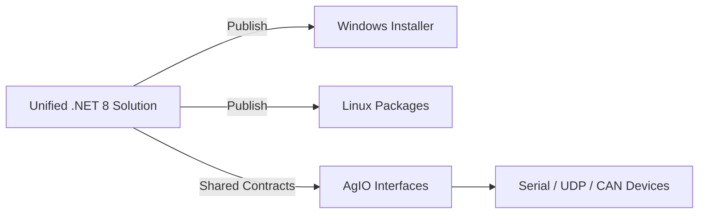

# 11-O1 — Unified Runtime for Section 11 OS Coverage

> **In plain terms:** Pick one managed runtime and toolkit so the Windows and
> Linux desktop builds stay in lockstep, and the OS support matrix in Section 11
> can be satisfied without parallel codebases.

*(Status: Proposed)*

**Option ID:** 11-O1  
**Section ID:** 11 — Operating System Support  
**Version:** 0.2.0  
**Authors:** Platform Foundations Working Group  
**Last Updated:** 2025-10-25  
**Related SRS:** `11_OS_Support.md`  
**Related ADRs:** `11-ADR-001 - Establish Windows and Linux Support Baseline.md`, `12-ADR-001 - Adopt .NET 8 LTS Runtime.md`, `13-ADR-001 - Use Avalonia for the Nexus Desktop UI Shell.md`

---

## 1) Summary

Section 11 demands a Windows baseline with a Linux build that stays feature
aligned. Option 11-O1 proposes standardising on .NET 8 with Avalonia UI and a
single AgIO abstraction so every OS build comes from the same codebase, the same
SDK, and the same packaging recipe. Success means operators download matching
Windows and Linux artifacts, run the same smoke tests, and see identical device
support tables.

---

## 2) Requirements Coverage

| Requirement | How 11-O1 satisfies it | Verification hook |
|-------------|------------------------|-------------------|
| **R-OS-000** — Windows build MUST ship | Build outputs a signed Windows installer from the unified solution. | Installer smoke + WinForms/Avalonia launch test |
| **R-OS-001** — AgIO parity across OSes | AgIO backends expose identical gRPC contracts; OS-specific drivers stay behind adapters. | Cross-OS loopback tests for serial/UDP/CAN |
| **R-OS-002** — Linux build SHOULD ship | Linux x64/ARM64 packages are compiled from the same solution with target-specific publish profiles. | Linux desktop parity checklist |
| **R-OS-003** — Signed installers/packages | Shared build pipeline signs MSI/EXE and deb/rpm artifacts during publish. | Release pipeline signature verification |
| **R-OS-004** — Performance guidance | Benchmarks run on each target OS using identical binaries and configuration presets. | Performance dashboard linked to release |

> **Traceability:** The option is scoped only to Section 11 outcomes. UI/UX
> policies, run modes, and build tooling details live in Sections 13 and 14.

---

## 3) Problem Statement & Goals

**Problem.** AgOpenGPS v6 proves we can ship Windows builds, but Linux parity is
hand-crafted and inconsistent. Section 11 elevates Linux desktop support and I/O
consistency to primary goals.

**Goals.**

- Produce Windows and Linux installers from one solution so parity work scales.
- Keep AgIO’s serial/UDP/CAN interfaces identical regardless of host OS.
- Publish a single support matrix that covers Windows x64 and Linux x64/ARM64.
- Document minimum hardware profiles using shared benchmark jobs.

**Non-goals.**

- Selecting mobile packaging or companion UX (covered elsewhere in the SRS).
- Redesigning AgIO transport semantics; focus stays on OS parity.
- Dictating build pipeline topology beyond what Section 11 needs for parity.

---

## 4) Approach Outline

1. **Runtime alignment.** Target .NET 8 LTS across all first-party executables
   (Core, AgIO, UI shell, plugins) so supported OSes share binaries and tooling
   in line with `12-ADR-001`.
2. **UI host reuse.** Use Avalonia as the desktop shell because it compiles for
   Windows, Linux, and future Android builds without forking the view models or
   rendering primitives. Section 13 details UX policy; this option simply
   records the runtime dependency and points to `13-ADR-001`.
3. **AgIO adapter strategy.** Keep hardware access behind AgIO interfaces that
   swap Windows-specific SDK bindings for Linux equivalents such as SocketCAN.
4. **Packaging templates.** Maintain publish profiles for Windows MSI/EXE and
   Linux deb/rpm/AppImage targets sourced from the same project files.
5. **Verification hooks.** Codify smoke scripts that exercise installation,
   AgIO loopback, and UI startup for each OS before releases are tagged.

---

## 5) OS Support Matrix

| Platform Tier | Windows | Linux |
|---------------|---------|-------|
| **Primary** | Windows 10/11 x64 desktop builds produced from the unified solution. | Ubuntu LTS x64 packages; Debian-based ARM64 images for CM5/Pi. |
| **Preview** | Windows NativeAOT investigations using the same projects. | Fedora/RHEL derivatives once tooling maturates; Android builds once Avalonia Android is production ready. |
| **Out of Scope** | Legacy .NET Framework builds. | Custom vendor-specific Linux distributions without glibc 2.31+. |

> **Note:** Mobile companion builds are handled by Section 13. They are not
> deliverables for Section 11 compliance but may benefit from the shared runtime.

---

## 6) Verification & Tooling

- **Installer smoke tests:** Scripted install/launch sequence per OS using the
  shared publish output.
- **AgIO loopback suite:** Serial, UDP, and CAN loopback tests executed on both
  Windows and Linux to confirm adapters behave identically.
- **Performance runs:** Benchmark workflow executed on reference hardware to
  collect FPS and telemetry latency statistics for the Section 11 report.
- **Support matrix publication:** Release notes include OS/architecture
  coverage, required dependencies, and known caveats sourced from one markdown
  template.

---

## 7) Risk Register

| ID | Risk | Impact | Mitigation |
|----|------|--------|------------|
| O1-R1 | Linux GPU driver variance lowers FPS. | Operators perceive Avalonia as sluggish. | Maintain benchmark dashboards; fall back to software rendering profiles when hardware is limited. |
| O1-R2 | Vendor CAN/GNSS SDKs lack Linux support. | Linux builds ship with reduced device coverage. | Prioritise SocketCAN shims and publish device support tiers in release notes. |
| O1-R3 | Tooling drift splits Windows and Linux pipelines. | Parity work doubles. | Keep build scripts in repo with shared publish profiles; gate releases on dual-OS smoke runs. |

---

## 8) Alternatives Considered

| Option | Summary | Why it does not meet Section 11 |
|--------|---------|---------------------------------|
| Retain Windows-only WinForms baseline | Keep shipping .NET Framework/WinForms artifacts only. | Fails R-OS-001 and R-OS-002 by skipping Linux packaging and AgIO parity work. |
| Forked Linux client | Maintain a Linux-specific UI/runtime while leaving Windows on .NET Framework. | Doubles maintenance cost and violates the single-matrix goal for Section 11. |
| Native C++/Qt rewrite | Rebuild desktop apps in Qt per platform. | Replaces existing C# investments and delays Section 11 compliance for multiple releases. |

---

## 9) Decision Readiness

- Outstanding research: finalise Linux distribution list and reference hardware.
- Dependencies: Section 12 runtime policy and Section 14 build tooling must
  publish aligned templates.
- Acceptance trigger: Section 11 decision matrix approves 11-O1 with evidence
  from parity pilots and release pipeline demonstrations.

