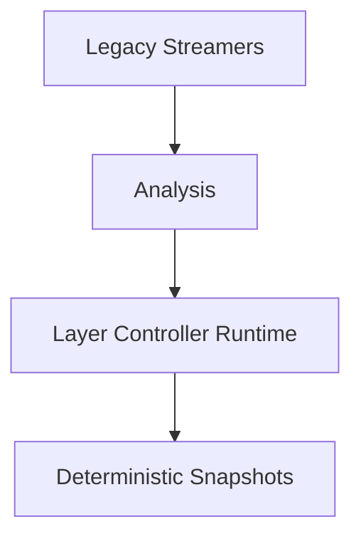
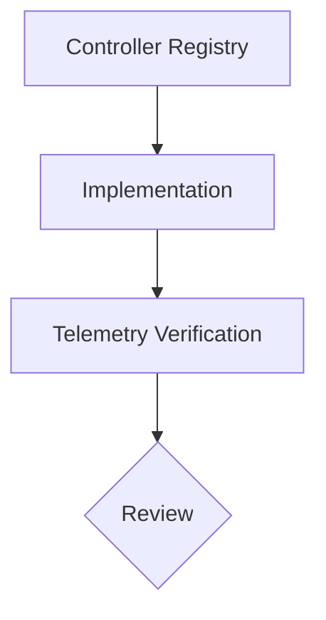

# 21-ADR-068 — Layer Controllers & Aggregation Runtime

*(Status: Accepted)*

**Authors:** @layer-wg
**Reviewers:** @nexus-specs, @mapping-guild
**Created:** 2025-05-17
**Last Updated:** 2025-02-14
**Supersedes:** —
**Superseded by:** —
**Related SRS:** `21_System_Decomposition_Boundaries.md`
**Related Considerations:** §21.9 (C1), §23.9 (C2)

---

## 1) Context

Layer controller modernization formalizes deterministic aggregation of sensor data, enabling richer telemetry, replay fidelity, and analytics without rewriting firmware.
Legacy streamers mixed ingestion, overlap math, and rendering, hindering testability and performance.
SRS §21 and §23 call for deterministic pipelines with explicit telemetry budgets, while §24 mandates configuration governance for controller registration.

---

## 2) Decision

Adopt layer controllers as the authoritative aggregation runtime within the Core service.

### Decision Summary

* **Scope:** Applies to Core mapping and section services plus plugin extension points that ingest field telemetry.
* **Boundary:** UI rendering logic and firmware sampling strategies remain out of scope.
* **Implementation Level:** Code + policy enforced in Core runtime libraries and plugin SDKs.

Controllers:

* Normalize raw samples into engineering, normalized, and quality metrics.
* Maintain rolling accumulators (sum, numerator/denominator, min/max) with deterministic emission cadence.
* Emit immutable snapshots consumed by mapping, telemetry, and storage pipelines.
* Register via dependency injection with schema-validated configuration.

---

## 3) Consequences

**Positive Impacts:**

* Enables deterministic replay comparisons for coverage math and rate control.【F:docs/sections/2X_System_Architecture/21_System_Decomposition_Boundaries.md†L1-L120】
* Provides richer telemetry (quality metrics, rateNA flags) to monitoring dashboards (§64).
* Simplifies plugin extensibility by centralizing aggregation logic.

**Negative / Mitigated Impacts:**

* Requires refactoring legacy streamers — mitigated through feature flag rollout and replay harness validation.
* Introduces additional memory usage — mitigated via buffer pooling and configuration caps.

**Follow-up Actions:**

* Implement controller interfaces and register baseline controllers (coverage, rate, alarms).
* Update replay CI to compare legacy vs controller outputs within ≤1% tolerance.
* Document configuration schema and diagnostics for operators.

---

## 4) Rationale

Controllers deliver deterministic aggregation aligned with modernization goals while avoiding microservice complexity.
Alternative approaches (scriptable aggregation, cloud offload) failed to meet determinism or offline requirements for field rigs.
Shared contracts across Windows/Linux ensure consistent behavior and replay fidelity.

---

## 5) Alternatives Considered

| Option | Summary | Reason Not Selected |
|--------|---------|---------------------|
| Maintain legacy streamers | Keep existing ingestion/rendering mix. | Difficult to test; lacks deterministic telemetry. |
| Cloud analytics pipeline | Offload aggregation to remote service. | Requires connectivity; increases latency. |
| Scriptable engine (Lua/Python) | Allow operator scripts to manage aggregation. | Safety/determinism risks; limited tooling. |

---

## 6) Implementation & Governance

* **Governance ownership:** Layer working group oversees controller contracts and telemetry expectations.
* **Update cadence:** Review quarterly or when new controller types introduced.
* **Documentation:** Maintain controller registry, configuration schema, and telemetry spec in SRS §21 and §24.

---

## 7) Risks & Mitigations

| ID | Risk | Impact | Mitigation / Monitoring |
|----|------|--------|-------------------------|
| R1 | Aggregation math regression. | High | Replay CI with golden datasets; unit tests per controller. |
| R2 | Snapshot backlog under high-rate inputs. | Medium | Bounded channels, telemetry alerts, adjustable cadence. |
| R3 | Plugins bypass controllers. | Medium | Enforce SDK guardrails; require ADR approval for exceptions. |

---

## 8) Legacy Implementation Notes

* Field streamers applied overlap math inline with rendering, leading to inconsistent coverage calculations.
* Quality metrics were ad-hoc or missing, limiting diagnostics.
* Replay scenarios required manual diffing due to lack of immutable snapshots.

---

## 9) Governance Updates

* **Review frequency:** Quarterly plus after major season releases.
* **Decision owner:** Layer working group with mapping guild oversight.
* **Compliance metrics:** Replay regression success rate; telemetry coverage error staying ≤1% vs baseline.

---

## 10) References

* **SRS Sections:** `21_System_Decomposition_Boundaries.md` — §21.5, §21.12; `23_Threading_Scheduling_Timing.md` — §23.5; `24_Configuration_Environment.md` — §24.5.
* **SRS Sections:** `21_System_Decomposition_Boundaries.md` — §21.5, §21.9; `23_Threading_Scheduling_Timing.md` — §23.5, §23.9.
* **Prior ADRs:** `21-ADR-004 - Establish the composite simulation fabric (SimClock + SimBus).md`
* **External References:** Layer controller prototype replay reports (2025-05-10).

---

## 11) Change Log

| Date | Change | Author | PR / Issue |
|------|--------|--------|------------|
| 2025-05-17 | Decision accepted by Core & Mapping guild. | @layer-wg | #0000 |
| 2025-02-14 | Reformatted to ADR template; added governance and risk tables. | @layer-wg | #0000 |

---

> **Lifecycle:** Proposed → Accepted → Superseded → Deprecated → Rejected
> **Traceability:** Links to SRS Decision Matrix §21.12 and design consideration §21.9 (C1).
