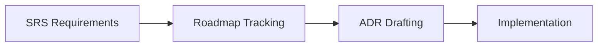
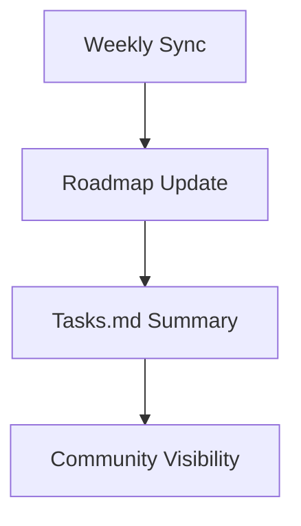

# 21-ADR-900 — PoseStream, Layer, and Control Program Roadmap

*(Status: Accepted)*

**Authors:** Nexus Team (Codex)
**Reviewers:** @nexus-specs, @program-management
**Created:** -
**Last Updated:** -
**Supersedes:** —
**Superseded by:** —
**Related SRS:** `21_System_Decomposition_Boundaries.md`
**Related Considerations:** §21.9 (C1, C2), §22.9 (C2, C3)

---

## 1) Context

This roadmap ADR consolidates active and planned decisions covering PoseStream, layer aggregation, and control program modernization.
It coordinates sequencing across Core runtime, telemetry, and plugin workstreams so prerequisites are satisfied before drafting new ADRs.【F:tasks.md†L131-L158】
The program board syncs weekly with architecture kanban updates and highlights dependency risk, staffing status, and tooling gaps.

---

## 2) Decision

Maintain a living roadmap ADR that enumerates decisions, dependencies, and governance actions for PoseStream, layer aggregation, and control program work.

### Decision Summary

* **Scope:** Applies to ADRs related to PoseStream, layer controllers, control automation, and associated telemetry tooling.
* **Boundary:** Engineering tasks outside these domains remain governed by respective sections.
* **Implementation Level:** Process and governance policy referenced by program management and technical leads.

Key elements:

* Roadmap table linking ADR IDs to SRS requirements, owners, and status.
* Weekly sync updates published to `tasks.md` with burndown and blockers.
* Dependency telemetry scripts highlighting missing registries or tooling.
* Monthly review cadence with published minutes for community visibility.

---

## 3) Consequences

**Positive Impacts:**

* Keeps modernization efforts aligned across Core, telemetry, and plugin teams.
* Provides early warning on dependency gaps or staffing conflicts.
* Ensures ADR drafts reference verified requirements and tooling readiness.

**Negative / Mitigated Impacts:**

* Requires discipline to update roadmap after each sync — mitigated via automation tied to kanban updates.
* Centralization may create bottleneck if owners delay updates; mitigated by assigning deputies per workstream.

**Follow-up Actions:**

* Automate roadmap extraction to dashboards for broader visibility.
* Document template for ADR readiness checks and include in program wiki.
* Align release notes with roadmap milestones.

---

## 4) Rationale

A structured roadmap ADR reduces coordination overhead and prevents conflicting ADR drafts.
Without it, teams duplicated effort or discovered missing prerequisites late in the cycle.
The roadmap ensures each ADR references satisfied SRS requirements and validated tooling before review.

---

## 5) Alternatives Considered

| Option | Summary | Reason Not Selected |
|--------|---------|---------------------|
| Informal kanban updates | Rely on boards without ADR consolidation. | Difficult to trace decisions back to requirements; lacks historical record. |
| Separate roadmap per guild | Maintain domain-specific trackers. | Fragmented view obscures cross-cutting dependencies. |
| Static document snapshot | Publish annual roadmap PDF. | Becomes stale quickly; lacks actionable governance hooks. |

---

## 6) Implementation & Governance

* **Governance ownership:** Architecture working group with program management liaison.
* **Update cadence:** Weekly sync plus monthly program review.
* **Documentation:** Roadmap tables and action logs stored in this ADR and mirrored to `tasks.md` updates.

---

## 7) Risks & Mitigations

| ID | Risk | Impact | Mitigation / Monitoring |
|----|------|--------|-------------------------|
| R1 | Roadmap not updated after sync. | Medium | Automation checks diffs against kanban; alerts owners. |
| R2 | Overloaded reviewers delay ADR gating. | Medium | Assign backup reviewers; publish capacity notes. |
| R3 | Dependencies missed before ADR drafting. | High | Enforce readiness checklist referencing SRS requirements. |

---

## 8) Legacy Implementation Notes

* Prior coordination relied on ad-hoc spreadsheets lacking traceability.
* ADR drafting often started before telemetry tooling or configuration schemas were ready, causing rework.
* Monthly meetings without published minutes left contributors unaware of sequencing changes.

---

## 9) Governance Updates

* **Review frequency:** Weekly sync for status; monthly review for program adjustments.
* **Decision owner:** Architecture working group with program management co-owner.
* **Compliance metrics:** Percentage of ADRs referencing satisfied requirements; number of open dependency blockers per sync.

---

## 10) References

* **SRS Sections:** `21_System_Decomposition_Boundaries.md` — §21.5, §21.15; `23_Threading_Scheduling_Timing.md` — §23.5; `24_Configuration_Environment.md` — §24.5.
* **SRS Sections:** `21_System_Decomposition_Boundaries.md` — §21.5, §21.9; `22_Process_Model_Deployment.md` — §22.5, §22.9.
* **Prior ADRs:** `21-ADR-004 - Establish the composite simulation fabric (SimClock + SimBus).md`, `21-ADR-068 - Layer Controllers & Aggregation Runtime.md`
* **External References:** Program board minutes (2025-01 to 2025-02), automation scripts in `tools/roadmap/`.

---

## 11) Change Log

| Date | Summary | Author | PR / Issue |
|------|---------|--------|------------|
| - | Initial roadmap ADR created. | Nexus Team (Codex) |  |
| - | Reformatted to ADR template; added risk/governance details. | Nexus Team (Codex) |  |

---

> **Lifecycle:** Proposed → Accepted → Superseded → Deprecated → Rejected
> **Traceability:** Links to SRS Decision Matrix §21.12 and design considerations §21.9 (C1, C2).
