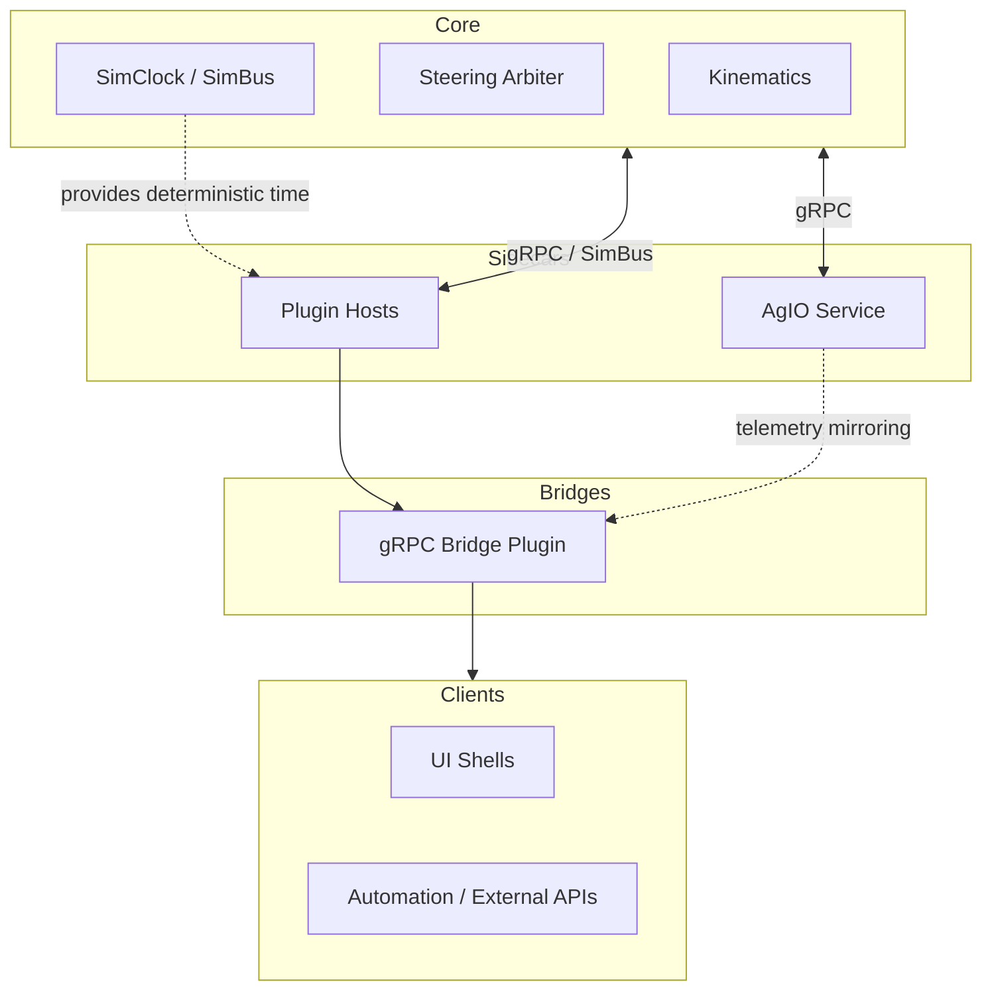

# 21 — System Decomposition & Boundaries
*(Status: Drafting — Decision-Agnostic Overview)*

**Author:** Codex  
**Created:** 2025-10-20  
**Version:** 0.3.0  
**Editors:** @nexus-specs, @layer-wg  
**Last Updated:** 2025-10-21

---

## 21.1 Purpose & Scope

This section describes how Nexus can be decomposed into **logical feature domains** (guidance, mapping, I/O, automation, simulation) and inventories the **potential deployment boundaries** (Core, AgIO, UI hosts, SDK-driven plugins) that future architecture decisions may consider.

The intent is to remain **decision agnostic**. Subsequent Option subsections (§21.14) and ADRs will select and justify specific stack shapes. Here we establish the shared vocabulary, the architectural forces that shape decomposition, and the evaluation criteria that future options must reference.

---

## 21.2 Legacy Baseline (Context Only)

Historically, **AgOpenGPS (V6 / ROC)** centered the bulk of its logic inside the main WinForms host, yet it already relied on
companion executables:

- `ApplicationCore` (WinForms) coordinated guidance, steering, and mapping in the primary thread space.
- **AgIO** shipped as a separate Windows process that bridged CAN/serial hardware via shared memory and PGNs.
- **Rate & Section Control (ROC)** could be deployed as an additional process when operators enabled advanced rate logic.
- Simulation and telemetry replay depended on bespoke stubs with minimal API seams between the processes.
- Timing, UI rendering, and logic loops remained tightly interleaved, so crashes or stalls in one area frequently impacted the
  rest of the stack despite the process split.

This loose multi-process arrangement offered limited fault isolation while still resisting cross-platform delivery and
community-driven extensions.

---

## 21.3 Feature Inventory & Task Alignment

The table below inventories the major Nexus feature domains and outlines representative hosting placements that have surfaced in discovery to date. It serves as a neutral “what could run where” reference while option analyses are still in progress.

| Feature Domain | Candidate In-Core Responsibilities | Candidate External / Plugin Responsibilities | Primary Drivers |
|----------------|------------------------------------|------------------------------------------------|----------------|
| **Kinematics / Pose** | Deterministic timebase ownership, hard real-time fusion loops. | Alternate fusion strategies, offline replay feeds. | Timing, determinism, sensor fan-in. |
| **Autosteer Control** | Arbitration loop, actuator safety interlocks. | Strategy modules, supervisory safety monitors, assist MCUs. | Safety certification, watchdog coverage. |
| **Guidance & Planning** | Tight coupling to deterministic pose, minimal deployment footprint. | Algorithm experimentation, independent release cadence, remote services. | Extensibility, operational cadence. |
| **Mapping & Variable Layers** | Core data ownership for deterministic tasks, minimal build profile. | UI-heavy workflows, headless map processors, optional analytics. | UI affinity, storage, concurrency. |
| **Rate & Section Control** | Enforcement of timing to actuators, fan-out orchestration. | Crop-specific logic, equipment-specific heuristics. | Device diversity, regulatory compliance. |
| **Monitoring & Telemetry** | Central health aggregation, baseline logging. | Optional sensor packs, fleet integrations, custom telemetry sinks. | Observability, optional integrations. |
| **AgIO Hardware Layer** | Deterministic actuator interface, minimal bootset for embedded rigs. | Driver packages, OS-specific hardware bridges, isolated restarts. | Fault isolation, OS packaging. |
| **Radiobridge / Communications** | Core-provided baseline radio support if required by minimum viable deployment. | Optional radios, data plans, or mesh networks. | Optional hardware, regional compliance. |
| **UI Shells** | Minimal presentation for tightly coupled deployments. | Desktop, web, or mobile clients consuming SDKs. | Operator experience, device targets. |
| **Simulation & Replay** | SimClock / SimBus governance. | Providers, automation clients, synthetic sensors. | Determinism, parity with field operation. |

---

## 21.4 SDK & Contract Overview

Discovery has identified **five prospective SDK surfaces** that recur across requirements and stakeholder interviews:

1. **Pose & Telemetry** — deterministic timebase access, streaming pose snapshots.
2. **Layer Snapshot** — map/layer queries, edits, and change journals.
3. **Target & Coverage** — guidance intents, headlands, and tasking metadata.
4. **Setpoint & Commands** — rate/section requests delivered to AgIO or equivalent hardware orchestrators.
5. **Health & Diagnostics** — heartbeats, watchdogs, and recoverability contracts.

### 21.4.1 Problem Statement

Field operators, Core services, UI shells, and plugins need consistent access to guidance, mapping, telemetry, and command surfaces regardless of where a component executes. Any SDK strategy MUST satisfy the following constraints pulled from Section 21 design considerations (C1–C6) and related requirements across Sections 41, 42, and 52:

| Requirement | Source | Verification Hook |
|-------------|--------|-------------------|
| Typed contracts MUST expose deterministic data models for pose, command, and telemetry domains. | §41.5 R-CTRL-003 | Contract compatibility tests |
| SDK surfaces MUST remain discoverable and versioned so operators can swap hosting modes without breaking plugins. | §41.5 R-CTRL-002, §41.5 R-STRUCT-001 | Capability registry + ABI tests |
| Bridge strategies MUST preserve parity with legacy PGN transports and satisfy latency budgets. | §42.5 R-COMM-004…R-COMM-052 | Transport replay + parity suites |

### 21.4.2 Candidate Binding Options

| Option ID | Binding Shape | Representative Strengths | Representative Risks / Mitigations | Notes |
|-----------|---------------|--------------------------|------------------------------------|-------|
| 21-O-STRUCT | In-process ABI using versioned C# structs/records. | Avoids serialization, aligns with tight deterministic loops. | Requires strict read-only governance and ABI testing to avoid crashes. | Investigated further in §21.5.3 and ADR drafts (e.g., ADR-061). |
| 21-O-GRPC | Out-of-process gRPC/WebSocket clients generated from protobuf contracts. | Mature tooling, remote deployment friendly, cross-language support. | Serialization adds jitter; depends on bridge parity with PGNs. | Captured in §21.5.2 and ADR drafts (e.g., ADR-002 / ADR-062). |
| 21-O-HYBRID | Dual binding where struct ABI and gRPC share schemas/codegen. | Enables seamless host switching and mixed deployments. | Requires bridge plugin and shared codegen investment. | Evaluated alongside Sections 41 & 42 option matrices. |

Architectural decisions recorded in future ADRs will select among these options. Maintaining a neutral view here keeps requirement coverage visible independent of the eventual choice.

---

## 21.5 Illustrative Stack Patterns

### 21.5.1 Legacy Coupling Diagram

```mermaid
flowchart LR
  subgraph Core
    KIN[Kinematics]
    ST[Steering Loop]
    GUI[Guidance]
    MAP[Mapping]
    IO[AgIO]
  end

  subgraph UI
    UI[WinForms/Avalonia]
  end

  UI <-- direct refs --> Core
  IO --> Core
```

**Limitations**

- No stable contracts for external modules.
- Any device driver crash can terminate Core.
- UI and business logic are inseparable.

### 21.5.2 Illustrative Partition — Out-of-Process Plugin Runtime



This diagram documents one explored partition where plugins execute in separate processes over gRPC, AgIO operates as a managed service, and a bridge plugin speaks gRPC/WebSocket to UI shells. It is provided for comparison only; no selection has been made.

### 21.5.3 Illustrative Partition — Core-Hosted Plugin Runtime (Struct ABI)

```mermaid
flowchart TB
  subgraph Core (In-Proc)
    KIN[Kinematics]
    STEER[Steering Arbiter]
    SIM[SimClock / SimBus]
    AGIOP[AgIO Plugin]
    PLUGS[Plugin Host Containers]
  end

  subgraph Bridge
    BRIDGE[gRPC Bridge Plugin]
  end

  subgraph External Clients
    AV[UI Shells]
    AUTO[Automation / Remote APIs]
  end

  KIN -- struct ABI --> PLUGS
  SIM -. struct feeds .-> PLUGS
  AGIOP -- struct ABI --> PLUGS
  PLUGS --> BRIDGE
  BRIDGE --> External Clients
```

Here, plugins—including AgIO—load in-process through versioned C# structs/records while a dedicated bridge plugin projects gRPC/WebSocket endpoints for remote clients. This is one candidate layout under evaluation.

---

## 21.6 Partition Decision Drivers

When evaluating whether a capability belongs in Core or crosses a process/service boundary, consider the following requirement-derived forces:

- **Timing** — loops tighter than ~10 ms demand deterministic scheduling; confirm whether IPC budgets satisfy the requirement envelope before externalizing.
- **Fault Isolation** — safety-critical I/O may need restart isolation or watchdog boundaries; capture the required failure handling semantics in requirements.
- **Release Cadence** — some domains must iterate independently of Core releases; option analyses should document how updates are delivered.
- **Operational Boundaries** — OS-specific dependencies can force separation for packaging reasons; capture constraints for each supported platform.
- **Simulation Parity** — services requiring SimClock/SimBus must preserve determinism across deployment topologies; options should explain how parity is maintained.
- **Team Ownership** — working group boundaries can influence module separation; traceability must link ownership to verification obligations.

---

## 21.7 Domain-Specific Considerations

| Domain | Core Hosting Considerations | External / Service Hosting Considerations |
|--------|-----------------------------|-------------------------------------------|
| **Kinematics** | Requires deterministic scheduling and zero-copy sensor access; establishes the timebase used elsewhere. | Enables alternate fusion strategies or replay feeds when timing budgets permit; must document latency tolerance. |
| **Autosteer** | Centralizes safety interlocks and actuator arbitration; simplifies certification. | External strategies or assist MCUs may introduce IPC latency; mitigation requirements must be explicit if separation is pursued. |
| **Guidance** | Simplifies debugging and reduces dependencies when co-located with pose. | Supports algorithm experimentation, independent release cadence, and remote hosting if SDK contracts preserve timing guarantees. |
| **Mapping** | Keeps business logic near deterministic layers but may inherit UI dependencies. | Allows headless processors, UI flexibility, and OS-specific integrations; requires concurrency safeguards and storage policies. |
| **Variable Rate / Sections** | Provides direct actuator timing control; mixes fast and slow loops. | Isolates crop/equipment logic, supports optional capabilities, and reduces Core complexity; must still meet command latency requirements. |
| **Monitoring** | Offers unified health reporting within Core fault domain. | Enables optional sensors and restart isolation; verification must cover telemetry parity. |
| **AgIO** | Simplifies packaging for single-binary deployments; shares Core fault domain. | Supports OS-specific drivers, restart isolation, and multiple hardware stacks; introduces service orchestration requirements. |
| **Radiobridge** | Reduces moving parts in minimal deployments. | Keeps optional radios isolated and replaceable; depends on shared diagnostics contracts. |
| **Simulation** | Embedding providers eases deterministic coordination but couples releases. | Providers can plug into SimBus externally; requires documentation on how deterministic time is propagated. |
| **UI Shells** | Supports classic monolithic experiences. | Enables desktop/web/mobile parity via SDKs; requires clearly versioned remote APIs. |

---

## 21.8 OS & Deployment Considerations

- **AgIO Packaging** — Separate AgIO hosting would allow platform-specific driver bundles (`NX-022`, `NX-023`, `NX-024`, `NX-029`, `NX-462`) while keeping the Core binary OS-neutral. Combined deployments remain viable if requirements favour a single process; both paths must honour the same contracts.
- **UI Hosting Modes** — Avalonia desktop, remote web, and mobile shells consume the same SDK endpoints. Documenting how each mode discovers services and handles authentication is part of future option work.
- **Deployment Complexity** — Supervisors (systemd, Windows Service Control Manager) provide restart semantics where multi-process layouts are chosen. IPC budgets (e.g., <1 ms p95 intra-host latency for gRPC) and ABI version guards for in-process hosting must be evaluated during option scoring, not assumed here.

---

## 21.9 Simulation & Replay Flow

Simulation must remain first-class regardless of partitioning:

1. **SimClock** (per §11) defines deterministic time slices distributed via SimBus or equivalent constructs.
2. **Providers** (auto-steer, sensors, crop models) interface through the Simulation SDK concepts referenced in `NX-035`, `NX-155`, `NX-401`.
3. **UI / Automation** clients interact via the same contracts used in production, independent of transport binding.
4. **AgIO** or successor hardware orchestrators may be replaced by simulated driver plugins, provided telemetry parity is maintained.

Option analyses must show how latency, determinism, and replay speed targets are preserved rather than assuming any specific binding.

---

## 21.10 Comparative Architecture Models

| Model | Description | Process Boundaries | Deployment Example |
|--------|-------------|--------------------|--------------------|
| **A — Monolithic Core** | All logic compiled into one executable. | None (single process) | Legacy WinForms deployments |
| **B — Modular Monolith** | Logical modules separated by clean interfaces but still in one process. | None (in-proc only) | Avalonia host with modular namespaces |
| **C — Out-of-Proc Plugin Runtime** | Core, AgIO, and domain services separated into individual services or dynamically loaded modules. | Process or gRPC boundaries | Linux Core + detachable plugins (illustrative) |
| **D — Core Plugin Runtime** | Core hosts plugin containers via struct/record ABIs and exposes remotes through a bridge plugin. | No boundary between Core and plugins; bridge projects gRPC/WebSocket | Windows/Linux single-binary bundle (illustrative) |

### 21.10.1 Domain Placement by Model

| Domain | In Model A | In Model B | In Model C | In Model D | Timing Risk if Separated | Typical Interfaces |
|---------|-------------|------------|-------------|-------------|---------------------------|--------------------|
| Kinematics | Core | Core | Core | Core | High | SimBus / Struct ABI / gRPC |
| Autosteer | Core | Core | Core (hard loop) | Core (hard loop) | High | SimBus / Struct ABI / gRPC |
| Guidance | Core | Internal module | External plugin | In-proc plugin | Medium | Struct ABI + Bridge / gRPC |
| Mapping | Core (tied to UI) | Module (MVVM) | Plugin | In-proc plugin | Low | Struct ABI + Bridge / gRPC |
| Variable Mapping | Core | Module | Plugin | In-proc plugin | Low | Struct ABI + Bridge / gRPC |
| Variable Rate | Core | Module | Plugin | In-proc plugin | Low | Struct ABI + Bridge / gRPC |
| Monitoring | Core | Module | Plugin | In-proc plugin | Low | Struct ABI + Bridge / gRPC |
| AgIO | Core | Shared service | Sidecar | In-proc privileged plugin | Medium | Struct ABI (primary) + Bridge |
| Radiobridge | Core | Module | Plugin | In-proc plugin | Low | Struct ABI + Bridge / gRPC |
| Simulation | None / ad-hoc | Integrated | Shared service | Shared in-proc providers | Low | SimBus / Struct ABI |
| UI Shells | WinForms host | Avalonia host | Remote clients | Remote clients via bridge | Low | Bridge gRPC/WebSocket |

### 21.10.2 Evaluation Matrix

| Criterion | Model A — Monolithic | Model B — Modular Monolith | Model C — Out-of-Proc Plugin Runtime | Model D — Core Plugin Runtime |
|------------|----------------------|-----------------------------|------------------------------------|-------------------------------|
| **Performance** | No IPC overhead | Minor abstraction cost | IPC overhead subject to budget validation | In-process calls minimize serialization; bridge adds measured overhead |
| **Determinism** | Simple timing model | Deterministic if SimClock central | Determinism depends on SimBus propagation guarantees | Determinism depends on struct feed governance |
| **Reliability** | Shared fault domain | Partial isolation through module boundaries | Fault isolation via process boundaries; requires supervision | Shared fault domain for plugins; bridge isolation depends on design |
| **Maintainability** | Tight coupling | Moderate | High potential with clear contracts | High potential with contracts + ABI versioning |
| **Cross-OS Portability** | Low | Medium | High if services are OS-neutral | High if ABI stays portable |
| **Community Extensibility** | Low | Medium | High; plugins/services can ship independently | High; plugins load via assemblies |
| **Testing & Simulation** | Manual integration | Replay harnesses possible | Deterministic replay achievable with explicit contracts | Deterministic replay achievable with struct taps |
| **Deployment Complexity** | Simple | Simple | Higher (service management, orchestration) | Requires ABI compatibility management and bridge supervision |

Comparisons highlight evaluation trade-offs only. Final scoring occurs in option subsections and ADRs once more data is available.

---

## 21.11 Latency & Complexity Considerations

- **IPC Budget** — Option analyses must validate intra-host communication targets (e.g., ≤1 ms p95 for gRPC) and document mitigation strategies when exceeded. In-process bindings require ABI governance to avoid instability.
- **Developer Ergonomics** — SDK templates should support both gRPC clients and struct-based adapters so contributors can develop modules in isolation. Future work (`NX-039`) tracks the tooling requirements; no specific implementation has been selected.
- **Operational Simplicity** — Compact installations may prefer single-process hosting with bridge projection, whereas distributed deployments may adopt multi-process layouts. The SRS records the requirement that switching transports remains a deployment decision with shared contracts.

---

## 21.12 Determinism Constraints

- All timing originates from a single **SimClock** reference.
- Data interchange between processes must include timestamps and sequence numbers.
- Hard-real-time loops (e.g., Steering, Kinematics) are expected to meet deterministic deadlines; options that externalize them must document how the requirement envelope is preserved.
- IPC targets: **p95 ≤ 1 ms**, **p99 ≤ 3 ms** for intra-host gRPC links (per §42 requirements); struct-based calls must remain lock-free and avoid allocations in hot loops.

---

## 21.13 Open Questions

| ID | Question | Current Thinking | Owner |
|----|-----------|------------------|--------|
| Q-21-1 | Should AgIO be part of Core or run as a sidecar? | Evaluate 21.5 illustrative partitions + §52 options before locking ADR scope. | Core WG |
| Q-21-2 | Can mapping remain cross-platform without Avalonia dependency? | Requires shared contracts (struct or gRPC) with documented UI discovery flow. | UI WG |
| Q-21-3 | What minimum SDK granularity keeps developer friction low? | Initial hypothesis: 4–5 contracts (Pose, LayerSnapshot, Target, Setpoint, Health); needs validation. | SDK WG |
| Q-21-4 | How to guarantee deterministic replay when services are split or hosted in-proc? | Investigate shared SimBus / struct journals + bridge verification. | Simulation WG |
| Q-21-5 | What ABI versioning policy keeps struct-based plugins safe to load? | Define in new ADR (see §41, §52 option analysis). | SDK WG |

---

## 21.14 Option References

Subsections (21-O1 … 21-O7) define concrete architecture proposals. Examples:

- **21-O1:** Maintain Monolithic Core.
- **21-O4:** Modular Monolith.
- **21-O7:** Plugin Runtime (AgIO + Core + Plugins via SDK over gRPC).
- **21-O8:** Core-Hosted Plugin Runtime (AgIO plugin + struct ABI + gRPC bridge).

Each option includes quantitative scoring (determinism, maintainability, latency, complexity) and ADR linkages.

---

## 21.15 Verification & Traceability

Verification ensures architectural integrity regardless of model selection:

- Deterministic replay (SimBus jitter ≤ 2 ms p95).
- Regression replay equivalence (geometry ± 1%).
- Health endpoints operational (< 30 s startup).
- Cross-OS contract parity (Core/AgIO/SDK).

---

