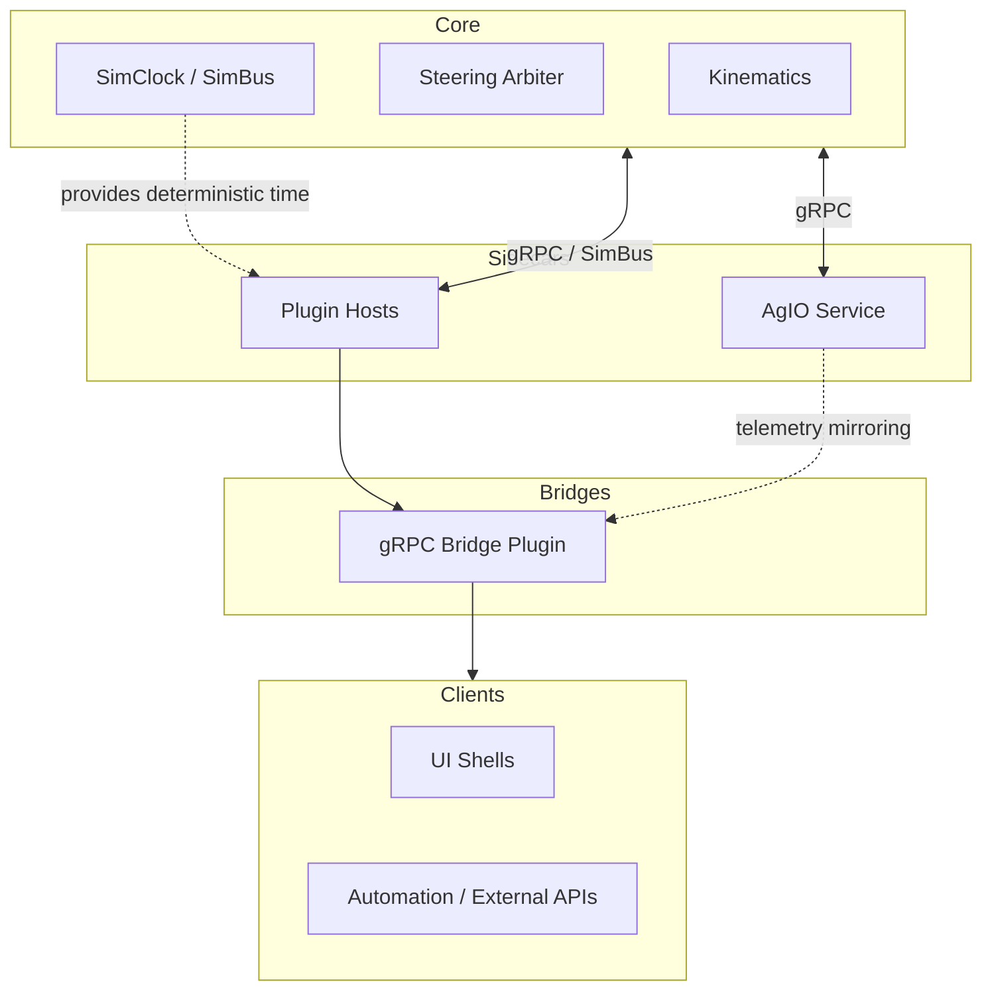

# 21 — System Decomposition & Boundaries
*(Status: Drafting — Option-Neutral Overview)*

**Author:** Codex  
**Created:** 2025-10-20  
**Version:** 0.3.0  
**Editors:** @nexus-specs, @layer-wg  
**Last Updated:** 2025-10-21

---

## 21.1 Purpose & Scope

This section establishes how Nexus decomposes into **logical feature domains** (guidance, mapping, I/O, automation, simulation) and how those domains may be **partitioned across deployment boundaries** (Core, AgIO, UI hosts, SDK-driven plugins).

It remains **decision neutral**: later Option subsections (§21.14) evaluate concrete stack shapes. The material here gives every option a shared vocabulary, clarifies why plugin support matters, and dispels concerns that a modular stack is prohibitively complex or slow.

---

## 21.2 Legacy Baseline (Context Only)

Historically, **AgOpenGPS (V6 / ROC)** centered the bulk of its logic inside the main WinForms host, yet it already relied on
companion executables:

- `ApplicationCore` (WinForms) coordinated guidance, steering, and mapping in the primary thread space.
- **AgIO** shipped as a separate Windows process that bridged CAN/serial hardware via shared memory and PGNs.
- **Rate & Section Control (ROC)** could be deployed as an additional process when operators enabled advanced rate logic.
- Simulation and telemetry replay depended on bespoke stubs with minimal API seams between the processes.
- Timing, UI rendering, and logic loops remained tightly interleaved, so crashes or stalls in one area frequently impacted the
  rest of the stack despite the process split.

This loose multi-process arrangement offered limited fault isolation while still resisting cross-platform delivery and
community-driven extensions.

---

## 21.3 Feature Inventory & Task Alignment

The table below inventories the major Nexus feature domains and highlights where those capabilities can live inside a decomposed stack. Use this as the quick “what runs where” reference when reasoning about plugins, SDKs, or process splits.

| Feature Domain | Nexus Stack Default | Alternative Partition Options | Notes |
|----------------|---------------------|------------------------------|-------|
| **Kinematics / Pose** | Core-hosted plugin executing within the deterministic struct ABI container | Dedicated Core loop for minimal builds | Maintains deterministic timebase while allowing plugin-delivered fusion strategies. |
| **Autosteer Control** | Core-hosted plugin with real-time arbitration hooks | Externalized safety monitor or assist MCU | Loop remains ≤20 ms; plugin governs strategies while Core enforces actuator safety. |
| **Guidance & Planning** | Plugin via Guidance SDK | Integrated module for single-process targets | Works well across gRPC; benefits from independent release cadence. |
| **Mapping & Variable Layers** | Plugin hosted via Mapping SDK | UI-coupled module for kiosk builds | Heavy UI affinity but no hard timing; ideal plugin candidate. |
| **Rate & Section Control** | Plugin feeding Core contracts | Integrated when device count is tiny | Shares contracts with AgIO plugins for deterministic command fan-out. |
| **Monitoring & Telemetry** | Plugin with telemetry service SDK | Bundled inside Core for embedded bundles | Primarily event driven; plugin keeps optional sensors out of Core. |
| **AgIO Hardware Layer** | Core-hosted plugin(s) replacing the legacy sidecar process | Sidecar service for OS-constrained deployments | Plugin split allows multiple hardware stacks (“multins”) while keeping fault domains contained. |
| **Radiobridge / Communications** | Plugin running alongside AgIO plugins | Core-hosted radio for fixed rigs | Shares diagnostics contracts with AgIO; optional for offline sims. |
| **UI Shells** | Avalonia/remote clients | Web/mobile thin clients via gRPC | UI consumes SDKs; no timing guarantees required. |
| **Simulation & Replay** | Core SimClock + plugin providers | External orchestrator for cloud sims | Time authority stays in Core; providers plug in through contracts. |

---

## 21.4 SDK & Contract Overview

Nexus exposes **five primary SDK surfaces** for optional services:

1. **Pose & Telemetry** — deterministic timebase access, streaming pose snapshots.
2. **Layer Snapshot** — map/layer queries, edits, and change journals.
3. **Target & Coverage** — guidance intents, headlands, and tasking metadata.
4. **Setpoint & Commands** — rate/section requests delivered to AgIO.
5. **Health & Diagnostics** — heartbeats, watchdogs, and recoverability contracts.

### 21.4.1 Problem Statement

Field operators, Core services, UI shells, and plugins need consistent access to guidance, mapping, telemetry, and command surfaces regardless of where a component executes. Any SDK strategy MUST satisfy the following constraints pulled from Section 21 design considerations (C1–C6) and related requirements across Sections 41, 42, and 52:

| Requirement | Source | Verification Hook |
|-------------|--------|-------------------|
| Typed contracts MUST expose deterministic data models for pose, command, and telemetry domains. | §41.5 R-CTRL-003 | Contract compatibility tests |
| SDK surfaces MUST remain discoverable and versioned so operators can swap hosting modes without breaking plugins. | §41.5 R-CTRL-002, §41.5 R-STRUCT-001 | Capability registry + ABI tests |
| Bridge strategies MUST preserve parity with legacy PGN transports and satisfy latency budgets. | §42.5 R-COMM-004…R-COMM-052 | Transport replay + parity suites |

### 21.4.2 Candidate Binding Options

| Option ID | Binding Shape | Strengths | Risks / Mitigations | Notes |
|-----------|---------------|-----------|---------------------|-------|
| 21-O-STRUCT | In-process ABI using versioned C# structs/records. | Zero serialization cost; aligns with Core-hosted plugin proposals. | Requires strict read-only governance and ABI testing to avoid crashes. | Discussed further in §21.5.3 and ADR-061. |
| 21-O-GRPC | Out-of-process gRPC/WebSocket clients generated from protobuf contracts. | Mature tooling, remote deployment friendly. | Serialization adds jitter; depends on bridge parity with PGNs. | Captured in §21.5.2 and ADR-002/ADR-062. |
| 21-O-HYBRID | Dual binding where struct ABI and gRPC share schemas/codegen. | Enables seamless host switching. | Requires bridge plugin and shared codegen investment. | Evaluated in Sections 41 & 42 option matrices. |

Architectural decisions recorded in ADRs select among these options; the SRS keeps both bindings visible so requirement coverage stays verifiable independent of the eventual choice.

---

## 21.5 Reference Stack Overview

### 21.5.1 Legacy Coupling Diagram

```mermaid
flowchart LR
  subgraph Core
    KIN[Kinematics]
    ST[Steering Loop]
    GUI[Guidance]
    MAP[Mapping]
    IO[AgIO]
  end

  subgraph UI
    UI[WinForms/Avalonia]
  end

  UI <-- direct refs --> Core
  IO --> Core
```

**Limitations**

- No stable contracts for external modules.
- Any device driver crash can terminate Core.
- UI and business logic are inseparable.

### 21.5.2 Reference Partition — Out-of-Process Plugin Runtime



This diagram captures the existing deployment bias: plugins execute in separate processes over gRPC, AgIO stays as a managed service, and a bridge plugin speaks gRPC/WebSocket to UI shells.

### 21.5.3 Reference Partition — Core-Hosted Plugin Runtime (Struct ABI)

```mermaid
flowchart TB
  subgraph Core (In-Proc)
    KIN[Kinematics]
    STEER[Steering Arbiter]
    SIM[SimClock / SimBus]
    AGIOP[AgIO Plugin]
    PLUGS[Plugin Host Containers]
  end

  subgraph Bridge
    BRIDGE[gRPC Bridge Plugin]
  end

  subgraph External Clients
    AV[UI Shells]
    AUTO[Automation / Remote APIs]
  end

  KIN -- struct ABI --> PLUGS
  SIM -. struct feeds .-> PLUGS
  AGIOP -- struct ABI --> PLUGS
  PLUGS --> BRIDGE
  BRIDGE --> External Clients
```

Here, plugins—including AgIO—load in-process through versioned C# structs/records. A dedicated bridge plugin projects gRPC/WebSocket endpoints for remote clients while preserving the same logical contracts.

---

## 21.6 Partition Decision Drivers

When deciding whether a capability belongs in Core or a plugin, weigh the following:

- **Timing** — loops tighter than ~10 ms stay in Core; everything else can tolerate IPC.
- **Fault Isolation** — safety-critical IO benefits from AgIO being restartable.
- **Release Cadence** — community plugins evolve faster when decoupled from Core releases.
- **Operational Boundaries** — OS-specific drivers fit better in AgIO sidecars.
- **Simulation Parity** — services that need SimClock/SimBus should use SDKs rather than bespoke shims.
- **Team Ownership** — domain-specific working groups can iterate independently via plugins.

---

## 21.7 Domain-Specific Pros & Cons

| Domain | Keep in Core | Externalize as Plugin / Service |
|--------|--------------|---------------------------------|
| **Kinematics** | ✅ Zero-copy access to sensors, deterministic scheduling. | ❌ IPC adds unacceptable latency; only replicate for offline replay. |
| **Autosteer** | ✅ Guarantees ≤20 ms command loop, integrates safety interlocks. | ⚠️ Plugin may add flexibility but must still run within Core process to avoid lag. |
| **Guidance** | ⚠️ Tight coupling eases debugging but slows community innovation. | ✅ Services can be swapped (e.g., headland algorithms) with negligible latency (<1 ms gRPC). |
| **Mapping** | ⚠️ Simplifies UI integration but pulls Avalonia into Core. | ✅ Plugins keep UI optional, enable headless map processors, and limit OS dependencies. |
| **Variable Rate / Sections** | ⚠️ Direct access to actuator bus but mixes deterministic and slow loops. | ✅ Plugin calculates targets; Core merely enforces timing, keeping latency minimal. |
| **Monitoring** | ⚠️ Shared fault domain with Core controllers. | ✅ Plugins restart independently, making sensor integrations community-friendly. |
| **AgIO** | ✅ Simplifies deployment on single-OS rigs. | ✅ Sidecar avoids Core restarts when drivers crash and lets Windows/Linux diverge where needed. |
| **Radiobridge** | ⚠️ Fewer moving parts if built-in. | ✅ Plugin aligns with optional hardware and enables alternate radios without touching Core. |
| **Simulation** | ⚠️ Embedding providers in Core complicates release cadence. | ✅ Providers plug into SimBus; deterministic time stays centralized. |
| **UI Shells** | ⚠️ Classic monolith experience. | ✅ Any UI (Avalonia, web, mobile) can attach via SDKs without altering Core. |

This framing emphasises why the plugin-first approach is **feasible**: only the hard-real-time loops demand in-process hosting.

---

## 21.8 OS & Deployment Considerations

- **AgIO Sidecar** — Running AgIO separately allows distinct packaging for Windows (`NX-022`, `NX-023`) and Linux (`NX-024`, `NX-029`, `NX-462`). The Core binary stays OS-neutral while drivers ship with their dependencies.
- **Combined Core + AgIO** — Embedded deployments may still merge them to reduce service management overhead. Contracts remain consistent, so swapping between modes is operational, not architectural.
- **UI Hosting** — Avalonia desktop, remote web views, or mobile shells all consume the same SDK endpoints. Keeping UI outside Core ensures kiosk builds and headless rigs share business logic.
- **Deployment Complexity** — Supervisors (systemd, Windows Service Control Manager) handle restart semantics. When using gRPC, budget <1 ms p95 intra-host latency; when hosting plugins in-process, enforce ABI version guards and bridge gRPC/WebSocket traffic through a dedicated adapter plugin.

---

## 21.9 Simulation & Replay Flow

Simulation is a first-class citizen regardless of partitioning:

1. **SimClock** in Core defines deterministic time slices shared via SimBus.
2. **Providers** (auto-steer, sensors, crop models) plug in through the Simulation SDK (`NX-035`, `NX-155`, `NX-401`).
3. **UI / Automation** clients observe or interact via the same gRPC contracts used in production.
4. **AgIO** can be replaced by simulated driver plugins, keeping telemetry identical to field runs.

Because plugins and services speak the same contracts as production, developers avoid bespoke sim code. IPC overhead stays negligible; replay runs at faster-than-real-time when CPU allows.

---

## 21.10 Comparative Architecture Models

| Model | Description | Process Boundaries | Deployment Example |
|--------|-------------|--------------------|--------------------|
| **A — Monolithic Core** | All logic compiled into one executable. | None (single process) | Windows WinForms legacy |
| **B — Modular Monolith** | Logical modules separated by clean interfaces but still in one process. | None (in-proc only) | Avalonia host with modular namespaces |
| **C — Out-of-Proc Plugin Runtime** | Core, AgIO, and domain services separated into individual services or dynamically loaded modules. | Process or gRPC boundaries | Linux Core + detachable plugins |
| **D — Core Plugin Runtime** | Core hosts plugin containers via struct/record ABIs and exposes remotes through a bridge plugin. | No boundary between Core and plugins; bridge projects gRPC/WebSocket | Windows/Linux single-binary bundle |

### 21.10.1 Domain Placement by Model

| Domain | In Model A | In Model B | In Model C | In Model D | Timing Risk if Separated | Typical Interfaces |
|---------|-------------|------------|-------------|-------------|---------------------------|--------------------|
| Kinematics | Core | Core | Core | Core | High | SimBus / Struct ABI / gRPC |
| Autosteer | Core | Core | Core (hard loop) | Core (hard loop) | High | SimBus / Struct ABI / gRPC |
| Guidance | Core | Internal module | External plugin | In-proc plugin | Medium | Struct ABI + Bridge / gRPC |
| Mapping | Core (tied to UI) | Module (MVVM) | Plugin | In-proc plugin | Low | Struct ABI + Bridge / gRPC |
| Variable Mapping | Core | Module | Plugin | In-proc plugin | Low | Struct ABI + Bridge / gRPC |
| Variable Rate | Core | Module | Plugin | In-proc plugin | Low | Struct ABI + Bridge / gRPC |
| Monitoring | Core | Module | Plugin | In-proc plugin | Low | Struct ABI + Bridge / gRPC |
| AgIO | Core | Shared service | Sidecar | In-proc privileged plugin | Medium | Struct ABI (primary) + Bridge |
| Radiobridge | Core | Module | Plugin | In-proc plugin | Low | Struct ABI + Bridge / gRPC |
| Simulation | None / ad-hoc | Integrated | Shared service | Shared in-proc providers | Low | SimBus / Struct ABI |
| UI Shells | WinForms host | Avalonia host | Remote clients | Remote clients via bridge | Low | Bridge gRPC/WebSocket |

### 21.10.2 Evaluation Matrix

| Criterion | Model A — Monolithic | Model B — Modular Monolith | Model C — Out-of-Proc Plugin Runtime | Model D — Core Plugin Runtime |
|------------|----------------------|-----------------------------|------------------------------------|-------------------------------|
| **Performance** | No IPC overhead | Minor abstraction cost | ≤1 ms IPC overhead (target) | Struct ABI eliminates serialization; bridge adds ≤1 ms |
| **Determinism** | Simple timing | Deterministic if SimClock central | Deterministic with explicit SimBus | Deterministic with shared SimClock/struct feeds |
| **Reliability** | Shared fault domain | Partial isolation | Full fault isolation (process) | Shared fault domain for plugins; bridge isolated |
| **Maintainability** | Tight coupling | Moderate | High — clear contracts | High — contracts shared; ABI versioning required |
| **Cross-OS Portability** | Low | Medium | High | High (single binary + bridge) |
| **Community Extensibility** | Low | Medium | High | High — plugins ship as assemblies |
| **Testing & Simulation** | Manual | Replay harnesses possible | Fully deterministic replay | Deterministic replay with struct taps |
| **Deployment Complexity** | Simple | Simple | Higher (service mgmt) | Simple binary; must manage ABI compatibility |

These comparisons show why the plugin-first stack is attractive: most benefits accrue without sacrificing determinism or adding noticeable latency.

---

## 21.11 Latency & Complexity Considerations

- **IPC Budget** — Intra-host gRPC calls with protobuf payloads stay under **1 ms p95**; in-proc struct calls are effectively zero-copy but require ABI guards. Bulk transfers (maps, tiles) rely on async streaming regardless of hosting model.
- **Developer Ergonomics** — SDK templates scaffold both gRPC clients and struct-based host adapters. Contributors can build plugins in isolation, then choose deployment mode with the same generated types and CI compatibility gates (`NX-039`).
- **Operational Simplicity** — Compact installations may co-host services in one process with a bridge plugin projecting remote APIs. Because contracts are shared, switching between struct and gRPC transport remains a deployment decision, not a coding burden.

---

## 21.12 Determinism Constraints

- All timing originates from a single **SimClock** reference.
- Data interchange between processes must include timestamps and sequence numbers.
- Hard-real-time loops (Steering, Kinematics) **remain in-process** with Core.
- IPC targets: **p95 ≤ 1 ms**, **p99 ≤ 3 ms** for intra-host gRPC links; struct-based calls must remain lock-free and avoid allocations in hot loops.

---

## 21.13 Open Questions

| ID | Question | Current Thinking | Owner |
|----|-----------|------------------|--------|
| Q-21-1 | Should AgIO be part of Core or run as a sidecar? | Evaluate 21.5 reference partitions + §52 options before locking ADR scope. | Core WG |
| Q-21-2 | Can mapping remain cross-platform without Avalonia dependency? | Yes, via shared contracts (struct or gRPC) | UI WG |
| Q-21-3 | What minimum SDK granularity keeps developer friction low? | 4–5 contracts (Pose, LayerSnapshot, Target, Setpoint, Health) regardless of transport | SDK WG |
| Q-21-4 | How to guarantee deterministic replay when services are split or hosted in-proc? | Shared SimBus / struct journals + bridge verification | Simulation WG |
| Q-21-5 | What ABI versioning policy keeps struct-based plugins safe to load? | Define in new ADR (see §41, §52 option analysis). | SDK WG |

---

## 21.14 Option References

Subsections (21-O1 … 21-O7) define concrete architecture proposals. Examples:

- **21-O1:** Maintain Monolithic Core.
- **21-O4:** Modular Monolith.
- **21-O7:** Plugin Runtime (AgIO + Core + Plugins via SDK over gRPC).
- **21-O8:** Core-Hosted Plugin Runtime (AgIO plugin + struct ABI + gRPC bridge).

Each option includes quantitative scoring (determinism, maintainability, latency, complexity) and ADR linkages.

---

## 21.15 Verification & Traceability

Verification ensures architectural integrity regardless of model selection:

- Deterministic replay (SimBus jitter ≤ 2 ms p95).
- Regression replay equivalence (geometry ± 1%).
- Health endpoints operational (< 30 s startup).
- Cross-OS contract parity (Core/AgIO/SDK).

---

