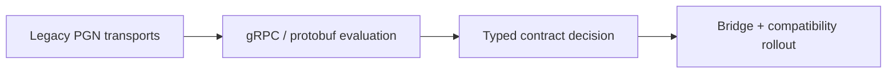

# 41-ADR-002 — Expose Nexus services over gRPC/protobuf contracts
*(Status: Proposed)*

**Author:** Codex
**Reviewers:** Interprocess Communications Working Group
**Created:** 2025-10-20
**Last Updated:** 2025-10-20
**Status:** Proposed
**Version:** 0.1.0
**Supersedes:** _None_
**Superseded by:** _None_
**Related SRS:** [41 — Service APIs & Contracts](41_Service_APIs_Contracts.md)
**Related Considerations:** [C3 - Typed API Bridge Strategy](41_Service_APIs_Contracts.md#c3---typed-api-bridge-strategy)

---

## 1) Context

The Nexus runtime needs a unified, typed inter-process API that Core, UI, plugins, and automation tools can share while
remaining portable across Windows and Linux deployments. gRPC/protobuf surfaces published via `Aog.Abstractions`
emphasize contract reuse and strongly typed streaming semantics, letting higher-level processes communicate over a
consistent surface while AgIO/Bridge services isolate hardware integration details.【F:docs/development/SRS/sections/4X_Interprocess_Communications/42_Transports.md†L4-L75】

Contributors also want determinism, versioning, and compatibility bridges while introducing new transports, ensuring that
legacy PGNs remain authoritative during migration phases.【F:docs/development/SRS/sections/4X_Interprocess_Communications/42_Transports.md†L76-L205】

---

## 2) Decision

Adopt gRPC with protobuf IDLs as the authoritative inter-process API for Nexus services. All Core, UI, plugin, and
automation components consume generated clients from the `Aog.Abstractions` package.

### Decision Summary

* **Scope:** Inter-process APIs between Core, UI, automation tooling, and Bridge services.
* **Boundary:** MCU transports remain defined by ADR-006 (AOG-Link) with PGN compatibility bridged by AgIO/Bridge.
* **Implementation Level:** Design + code; shared proto repository with automated linting and CI verification.

---

## 3) Consequences

**Positive Impacts:**

* Strongly typed, versioned contracts shared across all components.
* Enables streaming APIs with flow control aligned to simulation and telemetry needs.
* Supports language-agnostic clients for future integrations beyond .NET.

**Negative / Mitigated Impacts:**

* Adds hosting overhead relative to raw sockets — mitigated by reusing ASP.NET Core gRPC infrastructure.
* Requires contract governance to avoid breaking changes — addressed through ADR reviews and semantic versioning.

**Follow-up Actions:**

* Define protobuf packages and namespaces for the first wave of contracts (NX-003).
* Implement Bridge translation between gRPC services, AOG-Link datagrams, and legacy PGNs (NX-120 series).

---

## 4) Rationale

gRPC/protobuf offers deterministic contracts, built-in streaming, and tooling across languages while aligning with typed
API goals captured in Section 41. Compatibility bridges outlined in [C3](41_Service_APIs_Contracts.md#c3---typed-api-bridge-strategy)
ensure legacy PGNs remain usable, and the shared proto repository simplifies governance with CI linting.

---

## 5) Alternatives Considered

| Option | Summary | Reason Not Selected |
|--------|---------|---------------------|
| Status quo PGNs | Continue exposing only UDP/serial PGNs. | Lacks typed contracts, version negotiation, and Linux-friendly APIs. |
| REST/JSON facade | Wrap PGNs in REST/JSON endpoints. | Adds latency and lacks streaming semantics required by guidance. |
| MQTT/AMQP | Adopt brokered pub/sub for all transports. | Introduces new infrastructure while duplicating bridge responsibilities. |

