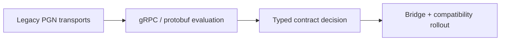

# 41-ADR-002 — Expose Nexus services over gRPC/protobuf contracts
*(Status: Proposed)*

**Authors:** Nexus Team (Codex)
**Reviewers:** Interprocess Communications Working Group
**Created:** 2025-10-20
**Last Updated:** 2025-10-20
**Status:** Proposed
**Version:** 0.1.0
**Supersedes:** _None_
**Superseded by:** _None_
**Related SRS:** [41 — Service APIs & Contracts](41_Service_APIs_Contracts.md)
**Related Considerations:** [C3 - Typed API Bridge Strategy](41_Service_APIs_Contracts.md#c3---typed-api-bridge-strategy)

---

## 1) Context

The Nexus runtime needs a unified, typed inter-process API that Core, UI, plugins, and automation tools can share while
remaining portable across Windows and Linux deployments. gRPC/protobuf surfaces published via `Aog.Abstractions`
emphasize contract reuse and strongly typed streaming semantics, letting higher-level processes communicate over a
consistent surface while AgIO/Bridge services isolate hardware integration details.【F:docs/sections/4X_Interprocess_Communications/42_Transports.md†L4-L75】

Contributors also want determinism, versioning, and compatibility bridges while introducing new transports, ensuring that
legacy PGNs remain authoritative during migration phases.【F:docs/sections/4X_Interprocess_Communications/42_Transports.md†L76-L205】

**Problem.**

- Typed contract governance lacks a single owner, making it easy for UI, Core, and plugin teams to drift while introducing
  new protobuf packages.
- Replay tooling cannot deterministically validate PGN ↔ gRPC translations, leaving regression coverage and audit trails
  fragmented across repos.
- Bridge operators must juggle legacy PGNs and proto evolution without a defined compatibility horizon, risking
  unexpected field regressions during migration windows.

---

## 2) Decision

Adopt gRPC with protobuf IDLs as the authoritative inter-process API for Nexus services. All Core, UI, plugin, and
automation components consume generated clients from the `Aog.Abstractions` package.

### Decision Summary

* **Scope:** Inter-process APIs between Core, UI, automation tooling, and Bridge services.
* **Boundary:** MCU transports remain defined by ADR-006 (AOG-Link) with PGN compatibility bridged by AgIO/Bridge.
* **Implementation Level:** Design + code; shared proto repository with automated linting and CI verification.

### Implementation Sketch

1. **Repository & packages.** Consolidate `.proto` files under `Nexus SourceCode/proto/` with language-specific stubs
   published from `Aog.Abstractions`; mirror bridge adapters in `tools/bridge/` for compatibility fixtures.
2. **CI gates.** Enforce buf/protoc linting, backward-compatibility checks, and deterministic generation in CI; require
   bridge replay suites to execute on every contract change.
3. **Rollout phases.**
   - Phase 1: Publish telemetry, guidance, and registry contracts with bridge shims for existing PGNs.
   - Phase 2: Enable plugin onboarding and capability leasing over gRPC with dual-stack support in AgIO/Bridge.
   - Phase 3: Deprecate PGN-first paths once operational metrics meet ADR thresholds, maintaining bridge fallbacks per
     the AgIO subsystem overview.

---

## 3) Consequences

> **Related Guides:** [AgIO subsystem overview](../../../AgIO/README.md), Section 4 — Deployment Playbooks.

**Positive Impacts**

- **Runtime:** Strongly typed, versioned contracts shared across Core, UI, and automation enable deterministic streaming
  semantics aligned with simulation timing.
- **Operational:** Language-agnostic clients reduce bespoke tooling, and bridge operators can follow the AgIO subsystem
  overview for rollout sequencing and observability.
- **Governance:** Centralized proto governance with CI enforcement clarifies ownership and simplifies change review.

**Negative / Mitigated Impacts**

- **Runtime:** Adds hosting overhead relative to raw sockets — mitigated by reusing ASP.NET Core gRPC infrastructure and
  bridge-side connection pooling documented in the AgIO overview.
- **Operational:** Bridge compatibility testing expands release checklists — mitigated by deterministic replay harnesses
  and operational runbooks referenced from the AgIO overview.
- **Governance:** Contract governance requires cross-team review cadences — mitigated through ADR checkpoints and
  versioning policies captured in Section 41 of the SRS.

**Follow-up Actions**

- Define protobuf packages and namespaces for the first wave of contracts (NX-003).
- Implement Bridge translation between gRPC services, AOG-Link datagrams, and legacy PGNs (NX-120 series) using the
  rollout phases enumerated above.

---

## 4) Rationale

gRPC/protobuf offers deterministic contracts, built-in streaming, and tooling across languages while aligning with typed
API goals captured in Section 41. Compatibility bridges outlined in [C3](41_Service_APIs_Contracts.md#c3---typed-api-bridge-strategy)
ensure legacy PGNs remain usable, and the shared proto repository simplifies governance with CI linting.

---

## 5) Alternatives Considered

| Option | Summary | Reason Not Selected |
|--------|---------|---------------------|
| Status quo PGNs | Continue exposing only UDP/serial PGNs. | Lacks typed contracts, version negotiation, and Linux-friendly APIs. |
| REST/JSON facade | Wrap PGNs in REST/JSON endpoints. | Adds latency and lacks streaming semantics required by guidance. |
| MQTT/AMQP | Adopt brokered pub/sub for all transports. | Introduces new infrastructure while duplicating bridge responsibilities. |

---

## Change Log

| Date | Summary | Author | PR / Issue |
|------|---------|--------|------------|
| 2025-10-20 | Initial draft | Nexus Team (Codex) |  |

