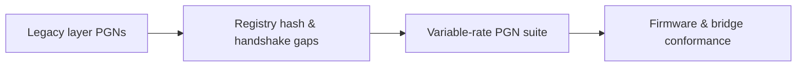

# 42-ADR-016 — Firmware and transport for variable-rate layer PGNs
*(Status: Proposed)*

**Authors:** Nexus Team (Codex)
**Reviewers:** Interprocess Communications Working Group
**Created:** 2025-10-20
**Last Updated:** 2025-10-20
**Status:** Proposed
**Version:** 0.1.0
**Supersedes:** _None_
**Superseded by:** _None_
**Related SRS:** [42 — Transports](42_Transports.md)
**Related Considerations:** [C2 - Versioned Variable-Rate Layer Streams](42_Transports.md#c2---versioned-variable-rate-layer-streams)

---

## 1) Context

Delivering layer definitions and feedback between Core, AgIO, and implement firmware requires deterministic CAN/UDP messages
aligned with the layer registry and section-control semantics. Legacy PGNs lack registry hashes, degraded-mode signaling, and
sequence discipline, motivating a modernized suite.【F:docs/sections/4X_Interprocess_Communications/42_Transports.md†L96-L178】

---

## 2) Decision

Standardize CAN/UDP PGNs `E2/E1/E0/DF/E3/E4` for layer definitions, feedback, and control acknowledgements, including node IDs,
sequencing, timeout, and heartbeat semantics.

### Decision Summary

* **Scope:** Variable-rate layer payloads exchanged between firmware, AgIO bridge, and Core.
* **Boundary:** gRPC typed APIs continue to surface layer data; MCU transports remain AOG-Link (ADR-006).
* **Implementation Level:** Design + code; shared reference firmware, simulators, and conformance tests.

---

## 3) Consequences

**Positive Impacts:**

* Deterministic schema negotiation with registry hash handshakes prevents silent drift.
* Sequencing and watchdog policies improve safety by failing sections closed when telemetry stops.
* Shared conformance tooling aligns firmware vendors, simulators, and bridge implementations.

**Negative / Mitigated Impacts:**

* Firmware and AgIO bridge must implement additional handshake logic and telemetry — mitigated via reference stubs.
* Increased implementation complexity — offset by documented watchdog thresholds and configuration hooks.
* CI infrastructure must expand to cover latency, jitter, and error injection scenarios — addressed via shared labs.

**Follow-up Actions:**

* Publish firmware examples with jitter injectors and watchdog tunables.
* Operate shared CAN/UDP harnesses for monthly health summaries and regression escalation.
* Expose configurable safety thresholds with documented safe ranges to avoid firmware forks.

---

## 4) Rationale

The defined PGN suite provides explicit registry hash negotiation, per-packet sequencing, and degraded-mode signals, aligning
firmware behavior with Core expectations and enabling deterministic analytics and control loops. Watchdog policies ensure
sections fail closed within 300 ms if communication is lost.

---

## 5) Alternatives Considered

| Option | Summary | Reason Not Selected |
|--------|---------|---------------------|
| Maintain legacy PGNs | Keep existing layer PGNs without registry hashes. | No drift detection; unsafe failure modes. |
| Push all telemetry via gRPC | Skip PGNs and rely on typed APIs only. | Firmware lacks capacity; PGN clients would break. |
| Custom vendor-specific frames | Allow OEM-specific payloads per implement. | Fragmented ecosystem and higher maintenance cost. |

---

## Change Log

| Date | Summary | Author | PR / Issue |
|------|---------|--------|------------|
| 2025-10-20 | Initial draft | Nexus Team (Codex) |  |

