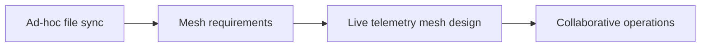

# 42-ADR-047 — Live Telemetry Mesh
*(Status: Proposed)*

**Authors:** Nexus Team (Codex)
**Reviewers:** Nexus Architecture Guild
**Created:** 2025-10-20
**Last Updated:** 2025-10-20
**Status:** Proposed
**Version:** 0.1.0
**Supersedes:** _None_
**Superseded by:** _None_
**Related SRS:** [42 — Transports](42_Transports.md)
**Related Considerations:** [C5 - Timebase & Telemetry Mesh Governance](42_Transports.md#c5---timebase--telemetry-mesh-governance), [C6 - Gauge Telemetry Channels](42_Transports.md#c6---gauge-telemetry-channels)

---

## 1) Context

Multi-machine collaboration requires low-latency sharing of presence, coverage, and layer updates across tractors, sprayers,
and scouts working the same job. Existing approaches rely on ad-hoc TCP servers or manual file syncing, which fail in rural
network conditions and lack access control. Nexus needs a mesh-friendly transport that integrates with plugin context,
respects privacy, and feeds UI overlays in real time.【F:docs/sections/4X_Interprocess_Communications/42_Transports.md†L180-L229】

---

## 2) Decision

Create a Live Telemetry Mesh plugin composed of a pub/sub overlay (`LiveMeshService`) and RadioBridge modules supporting ELRS/LoRa
transports. Devices publish presence heartbeats, trails, coverage tiles, and selected layer deltas; subscription profiles define
which tiers each device consumes.

### Decision Summary

* **Scope:** Presence, trails, coverage, and layer delta sharing across machines participating in a job.
* **Boundary:** Core transports, timebase synchronization, and security policies remain defined in related ADRs.
* **Implementation Level:** Design + code; mesh service, profile schemas, RadioBridge integration, and UI overlays.

---

## 3) Consequences

**Positive Impacts:**

* Enables collaborative operations with deterministic context sharing across machines.
* Integrates with plugin manifests, allowing opt-in replication of layer data.
* Provides operators with real-time visibility into remote devices via UI overlays.

**Negative / Mitigated Impacts:**

* QoS management and access control add complexity — mitigated by profile schemas and CI validation.
* Bandwidth constraints on radios require throttling and store-and-forward strategies — addressed by profile budgets and replay windows.
* Key rotation and ACL enforcement demand operational tooling — satisfied by documented rotation playbooks and telemetry audits.

**Follow-up Actions:**

* Version share and subscribe profile schemas in manifest bundles; block deployments lacking ACL policies or exceeding payload budgets.
* Include session IDs, mounted field sets, and profile hashes in presence heartbeats for auditability.
* Document key rotation and replay strategies for RadioBridge integrations with test vectors covering success/failure paths.

---

## 4) Rationale

A structured mesh overlay with share/subscribe profiles ensures only authorized data leaves the cab, while RadioBridge integrations
provide resilience on constrained links. Storing deltas as `LayerEditEvent` journals preserves replayability and provenance.

---

## 5) Alternatives Considered

| Option | Summary | Reason Not Selected |
|--------|---------|---------------------|
| Manual file sync | Copy coverage/layer files between machines. | High latency, prone to conflicts, no real-time collaboration. |
| Central cloud broker | Route all telemetry through an external service. | Dependent on connectivity; unacceptable for offline fields. |
| Peer-to-peer TCP mesh | Build custom TCP overlay per device. | Poor performance on lossy links; lacks QoS governance. |

---

## Change Log

| Date | Summary | Author | PR / Issue |
|------|---------|--------|------------|
| 2025-10-20 | Initial draft | Nexus Team (Codex) |  |

