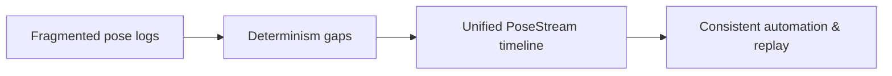

# 61-ADR-007 — PoseStream and SectionState Architecture

*(Status: Proposed)*

**Author:** Codex
**Reviewers:** Core Domain Working Group
**Created:** 2025-10-20
**Last Updated:** 2025-10-20
**Status:** Proposed
**Version:** 0.1.0
**Supersedes:** —
**Superseded by:** —
**Related SRS:** `61_Kinematics_Pose_Fusion.md`
**Related Options:** `61-O2`, `61-O3`

---

## 1) Context

Nexus requires a single authoritative timeline that carries tractor, implement,
toolbar, and section poses alongside diffed SectionState updates. Legacy prototypes
relied on disparate logs and cadence assumptions that broke determinism, complicated
automation gating, and made replay analysis inconsistent. This ADR formalizes
PoseStream expectations so downstream ADRs for equipment hierarchy, persistence,
guidance, and control share temporal guarantees while inheriting stack boundaries
set by ADR-028.【F:docs/sections/6X_Core_Domain_Services/61-ADR-007 - PoseStream and SectionState architecture.md†L9-L28】

Key inputs include communications and transport requirements, data persistence
formats, and section control working-group feedback.

---

## 2) Decision

Standardize on a unified PoseStream that sequences all pose-producing sources with
explicit cadence policies and shared time authority while diffing SectionState on
the same timeline. Enforce monotonic ordering under drift, define opportunity/event
tally semantics, and establish degraded-mode behaviors when optional feeds are
absent to guarantee deterministic fallbacks and telemetry signaling.【F:docs/sections/6X_Core_Domain_Services/61-ADR-007 - PoseStream and SectionState architecture.md†L12-L24】

### Decision Summary

* **Scope:** Core pose ingestion, automation arbitration, telemetry logging, and replay tooling.
* **Boundary:** Does not implement kinematics math or downstream visualizations.
* **Implementation Level:** Design + service contracts governing PoseStream and SectionState APIs.

---

## 3) Consequences

**Positive Impacts:**

* Downstream services (equipment hierarchy, persistence, guidance) assume a stable
  pose timeline with bounded payload sizes and deterministic diff ordering.
* Replay tooling preserves ordering to remain within determinism budgets.
* Telemetry and analytics gain opportunity/event tallies with traceable provenance.【F:docs/sections/6X_Core_Domain_Services/61-ADR-007 - PoseStream and SectionState architecture.md†L26-L40】

**Negative / Mitigated Impacts:**

* Legacy components require shims to adapt multi-stream logs into the combined format —
  mitigated through compatibility adapters.
* Integration suites must expand fault-injection coverage (duplication, reordering,
  ±75 ms clock skew) — mitigated via CI automation.【F:docs/sections/6X_Core_Domain_Services/61-ADR-007 - PoseStream and SectionState architecture.md†L40-L52】

**Follow-up Actions:**

* Publish protobuf and JSON schema updates for PoseStream and SectionState payloads.
* Extend replay fixtures and determinism benchmarks to cover new cadence guarantees.
* Coordinate consumer sign-off across equipment hierarchy, guidance, and persistence teams.

---

## 4) Rationale

The unified PoseStream provides deterministic sequencing required by section control
and automation ADRs while reducing duplicated logs. Alternative approaches relying on
independent streams could not meet determinism, audit, or telemetry tally goals
without excessive synchronization overhead.【F:docs/sections/6X_Core_Domain_Services/61-ADR-007 - PoseStream and SectionState architecture.md†L9-L28】

---

## 5) Alternatives Considered

| Option | Summary | Reason Not Selected |
|--------|---------|---------------------|
| 61-O1 | Maintain legacy multi-stream pose logs. | Fails determinism and replay requirements. |
| 61-O4 | Introduce per-plugin pose timelines with reconciliation. | Adds complexity and still requires global arbitration. |
| 61-O5 | Linux Core kiosk without unified pose stream. | Lacks guarantees for headless automation gating. |

---

## 6) Implementation Notes

* Update `proto/core.proto` with PoseStreamService and SectionState contracts.
* Publish `PoseStreamFrame.v1.json` and `SectionStateTally.v1.json` schemas.
* Add deterministic fixtures under `docs/Plugins/fixtures/pose-section-fixture.jsonl`.
* Document schema evolution rules (additive fields, reserved IDs) and downgrade verification.

---

## 7) Verification

* Integration suites include packet duplication, reorder, and ±75 ms clock skew bursts.
* PoseStream diff compression must maintain ≤ 2.5 KB median frame payload at 20 Hz for
  48-section rigs under replay testing.
* Opportunity/event tallies must match analytical goldens within 1% per hectare.
* Forced clock skew of ±25 ms must not break monotonic SectionState sequencing.【F:docs/sections/6X_Core_Domain_Services/61-ADR-007 - PoseStream and SectionState architecture.md†L32-L52】

---

## 8) References

* [Communications & transports requirements](../4X_Interprocess_Communications/42_Transports.md)
* [Data model & storage requirements](../3X_Data_Storage/32_Persistence_Formats.md)
