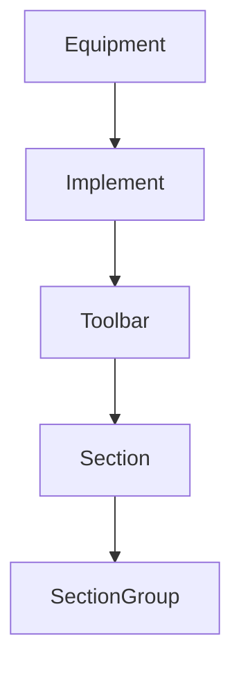

# 61-ADR-008 — Equipment → Implement → Toolbar → Section Hierarchy

*(Status: Proposed)*

**Author:** Codex
**Reviewers:** Equipment & Automation Working Group
**Created:** 2025-10-20
**Last Updated:** 2025-10-20
**Status:** Proposed
**Version:** 0.1.0
**Supersedes:** —
**Superseded by:** —
**Related SRS:** `61_Kinematics_Pose_Fusion.md`
**Related Options:** `61-O1`, `61-O2`

---

## 1) Context

Legacy AgOpenGPS configurations model implements as flat lists of sections with limited
grouping semantics. Nexus must handle multiple toolbars per implement, overlapping
SectionGroups, and richer metadata to coordinate lookahead, overlap policies, and future
kinematic links. A shared hierarchy ensures PoseStream, control arbitration, and UI
editors reference the same structure while enabling ADR-017 profile integration and
session provenance alignment with ADR-041.【F:docs/development/SRS/sections/6X_Core_Domain_Services/61-ADR-008 - Equipment Implement Toolbar Section hierarchy.md†L9-L31】

---

## 2) Decision

Adopt a canonical object model nesting equipment, implements, toolbars, and sections
with stable IDs and per-node offsets. Support overlapping SectionGroups, including
master groups, with documented arbitration order for conflicting commands. Capture
toolbar-level lookahead/overlap metadata and expose configuration hooks for future
kinematic integration. Provide schema and editor updates so legacy implements migrate
deterministically.【F:docs/development/SRS/sections/6X_Core_Domain_Services/61-ADR-008 - Equipment Implement Toolbar Section hierarchy.md†L13-L24】

### Decision Summary

* **Scope:** Equipment hierarchy definitions, configuration editors, and control arbitration consumers.
* **Boundary:** Does not define runtime kinematics math (covered by ADR-017).
* **Implementation Level:** Design + schema specification and migration tooling.

---

## 3) Consequences

**Positive Impacts:**

* Section control semantics (ADR-015) rely on consistent hierarchy relationships when
  applying overrides or resolving overlaps.
* PoseStream consumers reference stable identifiers for toolbar/section mapping and telemetry.
* Session captures reference applied configurations so replay, profit, and genetics plugins
  align telemetry with actual hardware state.【F:docs/development/SRS/sections/6X_Core_Domain_Services/61-ADR-008 - Equipment Implement Toolbar Section hierarchy.md†L24-L38】

**Negative / Mitigated Impacts:**

* Migration tooling must normalize legacy configs into the new schema — mitigated via
  scripted converters and validation reports.
* Editor UX must surface additional validation guidance — mitigated by shared schema validators.

**Follow-up Actions:**

* Deliver migration playbook covering V5/V6 configuration conversion with diff reports.
* Version equipment hierarchy schemas and enforce compatibility gates in registry CI.
* Require human QA sign-off on representative rigs each release cycle.

---

## 4) Rationale

A canonical hierarchy enables deterministic control arbitration, lookahead tuning, and
kinematic integration. Alternatives that kept flat section lists failed to capture
complex toolbar relationships or provide stable IDs for telemetry and replay consumers.【F:docs/development/SRS/sections/6X_Core_Domain_Services/61-ADR-008 - Equipment Implement Toolbar Section hierarchy.md†L9-L24】

---

## 5) Alternatives Considered

| Option | Summary | Reason Not Selected |
|--------|---------|---------------------|
| Legacy flat schema | Retain current flat section lists. | Cannot represent overlapping groups or multi-toolbar rigs. |
| Per-plugin hierarchy | Allow each plugin to define structure. | Breaks determinism and increases migration burden. |
| Simplified grouping | Restrict to non-overlapping groups. | Fails advanced implement use-cases (multi-rate, master overrides). |

---

## 6) Implementation Notes

* Scripted converter ingests V5/V6 configs, outputs diff reports, and highlights operator-visible changes.
* Schema versions enforce downgrade paths with associated unit tests.
* Lifecycle bus publishes `onSessionStart`/`onSessionEnd` with resolved implement IDs for provenance attachments.

---

## 7) Verification

* JSON schema validation must round-trip at least 30 representative V5/V6 configurations
  without unexpected diffs beyond ID normalization.
* Overlapping SectionGroup arbitration tests demonstrate deterministic override order with
  ≤ 50 ms resolution latency under concurrent commands.
* Configuration editor UX tests reject invalid overlap definitions and surface contextual guidance.【F:docs/development/SRS/sections/6X_Core_Domain_Services/61-ADR-008 - Equipment Implement Toolbar Section hierarchy.md†L40-L55】

---

## 8) References

* [Interprocess API requirements](../4X_Interprocess_Communications/41_Service_APIs_Contracts.md)
* [Control & automation requirements](61_Kinematics_Pose_Fusion.md)
* [ADR-007 — PoseStream and SectionState Architecture](61-ADR-007%20-%20PoseStream%20and%20SectionState%20architecture.md)
* [ADR-015 — Section Control & Grouping Semantics](61-ADR-015%20-%20Section%20control%20and%20grouping%20semantics.md)
