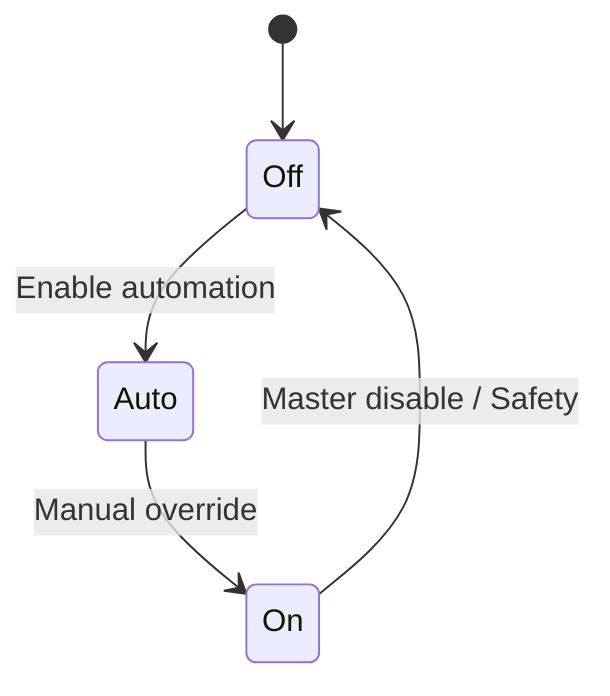

# 61-ADR-015 — Section Control and Grouping Semantics

*(Status: Proposed)*

**Author:** Codex
**Reviewers:** Automation & Safety Working Group
**Created:** 2025-10-20
**Last Updated:** 2025-10-20
**Status:** Proposed
**Version:** 0.1.0
**Supersedes:** —
**Superseded by:** —
**Related SRS:** `61_Kinematics_Pose_Fusion.md`
**Related Options:** `61-O2`, `61-O3`

---

## 1) Context

Nexus requires deterministic section control behavior honoring manual overrides,
automation, and plugin contributions while managing overlapping groups and toolbar-level
lookahead. Legacy systems relied on ad-hoc priority rules with limited observability.
This ADR defines the control graph and arbitration rules aligned with ADR-008 hierarchy,
ADR-007 PoseStream cadence, and ADR-018 plugin capabilities.【F:docs/sections/6X_Core_Domain_Services/61-ADR-015 - Section control and grouping semantics.md†L9-L18】

---

## 2) Decision

Establish a control graph covering On/Auto/Off states, master group actions, overlapping
group arbitration, and toolbar-specific lookahead/overlap defaults. Define arbitration
priorities (manual > plugin > auto) with safety interlocks and telemetry for overrides.
Provide configuration UI updates and documentation so operators understand group
behaviors, and integrate with plugin lifecycle hooks ensuring permissions guard
control extensions and degraded modes surface missing capabilities.【F:docs/sections/6X_Core_Domain_Services/61-ADR-015 - Section control and grouping semantics.md†L18-L26】

### Decision Summary

* **Scope:** Core section control arbiter, UI configuration surfaces, plugin lifecycle hooks.
* **Boundary:** Does not dictate hardware-specific actuation; firmware handles final outputs.
* **Implementation Level:** Design + policy enforced by automation services.

---

## 3) Consequences

**Positive Impacts:**

* Section control becomes predictable and testable across automation modes, improving safety
  and operator trust.
* Overrides emit structured telemetry for audit retention policies.
* Simulation and replay flows gain deterministic coverage of interlocks and overrides.【F:docs/sections/6X_Core_Domain_Services/61-ADR-015 - Section control and grouping semantics.md†L26-L44】

**Negative / Mitigated Impacts:**

* Arbitration logic adds complexity requiring thorough simulation — mitigated by mandatory
  SimBus scenarios and invariant checks.
* Plugins must adapt to new lifecycle hooks — mitigated via capability discovery APIs.

**Follow-up Actions:**

* Implement formal verification on state charts (deadlock, mutual exclusion) with CI gating.
* Extend SimBus scenarios covering safety interlocks and override paths.
* Ensure override logging includes timestamp, operator, reason, and duration.

---

## 4) Rationale

Deterministic arbitration ensures manual overrides supersede automation while safety
interlocks enforce fail-closed behavior. Competing approaches without a unified control
graph could not guarantee predictable priority handling or auditability across plugins.

---

## 5) Alternatives Considered

| Option | Summary | Reason Not Selected |
|--------|---------|---------------------|
| Legacy priority heuristics | Maintain existing ad-hoc ordering. | Unverifiable and inconsistent across plugins. |
| Plugin-defined arbitration | Let each plugin arbitrate output. | Breaks determinism and safety interlocks. |
| Manual-only override logging | Skip automation awareness. | Sacrifices automation roadmap and telemetry transparency. |

---

## 6) Implementation Notes

* State charts documented with invariant tests and checked into CI artifacts.
* UI editors updated with validation messaging and documentation for group precedence.
* Plugin lifecycle hooks reference ADR-018 to enforce permissions and degraded-mode signaling.

---

## 7) Verification

* Section control simulator keeps overlap error ≤ 8% against agronomic goldens across replay fixtures.
* Manual overrides pre-empt plugin commands within 100 ms and log actor plus duration in telemetry streams.
* Safety interlock tests assert sections fail closed when heartbeat loss exceeds 300 ms using integration harnesses.【F:docs/sections/6X_Core_Domain_Services/61-ADR-015 - Section control and grouping semantics.md†L35-L44】

---

## 8) References

* [Control & automation requirements](61_Kinematics_Pose_Fusion.md)
* [Extensibility & plugin requirements](../9X_Frontends_Ops/94_Extensibility_Packaging_Updates.md)
* [ADR-008 — Equipment hierarchy](61-ADR-008%20-%20Equipment%20Implement%20Toolbar%20Section%20hierarchy.md)
* [ADR-007 — PoseStream and SectionState architecture](61-ADR-007%20-%20PoseStream%20and%20SectionState%20architecture.md)
* [ADR-018 — Plugin API and capability discovery](../9X_Frontends_Ops/94-ADR-018%20-%20Plugin%20API%20and%20capability%20discovery.md)
