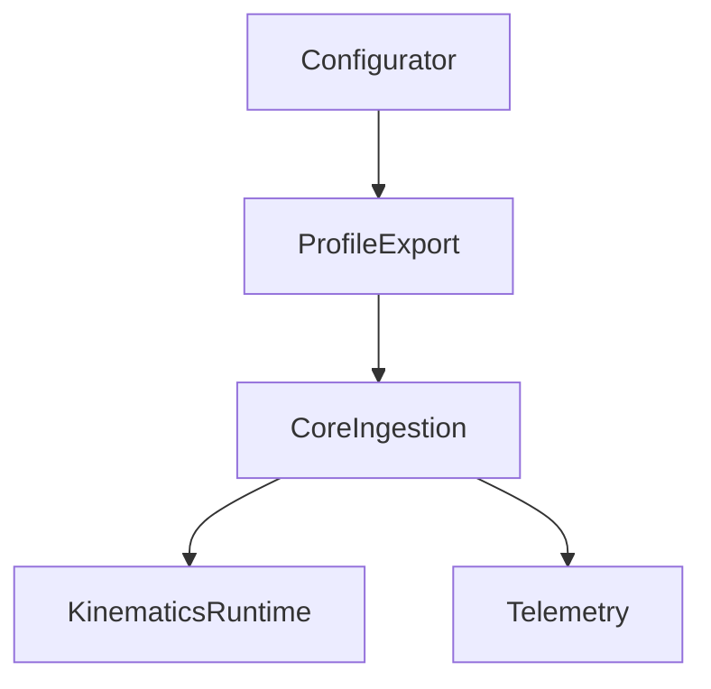

# 61-ADR-067 — Equipment Configuration and Axle-Centric Kinematics Runtime

*(Status: Proposed)*

**Author:** Codex
**Reviewers:** Kinematics Runtime Working Group
**Created:** 2025-10-20
**Last Updated:** 2025-10-20
**Status:** Proposed
**Version:** 0.1.0
**Supersedes:** —
**Superseded by:** —
**Related SRS:** `61_Kinematics_Pose_Fusion.md`
**Related Options:** `61-O2`, `61-O3`

---

## 1) Context

Operators need to configure articulated, multi-steer, and tracked machines without hand-editing
JSON while Core consumes a kinematic graph that respects axle geometry, hitch couplers, sensors,
and mode-dependent limits. The multi-steer configurator blueprint defines UX, schema, and sensor
catalog expectations, but an executable contract is required to bridge exports into Core’s
kinematics runtime, pose fusion, and planner guardrails without bespoke integration per rig.【F:docs/development/SRS/sections/6X_Core_Domain_Services/61-ADR-067 - Equipment configuration and axle-centric kinematics runtime.md†L9-L32】

---

## 2) Decision

Adopt the axle-centric runtime from the multi-steer configurator as the canonical equipment export.
Axles form primary nodes, drawbars encode joints, and wheels attach with steering geometry metadata
so kinematics compute curvature, slip, and Ackermann-corrected commands. Require exports to include
frames/units/timebase metadata, steering module definitions, hitch/joint dynamics, sensor attachments,
mode profiles, and deterministic content hashes. Define a Core ingestion API that validates the graph,
enforces compatibility guards, exposes deterministic ingestion, and surfaces timebase/late-measurement
policies. Publish telemetry and planner hand-off contracts (`/machine/health`, `/planner/limits`,
`/estimator/debug`, `/calibration/status`) alongside capability summaries and profile hashes.【F:docs/development/SRS/sections/6X_Core_Domain_Services/61-ADR-067 - Equipment configuration and axle-centric kinematics runtime.md†L32-L84】

### Decision Summary

* **Scope:** Configurator exports, Core ingestion service, telemetry and planner contracts.
* **Boundary:** Does not define hardware calibration tooling beyond schema requirements.
* **Implementation Level:** Design + runtime implementation with deterministic ingestion and telemetry surfaces.

---

## 3) Consequences

**Positive Impacts:**

* Guidance, section, and automation planners rely on uniform axle-centric models with explicit limits,
  reducing bespoke integrations and enabling deterministic simulation across articulated rigs.
* Operators gain guided configuration workflows with validation and content hashes, improving onboarding and support.
* Telemetry surfaces expose curvature limits, health, and calibration status for diagnostics and automation governance.【F:docs/development/SRS/sections/6X_Core_Domain_Services/61-ADR-067 - Equipment configuration and axle-centric kinematics runtime.md†L86-L130】

**Negative / Mitigated Impacts:**

* Core must ship ingestion, validation, and telemetry services, increasing engineering effort — mitigated by shared fixtures and automation.
* Legacy presets require migration helpers and coordination with dealers — mitigated via scripted conversions and documentation.

**Follow-up Actions:**

* Finalize JSON schema, validation rules, and export pipeline including content hashes and calibration stamps.
* Implement Core loader enforcing Definition of Done checks, compatibility guards, deterministic seeds, and error taxonomy.
* Integrate planners and controllers with curvature limits, drive-direction policies, and slip estimates.
* Deliver calibration workflows (Ackermann wizard, hitch zeroing, slip checks) and publish operator guides plus preset libraries.【F:docs/development/SRS/sections/6X_Core_Domain_Services/61-ADR-067 - Equipment configuration and axle-centric kinematics runtime.md†L130-L188】

---

## 4) Rationale

Axle-centric exports provide deterministic geometry for Core without bespoke adapters. Alternatives that
kept legacy presets or partial schemas failed to capture steering authority, latency, and slip metadata
needed for automation safety and planner guardrails.

---

## 5) Alternatives Considered

| Option | Summary | Reason Not Selected |
|--------|---------|---------------------|
| Legacy preset conversion | Continue manual JSON editing per rig. | Error-prone, lacks deterministic ingestion and telemetry. |
| Minimal profile export | Export limited geometry without axle focus. | Cannot derive curvature limits or slip budgets reliably. |
| Plugin-specific ingestion | Allow each planner to parse exports. | Duplicates logic and breaks determinism across services. |

---

## 6) Implementation Notes

* Ingestion validates single rooted tree, dependency completeness, schema compatibility, and `meta.compat.guard` requirements.
* Deterministic ingestion provides `{deterministic, seed}` parameters and publishes profile hashes for regression tracking.
* Telemetry topics mirror configurator blueprint and include capability summaries for planners and diagnostics.
* Definition of Done gates demand lossless round-trips, latency/overshoot budgets, and slip/accuracy metrics across fixtures.

---

## 7) Verification

* Regression fixtures confirm ≤ 5 cm RMS toolpoint cross-track error on flat ground and ≤ 10 cm on 8% sidehills without crab steering.
* Mode profile transitions (road ↔ field ↔ fail_safe) complete in < 150 ms with < 1° transient on dependent joints.
* Export/import round-trips preserve content hashes (modulo calibration stamps) and reject cycles, missing sensors, or incompatible schemas.
* Ackermann wizard CSV loopback yields < 0.2° RMS residual; sidehill slip sanity produces 0.08–0.16 m/s with κ_max derate ≥ 15%; road→field flips stay < 150 ms and < 1° transient.【F:docs/development/SRS/sections/6X_Core_Domain_Services/61-ADR-067 - Equipment configuration and axle-centric kinematics runtime.md†L188-L210】

---

## 8) References

* [Multi-steer equipment configurator blueprint](../6X_Core_Domain_Services/61_Kinematics_Pose_Fusion.md#6192-multi-steer-configurator-detail)
* [ADR-017 — Equipment profiles and kinematics](61-ADR-017%20-%20Equipment%20profiles%20and%20kinematics.md)
* [ADR-033 — Guidance planner and autosteer orchestration](../6X_Core_Domain_Services/61-ADR-033%20-%20Guidance%20planner%20and%20autosteer%20orchestration.md)
* [ADR-028 — Stack boundaries](../6X_Core_Domain_Services/61-ADR-028%20-%20Stack%20boundaries.md)
