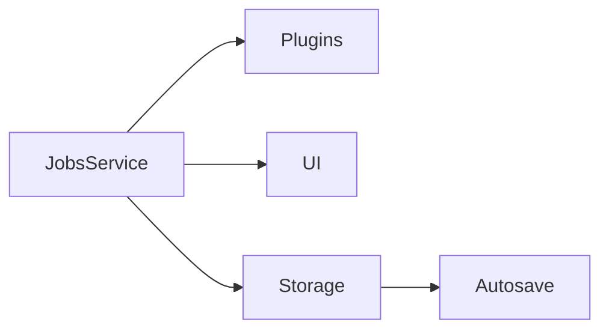

# 62-ADR-030 — Field Job Sessions and Lifecycle Services

*(Status: Proposed)*

**Author:** Codex
**Reviewers:** Job Lifecycle Working Group
**Created:** 2025-10-20
**Last Updated:** 2025-10-20
**Status:** Proposed
**Version:** 0.1.0
**Supersedes:** —
**Superseded by:** —
**Related SRS:** `62_Job_Lifecycle.md`
**Related Options:** `62-O1`, `62-O2`, `62-O3`

---

## 1) Context

AgOpenGPS v6 exposes field sessions as loosely-structured folders with ad-hoc menu flows. Coverage
files, boundaries, and guidance assets share directories and `Resume.txt` is the only structured
metadata. Nexus Core orchestrates plugins, presets, and layouts but lacks a first-class job lifecycle
model, making autosave, geofence discovery, and plugin participation inconsistent. A unified Job
abstraction must exchange consistent metadata, load/save workflows, and resume behavior while remaining
compatible with legacy archives.【F:docs/development/SRS/sections/6X_Core_Domain_Services/62-ADR-030 - Field job sessions and lifecycle services.md†L9-L23】

---

## 2) Decision

Establish Jobs as a first-class concept spanning Core, UI, and plugins with the following pillars:

1. **Job metadata contract.** Versioned `aog.job.v1` schema stored as `job.json` capturing identity,
   timestamps, spatial hints, asset paths, equipment/preset pointers, layout references, and user tags.
2. **Filesystem job store.** `/Jobs/<DisplayName>/` root containing `job.json`, `Resume.txt`, and `data/`
   subtree for boundaries, guidance, coverage, prescriptions, and attachments. Cloud mirrors optional,
   but offline structure mandatory.
3. **JobsService lifecycle API.** Core-hosted gRPC service exposing verbs for `New`, `Resume`, `Open`,
   `DriveIn`, `Import`, `Clone`, `Save`, `Close`, plus `GetActive`, `List`, and `Watch` for transitions.
4. **UI integrations.** Mirror legacy menu, surface active job in UI chip, provide drawers showing assets
   and implement context, and offer Drive-In geofence prompts.
5. **Plugin extensibility.** Allow plugins to register import sources, contribute decorators, and receive
   lifecycle hooks gated by permissions.
6. **Safety & autosave.** Track dirty state, autosave at intervals/before risky operations, and run crash-safe
   journaling for coverage tiles.

Degraded operation messaging covers missing mapping providers, unavailable plugin hooks, and read-only or
low-disk job stores with explicit operator alerts and fallback behaviors.【F:docs/development/SRS/sections/6X_Core_Domain_Services/62-ADR-030 - Field job sessions and lifecycle services.md†L25-L63】

### Decision Summary

* **Scope:** Core JobsService, on-disk schema, UI orchestration, plugin lifecycle hooks.
* **Boundary:** Does not enforce cloud sync; offline-first operation remains primary.
* **Implementation Level:** Design + Core service implementation and UI integration.

---

## 3) Consequences

**Positive Impacts:**

* Core, UI, and plugins share a single authority for job identity and storage enabling autosave, Drive-In
  geofence matching, and deterministic crash recovery while keeping V6 compatibility.
* Extensible import pipeline normalizes ISOXML, KML, and plugin-defined sources into the job store.
* Jobs reference presets/layouts by link or snapshot allowing seasonal updates with historical overrides.【F:docs/development/SRS/sections/6X_Core_Domain_Services/62-ADR-030 - Field job sessions and lifecycle services.md†L63-L88】

**Negative / Mitigated Impacts:**

* Implementation workload spans schema, service host, UI, and migration tooling — mitigated with staged work
  packages and automated migration harnesses.
* Offline storage pressure and plugin absence require UX messaging — mitigated by built-in alerts and fallback modes.

**Follow-up Actions:**

* Implement schema helpers, JobsService host, refreshed UI flows, and importer pipeline.
* Deliver Drive-In geofence indexing, autosave + coverage journaling, and V6 migration tools.
* Maintain schema diff tooling, transactional hooks, and release rehearsals before promoting changes.

---

## 4) Rationale

A first-class job service enforces consistent metadata, lifecycle operations, and plugin coordination while
preserving legacy archives. Alternatives relying on folder heuristics cannot deliver deterministic resumes,
structured imports, or extensible automation hooks.

---

## 5) Alternatives Considered

| Option | Summary | Reason Not Selected |
|--------|---------|---------------------|
| Legacy folder workflows | Keep existing Resume.txt-driven flows. | Lacks structured metadata and automation hooks. |
| Plugin-owned job stores | Let plugins manage jobs independently. | Causes divergent workflows and breaks crash recovery. |
| Cloud-only job database | Require online connectivity. | Violates offline-first requirement for rigs. |

---

## 6) Implementation Notes

* Canonical disk layout `/Jobs/<JobName>/job.json`, `Resume.txt`, `layers/`, `sessions/`, `attachments/` reaffirmed.
* Session awareness events (`onSessionStart`, `onSessionEnd`, `onSessionMetadataChange`) emitted to plugins and dashboards.
* Remote dashboards operate monitor-only unless operators grant write permissions.

---

## 7) Verification

* Crash recovery restores previously active job within 8 seconds without duplicating more than one PoseStream segment.
* Migration harness converts ≥ 50 representative V6 jobs without schema failures, flagging downgraded fields as warnings.
* Drive-In geofence discovery populates entry/exit events with ≤ 50 cm spatial error on RTK replay datasets.【F:docs/development/SRS/sections/6X_Core_Domain_Services/62-ADR-030 - Field job sessions and lifecycle services.md†L88-L108】

---

## 8) References

* [Persistence formats](../3X_Data_Storage/32_Persistence_Formats.md)
* [Plugin lifecycle](../9X_Frontends_Ops/94-ADR-018%20-%20Plugin%20API%20and%20capability%20discovery.md)
* [Mapping & coverage responsibilities](../9X_Frontends_Ops/94-ADR-029%20-%20Mapping%20plugin%20architecture.md)
