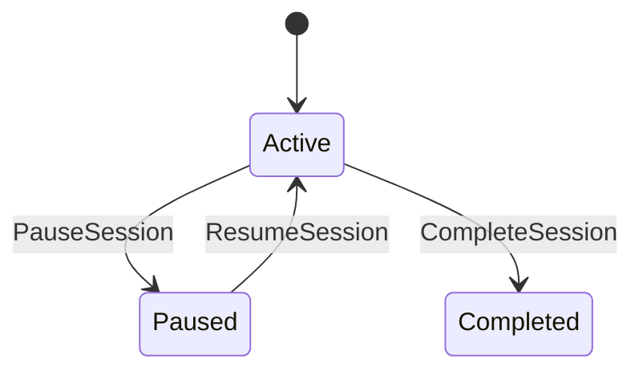

# 62-ADR-041 — Job Sessions Lifecycle

*(Status: Proposed)*

**Author:** Codex
**Reviewers:** Session Lifecycle Working Group
**Created:** 2025-10-20
**Last Updated:** 2025-10-20
**Status:** Proposed
**Version:** 0.1.0
**Supersedes:** —
**Superseded by:** —
**Related SRS:** `62_Job_Lifecycle.md`
**Related Options:** `62-O1`, `62-O3`

---

## 1) Context

Legacy workflows tracked a single “run” per job folder, forcing analytics and compliance exports to infer
activity from sparse timestamps and notes. Core orchestration centralizes jobs but still treated field time as
one blob, leaving plugins without deterministic hooks when work starts, pauses, or finishes. ADR-041 replaces
legacy runs with first-class sessions so Core, UI, and plugins coordinate lifecycle, provenance, and automation
consistently.【F:docs/development/SRS/sections/6X_Core_Domain_Services/62-ADR-041 - Job Sessions Lifecycle.md†L11-L37】

---

## 2) Decision

Introduce explicit sessions capturing contiguous blocks of work inside a job orchestrated by Core, UI, and
plugins.

### Session Model

* Sessions auto-create when a job starts (`Session 1`) and may be renamed by operators.
* State machine flows `Active → Paused → Active → Completed`; completed sessions become immutable snapshots with
  editable metadata notes only.
* Each session carries stable identifiers (`sessionId`, `jobId`, optional `seasonId`, `farmId`, `fieldIds`),
  timestamps, operator roster, environmental measurements, equipment bundles, and plugin extensions.【F:docs/development/SRS/sections/6X_Core_Domain_Services/62-ADR-041 - Job Sessions Lifecycle.md†L37-L53】

### Storage Layout

* `job.json` gains a `sessions[]` array storing descriptors (IDs, names, state, timestamps, operators, stats).
* Detailed payloads live in `sessions/<sessionId>.json` with atomic autosave and journaling for rollback safety.
* Sessions reference layers, telemetry logs, prescriptions, and attachments via stable IDs.【F:docs/development/SRS/sections/6X_Core_Domain_Services/62-ADR-041 - Job Sessions Lifecycle.md†L53-L86】

### Lifecycle API & Events

* JobsService adds verbs: `StartSession`, `PauseSession`, `ResumeSession`, `CompleteSession`, `StartNextSession`,
  `UpdateSessionMetadata`, `ListSessions` with role-based access.
* Core publishes lifecycle events (`onSessionStart`, `onSessionPause`, `onSessionResume`, `onSessionEnd`,
  `onSessionMetadataChange`) buffered per plugin for deterministic acknowledgements.【F:docs/development/SRS/sections/6X_Core_Domain_Services/62-ADR-041 - Job Sessions Lifecycle.md†L86-L110】

### Work Orders & UI Integration

* TaskService launches sessions when work orders enter `InProgress`, storing `workOrderId`, assignees, presets,
  layouts, and checklist status for reconciliation.
* UI replaces “Run” with “Session”, offering drawers to control sessions, review notes, and capture metadata while
  Drive-In prompts trigger session start when geofence proximity matches templates.【F:docs/development/SRS/sections/6X_Core_Domain_Services/62-ADR-041 - Job Sessions Lifecycle.md†L110-L132】

### Autosave, Journaling, Observability & Degraded Operation

* Autosave flushes session documents alongside coverage tiles; transitions require successful checkpoints before
  acknowledgement.
* Lifecycle events emit audit logs and metrics (duration, pause counts) for observability; offline rigs queue events
  for later upload with conflict resolution guidance.
* If plugins skip hooks or storage becomes read-only, Core annotates sessions with skipped reasons and switches to
  append-only journals while prompting operators.【F:docs/development/SRS/sections/6X_Core_Domain_Services/62-ADR-041 - Job Sessions Lifecycle.md†L132-L173】

### SRS Impact

Aligns operational hierarchy and session payload requirements in data model, implements lifecycle states and
autosave expectations in Job Lifecycle, and provides backend services with deterministic checkpoints and metrics
for controllers, journaling, and automation coordination.【F:docs/development/SRS/sections/6X_Core_Domain_Services/62-ADR-041 - Job Sessions Lifecycle.md†L173-L189】

---

## 3) Consequences

**Positive Impacts:**

* Deterministic lifecycle events let plugins checkpoint state, rotate logs, and stamp provenance without polling.
* Resume flows replay pending journals while maintaining context for automation and analytics.
* Fleet admins gain visibility into session metrics, notes, and skipped hooks for compliance.

**Negative / Mitigated Impacts:**

* Additional storage and autosave coordination required — mitigated by atomic journaling and rollback facilities.
* Plugins must adopt session-aware hooks — mitigated by buffered acknowledgements and manifest opt-ins.

**Follow-up Actions:**

* Ship session schema validators, lifecycle gRPC implementations, and UI drawer updates.
* Update TaskService integration tests for automatic session launch and provenance capture.
* Document degraded operation playbooks for offline conflict resolution and storage pressure.

---

## 4) Rationale

Sessions provide explicit lifecycle boundaries enabling deterministic automation, provenance, and analytics.
Maintaining legacy run semantics cannot support work-order alignment, multi-session analysis, or reliable
crash recovery.

---

## 5) Alternatives Considered

| Option | Summary | Reason Not Selected |
|--------|---------|---------------------|
| Legacy run concept | Keep implicit single run per job. | Lacks deterministic hooks and provenance. |
| Plugin-specific sessions | Allow plugins to manage their own session state. | Introduces race conditions and inconsistent UX. |
| Session-less journaling | Depend solely on timestamps. | Cannot reconcile work orders or multi-operator scenarios. |

---

## 6) Implementation Notes

* Session schema updates accompany `job.json` migration and `sessions/<id>.json` persistence.
* Lifecycle events integrate with TaskService, automation plugins, and telemetry exporters.
* Offline conflict resolution merges notes/attachments while rejecting contradictory state transitions.

---

## 7) Verification

* Session lifecycle tests exercise start/pause/resume/complete flows with deterministic plugin acknowledgements.
* Autosave and journaling fixtures ensure transitions succeed only after checkpoints and roll back on failure.
* Offline reconciliation scenarios validate conflict resolution messaging and queue replay fidelity.

---

## 8) References

* [Job Lifecycle SRS section](62_Job_Lifecycle.md)
* [TaskService work order integration](62_Job_Lifecycle.md#work-orders-task-orchestration)
* [Provenance governance](64-ADR-019%20-%20Provenance%20audit%20and%20QA%20governance.md)
