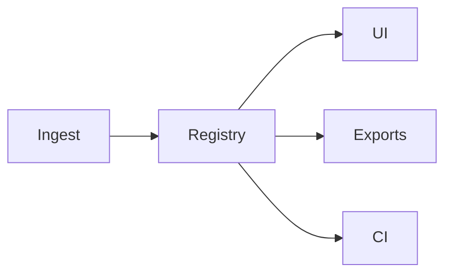

# 64-ADR-019 — Provenance, Audit, and QA Governance

*(Status: Proposed)*

**Author:** Codex
**Reviewers:** Provenance & QA Working Group
**Created:** 2025-10-20
**Last Updated:** 2025-10-20
**Status:** Proposed
**Version:** 0.1.0
**Supersedes:** —
**Superseded by:** —
**Related SRS:** `64_Telemetry_Health.md`
**Related Options:** `64-O1`, `64-O3`

---

## 1) Context

Nexus orchestrates multi-layer analytics and prescriptions, requiring provenance, quality status, and audit
trails across storage, UI, and export pipelines. Current workflows lack unified identifiers and hash checks,
complicating compliance reporting and troubleshooting. This ADR defines provenance registry expectations aligned
with session models, derived products, and persistence strategies.【F:docs/sections/6X_Core_Domain_Services/64-ADR-019 - Provenance audit and QA governance.md†L9-L16】

---

## 2) Decision

* Introduce a provenance registry capturing dataset hashes, job/session IDs, quality flags, and chain-of-custody rules across
  ingestion, transformation, and export stages.
* Enforce QA badge surfacing in UI components with drill-down links to dataset histories and audit events.
* Integrate hash validation and provenance checks into CI pipelines to detect regressions or unauthorized modifications.
* Coordinate with session orchestration to ensure provenance relationships span jobs, PoseStreams, and derived artifacts.【F:docs/sections/6X_Core_Domain_Services/64-ADR-019 - Provenance audit and QA governance.md†L16-L27】

### Decision Summary

* **Scope:** Provenance registry, hash validation workflows, UI badge surfacing, CI integration.
* **Boundary:** Does not prescribe analytics scoring algorithms; focuses on lineage and QA governance.
* **Implementation Level:** Design + infrastructure services, UI hooks, and CI enforcement.

---

## 3) Consequences

**Positive Impacts:**

* Operators and auditors gain visibility into data lineage and QA status, improving trust and compliance readiness.
* Incident response incorporates provenance checkpoints, accelerating root-cause analysis.

**Negative / Mitigated Impacts:**

* Additional storage and UI work required to persist and surface provenance metadata — mitigated by shared registry services.
* CI pipelines incur hash computation overhead — mitigated by incremental hashing and caching strategies.【F:docs/sections/6X_Core_Domain_Services/64-ADR-019 - Provenance audit and QA governance.md†L27-L44】

**Follow-up Actions:**

* Implement retention SLA enforcement with automated monthly verification.
* Deploy tamper-evident storage (hash chains, Merkle proofs) and integrate with audit export tooling.
* Update incident response playbooks to include provenance checkpoint review.

---

## 4) Rationale

Unified provenance governance ensures every dataset carries traceable lineage, QA badges, and tamper detection, enabling
regulatory compliance and trustworthy analytics. Disparate identifiers or optional hashing cannot satisfy audit and
security requirements.

---

## 5) Alternatives Considered

| Option | Summary | Reason Not Selected |
|--------|---------|---------------------|
| Ad-hoc provenance files | Leave provenance to individual plugins. | Leads to inconsistent identifiers and missing hashes. |
| Hash-only CI checks | Skip registry/UI integration. | Fails to surface QA context to operators and auditors. |
| UI-only QA badges | Present statuses without storage enforcement. | Cannot prove integrity or support incident response. |

---

## 6) Implementation Notes

* Provenance registry retains seven years of audit entries by default; reductions require legal approval and automated SLA checks.
* Hash chains and Merkle proofs back every bundle so auditors can verify integrity offline.
* Audit exports produce signed JSON logs for 30-day rapid access while long-term archives remain in the registry.

---

## 7) Verification

* Provenance records apply SHA-256 hash stamps to PoseStream and tile artifacts with 100% match against regression goldens.
* UI badges reflect QA state transitions within ≤ 2 seconds of provenance updates with verified telemetry events.
* CI pipelines export signed JSON logs with ≤ 5% size overhead relative to raw event streams.【F:docs/sections/6X_Core_Domain_Services/64-ADR-019 - Provenance audit and QA governance.md†L44-L52】

---

## 8) References

* [Telemetry & health requirements](64_Telemetry_Health.md)
* [Quality engineering & release requirements](../9X_Frontends_Ops/96_Quality_Engineering_Release.md)
* [Persistence formats](../3X_Data_Storage/32_Persistence_Formats.md)
* [ADR-009 — PoseStream vector logs and TileStore persistence](../6X_Core_Domain_Services/61-ADR-009%20-%20PoseStream%20vector%20logs%20and%20layer%20TileStore%20persistence.md)
* [ADR-023 — Session and job model](62-ADR-023%20-%20Session%20and%20job%20model%20with%20provenance%20graph.md)
