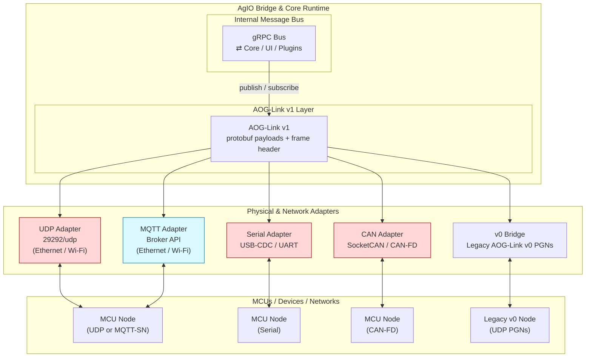

# AOG-Link Bridge Architecture Guide

> Task: NX-115 AOG-Link protocol specification and reference flows.

This guide walks through the practical view of the Bridge stack so engineers,
integrators, and support teams can explain how gRPC services, AOG-Link v1, and
the transport adapters cooperate. Pair it with Section 3A of the SRS for the
full normative specification.

## 1. Layered view at a glance

1. **Core runtime (gRPC bus).** Core, UI, and plugins exchange typed messages
   over the in-process gRPC bus. Everything north of the Bridge speaks this
   contract.
2. **AOG-Link v1 layer.** The Bridge converts gRPC intents and telemetry into
   protobuf payloads plus the 8-byte frame header defined in the SRS. Reliability
   policies (ACKs, retries, segmentation) live here so transports stay thin.
3. **Adapters.** UDP, Serial, CAN, and MQTT adapters reuse the shared codec and
   only worry about sockets, ports, baud rates, and SocketCAN details.
4. **Legacy bridge.** A dedicated adapter still emits/consumes AOG-Link v0 UDP
   PGNs so older MCUs remain operable until retirement.

## 2. Why the split matters

- **Shared logic once.** Encoding, decoding, ACK handling, and rate limiting are
  written once in the AOG-Link v1 layer. A bug fix benefits every transport.
- **Transport specialization.** Each adapter focuses on its medium (socket
  setup, COBS framing, SocketCAN filters) without duplicating business logic.
- **Clear upgrade plan.** v0-only nodes stay on the legacy bridge, while new
  firmware simply adds the appropriate adapter client.

## 3. Control vs telemetry paths

| Path type         | Preferred transports                        | Notes                                                   |
|-------------------|---------------------------------------------|---------------------------------------------------------|
| Low-latency CTRL  | Shared memory (same host) → Serial/CAN → UDP | `ACK_REQUIRED` commands, steer and section loops.        |
| Fan-out telemetry | MQTT QoS0 → UDP multicast (optional)         | GPS, IMU, status, health metrics.                       |
| Legacy support    | v0 Bridge                                    | Emits AOG-Link v0 PGNs for classic controllers.         |

The Mermaid flowchart above (mirrored in the SRS, Section 3A §6) marks
control-focused adapters in red and telemetry-first adapters in blue. Use it as
the visual aid when explaining the data paths to stakeholders.

## 4. Operational checklist

- ✅ Confirm every node advertises the correct `roles_mask` in `Hello` so the
  Bridge can route authority and telemetry appropriately.
- ✅ Keep Mosquitto (or your broker of choice) on the same host as Core for fast
  fan-out; remote brokers are acceptable but add latency.
- ✅ When adding a new transport, start by wiring it through the shared AOG-Link
  v1 layer. Only create a new adapter when the physical medium truly differs.
- ✅ For brownfield sites, leave the v0 bridge enabled until all legacy nodes
  show up with v1 firmware in `Hello` responses.

## 5. Troubleshooting tips

- **Control jitter?** Inspect the control adapters (Serial, CAN, UDP) first;
  telemetry adapters rarely cause steering delay.
- **Missing telemetry?** Subscribe to the MQTT topics directly (`aog/v1/*`) to
  confirm the Bridge still publishes. If MQTT is silent, fall back to UDP
  captures to isolate the problem.
- **Authority confusion?** Check the retained `aog/v1/{group}/ctrl/authority`
  topic and ensure `setpoint_ttl_ms` from `HelloAck` has not expired.

Keeping the mental model above aligned across engineering, support, and dealer
teams prevents miscommunication when multiple transports are active in the same
deployment.
