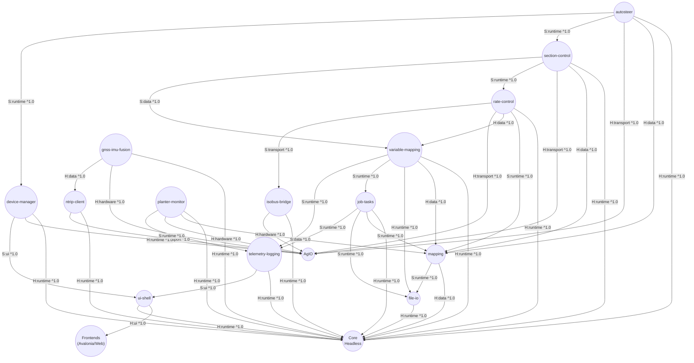
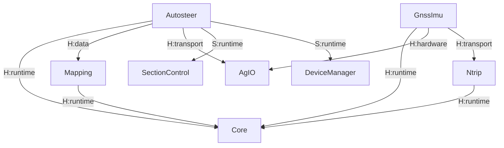
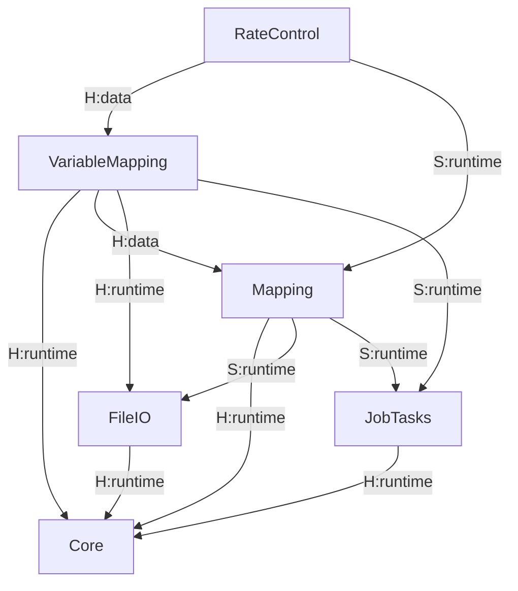
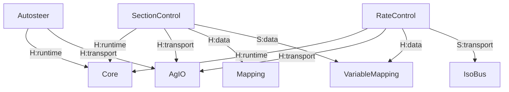
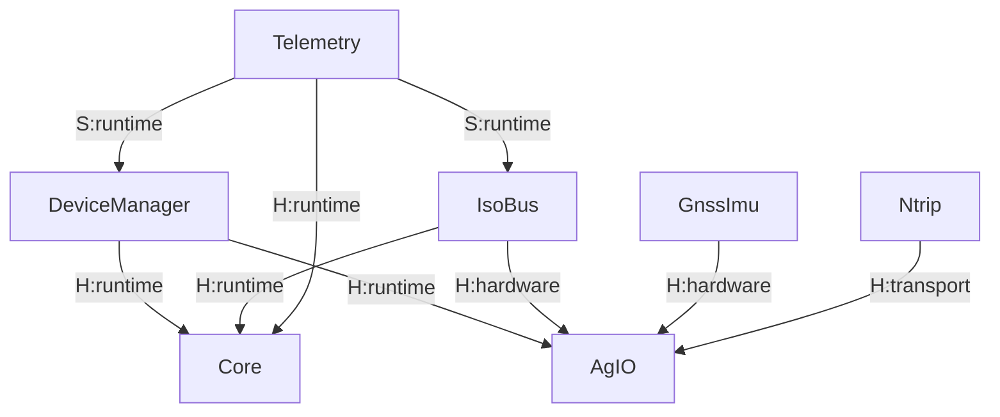
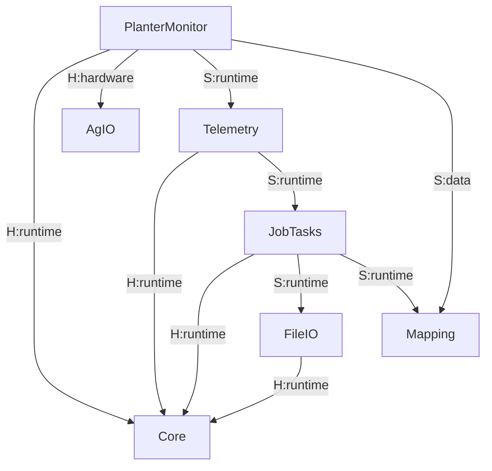

# AgOpenGPS Nexus Plugin Dependency Map

*Generated: 2025-10-14 UTC*

## How to Read This Map
- **Hard (H)** — Required for the plugin to start or remain healthy.
- **Soft (S)** — Optional; unlocks additional functionality when present.
- **Suggest (G)** — Recommended pairing surfaced to operators.
- **Type codes** — `runtime`, `data`, `transport`, `ui`, `hardware`, `build` correspond to runtime contract, data contract, transport/channel, UI surface, physical IO, or build-time artifacts.
- **Version** — Semantic version or tagged contract range expected by the dependency.
- **Relationship codes** — `P` (peerOf), `X` (conflictsWith), `R` (replaces), `E` (extends) annotate higher-order relationships enforced by the resolver when multiple providers exist.
- **Profiles & features** — Capability entries reference manifest `provides.capabilities[].features` and `provides.profiles[]` values so conformance-attested providers can substitute for the official implementations without aliases.【F:docs/SRS/appendices/plugin_manifest.schema.json†L153-L308】

### Equivalency & Provider Selection

- **Conformance profiles.** Plugins that implement `provides.profiles` must ship CI attestations proving the declared profile/feature matrix before the bundle treats them as eligible replacements.【F:docs/SRS/appendices/plugin_manifest.schema.json†L309-L332】【F:docs/SRS/sections/9X_Frontends_Ops/94-ADR-031 - Official Plugin Bundle Dependency Governance.md†L25-L74】
- **Deterministic resolver.** Core evaluates `requires.capabilities`, `requires.profiles`, and relationship hints (`peerOf`, `conflictsWith`, `replaces`, `extends`) before selecting providers, quarantining conflicts, and surfacing downgrade states when only soft matches exist.【F:docs/SRS/sections/9X_Frontends_Ops/94_Extensibility_Packaging_Updates.md†L24-L32】【F:docs/SRS/sections/9X_Frontends_Ops/94-ADR-031 - Official Plugin Bundle Dependency Governance.md†L49-L83】
- **Policy overlays.** Administrators can pin preferred providers or enable multi-provider mode using a TOML DSL that flows with the manifest bundle:

```toml
[capability."mapping:vector"]
prefer = ["vendor.mapping", "org.agopengps.plugins.mapping"]
allowMultiple = false
```

  Core records the winning provider and decision inputs in the dependency resolution report so support teams can audit field rigs.【F:docs/SRS/sections/9X_Frontends_Ops/94_Extensibility_Packaging_Updates.md#packaging-updates--catalog†L7-L27】

## Top-Level Stack Relationships


## Domain Graphs

### Guidance & Localization


### Mapping & Agronomy


### Machine Control & Actuation


### IO & Communications


### Data, Jobs & Observability


## Dependency Matrix

Legend: `H` = Hard, `S` = Soft, `G` = Suggest. Types abbreviated (`rt` runtime, `dt` data contract, `tp` transport, `ui` UI surface, `hw` hardware bus). Versions shown where applicable.

| Plugin \\ Dependency | core | agio | frontend | mapping | variable-mapping | gnss-imu-fusion | ntrip-client | device-manager | section-control | rate-control | job-tasks | telemetry-logging | file-io | isobus-bridge |
| --- | --- | --- | --- | --- | --- | --- | --- | --- | --- | --- | --- | --- | --- | --- |
| mapping | H:rt(^1.0.0) | — | — | — | — | — | — | — | — | — | S:rt(^1.0.0) | S:rt(^1.0.0) | S:rt(^1.0.0) | — |
| autosteer | H:rt(^1.0.0) | H:tp(^1.0.0) | — | H:dt(^1.0.0) | — | H:rt(^1.0.0) | — | S:rt(^1.0.0) | S:rt(^1.0.0) | — | — | S:rt(^1.0.0) | — | — |
| section-control | H:rt(^1.0.0) | H:tp(^1.0.0) | — | H:dt(^1.0.0) | S:dt(^1.0.0) | — | — | — | — | S:rt(^1.0.0) | — | S:rt(^1.0.0) | — | S:tp(^1.0.0) |
| rate-control | H:rt(^1.0.0) | H:tp(^1.0.0) | — | S:rt(^1.0.0) | H:dt(^1.0.0) | — | — | — | — | — | S:rt(^1.0.0) | S:rt(^1.0.0) | — | S:tp(^1.0.0) |
| variable-mapping | H:rt(^1.0.0) | — | — | H:dt(^1.0.0) | — | — | — | — | — | — | S:rt(^1.0.0) | S:rt(^1.0.0) | H:rt(^1.0.0) | — |
| isobus-bridge | H:rt(^1.0.0) | H:hw(^1.0.0) | — | — | S:dt(^1.0.0) | — | — | S:rt(^1.0.0) | — | S:tp(^1.0.0) | — | S:rt(^1.0.0) | — | — |
| gnss-imu-fusion | H:rt(^1.0.0) | H:hw(^1.0.0) | — | S:dt(^1.0.0) | — | — | H:tp(^1.0.0) | S:rt(^1.0.0) | — | — | — | S:rt(^1.0.0) | — | — |
| ntrip-client | H:rt(^1.0.0) | H:tp(^1.0.0) | — | — | — | — | — | — | — | — | — | S:rt(^1.0.0) | — | — |
| device-manager | H:rt(^1.0.0) | H:rt(^1.0.0) | G:ui(^1.0.0) | — | — | — | — | — | — | — | — | S:rt(^1.0.0) | — | — |
| planter-monitor | H:rt(^1.0.0) | H:hw(^1.0.0) | — | S:dt(^1.0.0) | — | — | — | S:rt(^1.0.0) | — | — | S:rt(^1.0.0) | S:rt(^1.0.0) | — | — |
| job-tasks | H:rt(^1.0.0) | — | S:ui(^1.0.0) | S:rt(^1.0.0) | — | — | — | — | — | — | — | S:rt(^1.0.0) | S:rt(^1.0.0) | — |
| telemetry-logging | H:rt(^1.0.0) | — | S:ui(^1.0.0) | S:rt(^1.0.0) | S:rt(^1.0.0) | S:rt(^1.0.0) | S:rt(^1.0.0) | S:rt(^1.0.0) | S:rt(^1.0.0) | S:rt(^1.0.0) | S:rt(^1.0.0) | — | S:rt(^1.0.0) | S:rt(^1.0.0) |
| file-io | H:rt(^1.0.0) | — | — | S:rt(^1.0.0) | S:rt(^1.0.0) | — | — | — | — | — | S:rt(^1.0.0) | — | — | — |
| ui-shell | H:rt(^1.0.0) | — | H:ui(^1.0.0) | S:ui(^1.0.0) | — | — | — | S:ui(^1.0.0) | S:ui(^1.0.0) | S:ui(^1.0.0) | S:ui(^1.0.0) | S:ui(^1.0.0) | S:ui(^1.0.0) | S:ui(^1.0.0) |

## Plugin Detail Cards

### mapping
- **Provides:** Field boundaries, AB lines, coverage layers, headlands streams over `core://mapping`.
- **Profiles:** `aog.mapping.v1/core`, `aog.mapping.v1/tiles` (CI attested) plus `mapping:vector` capability features for offline pyramid support so certified replacements can stand in for the official provider.【F:docs/SRS/appendices/plugin_manifest.schema.json†L153-L308】
- **Hard dependencies:** Core runtime store (`^1.0.0`).
- **Soft dependencies:** File IO for shapefile/GeoJSON import, Job Tasks for autosave/resume, Telemetry Logging for coverage replay hooks.
- **Transports:** gRPC endpoint `core://mapping` (server).
- **Contracts:** `aog.mapping.v1` (server role).
- **Hardware:** None.
- **UI slots:** `panel:Map`, `menu:Field`.
- **Notes:** Acts as canonical layer registry for control plugins; optional dependencies unlock persistence and analytics.

### autosteer
- **Provides:** `Aog.Guidance.v1` steering commands, engage state, autopilot status.
- **Hard dependencies:** Core runtime host, Mapping data contracts for guidance paths, GNSS/IMU fusion pose stream, AgIO transport for actuator output.
- **Soft dependencies:** Section Control for implement gating, Device Manager for hardware health, Telemetry Logging for replay diagnostics.
- **Transports:** gRPC `core://guidance`, AgIO CAN/serial channel.
- **Contracts:** `aog.guidance.v1` (server), legacy UDP heartbeat.
- **Hardware:** `can0`, `serial1` actuators.
- **UI slots:** `panel:Autosteer`, `menu:Guidance`.
- **Notes:** Declares optional gating hooks so control arbitration can account for implement readiness.

### section-control
- **Provides:** Section mask arbitration (`Aog.Section.v1`), implement states, boom diagnostics.
- **Hard dependencies:** Core runtime arbitration, Mapping coverage data, AgIO IO lines/valves.
- **Soft dependencies:** Variable Mapping for prescription-driven lookahead, Rate Control for coordinated setpoints, Telemetry Logging for audit trail.
- **Transports:** gRPC `core://sections`, AgIO CAN/serial.
- **Contracts:** `aog.section.v1` (server), optional UDP PGN broadcast.
- **Hardware:** `can0`, `rs485-1` booms.
- **UI slots:** `panel:Sections`, `menu:Implement`.
- **Notes:** Optional ISO compatibility arrives via the ISOBUS bridge dependency.

### rate-control
- **Provides:** `Aog.Rate.v1` target rate streams and implement feedback.
- **Hard dependencies:** Core runtime, Variable Mapping prescriptions, AgIO drive outputs.
- **Soft dependencies:** Mapping for fallback single-layer setpoints, Job Tasks for job-linked rate presets, Telemetry Logging for audit, ISOBUS bridge for TC/UT bridging.
- **Transports:** gRPC `core://rate`, AgIO CAN/serial.
- **Contracts:** `aog.rate.v1` (server), optional ISO TC frames.
- **Hardware:** `can0`, `serial2` drives.
- **UI slots:** `panel:RateControl`, `menu:Implement`.
- **Notes:** Supports alternative contract providers when ISOBUS TC is active.

### variable-mapping
- **Provides:** Prescription blending (`Aog.VariableMap.v1`), layer sampling API, blend events.
- **Profiles:** Consumes `aog.mapping.v1/core@^1.2` and `mapping:vector` capability with `offlinePyramid` feature so attested third-party mapping plugins satisfy the hard dependency edges without aliasing.【F:docs/SRS/sections/9X_Frontends_Ops/94_Extensibility_Packaging_Updates.md†L24-L32】
- **Hard dependencies:** Core runtime, Mapping geospatial context, File IO for ingest.
- **Soft dependencies:** Job Tasks for job binding, Telemetry Logging for dataset provenance.
- **Transports:** gRPC `core://variable-mapping`.
- **Contracts:** `aog.variablemap.v1` (server), expects `aog.mapping.v1` client.
- **Hardware:** None.
- **UI slots:** `panel:VariableMap`, `menu:Agronomy`.
- **Notes:** Exposes per-layer compatibility metadata consumed by Rate Control.

### isobus-bridge
- **Provides:** ISOBUS Task Controller/Universal Terminal bridging, PGN translation.
- **Hard dependencies:** Core runtime for capability registration, AgIO for CAN interface.
- **Soft dependencies:** Variable Mapping for DDI lookups, Rate Control for TC command routing, Device Manager for adapter health, Telemetry Logging for PGN capture.
- **Transports:** CAN `can0`, optional UDP PGN mirror.
- **Contracts:** `aog.isobus.v1` (server/client pair), ISO11783 TC/UT frames.
- **Hardware:** `can0`, optional `eth0` bridge adapters.
- **UI slots:** `panel:ISOBUS`, `menu:Implement`.
- **Notes:** Provides fallback UDP bridge for legacy PGN consumers.

### gnss-imu-fusion
- **Provides:** Pose fusion (`Aog.Pose.v1`), IMU health, NTRIP feed status.
- **Hard dependencies:** Core runtime, AgIO sensor IO, NTRIP client for RTCM corrections.
- **Soft dependencies:** Mapping for context overlay, Device Manager for device state, Telemetry Logging for pose replay.
- **Transports:** gRPC `core://pose`, CAN/serial sensor buses.
- **Contracts:** `aog.pose.v1` (server), `aog.imu.v1` (server), optional UDP pose feed.
- **Hardware:** `serial1` GNSS, `imu0`, optional `eth0` NTRIP modem.
- **UI slots:** `panel:Pose`, `menu:Guidance`.
- **Notes:** Falls back to standalone GNSS when NTRIP unavailable; reports degraded state via Device Manager.

### ntrip-client
- **Provides:** RTCM stream acquisition, caster authentication, mountpoint management.
- **Hard dependencies:** Core runtime for lifecycle, AgIO networking bridge for GNSS transport.
- **Soft dependencies:** Telemetry Logging for correction audit.
- **Transports:** TCP `eth0`/cellular, gRPC `core://ntrip` (status).
- **Contracts:** `aog.ntrip.v1` (server), RTCM 3.x stream out via AgIO.
- **Hardware:** `eth0`, `cell-modem0`.
- **UI slots:** `panel:NTRIP`, `menu:Connectivity`.
- **Notes:** Publishes correction status so pose fusion can gate quality metrics.

### device-manager
- **Provides:** Device inventory, firmware metadata, health telemetry.
- **Hard dependencies:** Core runtime, AgIO hardware registry.
- **Soft dependencies:** Telemetry Logging for health history, UI Shell for operator panels.
- **Transports:** gRPC `core://devices`.
- **Contracts:** `aog.devices.v1` (server).
- **Hardware:** None directly (aggregates via AgIO).
- **UI slots:** `panel:Devices`, `menu:Hardware`.
- **Notes:** Acts as entry point for OTA and fault triage workflows.

### planter-monitor
- **Provides:** Row population metrics, singulation alarms, downforce/seed tube telemetry.
- **Hard dependencies:** Core runtime session store, AgIO row sensor IO.
- **Soft dependencies:** Mapping for geo overlays, Device Manager for hardware inventory, Job Tasks for session binding, Telemetry Logging for replay.
- **Transports:** gRPC `core://planter`, CAN/serial row bus.
- **Contracts:** `aog.planter.v1` (server).
- **Hardware:** `can1`, `rs485-planter`.
- **UI slots:** `panel:Planter`, `menu:Implement`.
- **Notes:** Publishes anomaly events consumed by Telemetry Logging and UI Shell alerts.

### job-tasks
- **Provides:** Job lifecycle (`Aog.Jobs.v1`), resume/save orchestration, metadata registry.
- **Hard dependencies:** Core runtime.
- **Soft dependencies:** Mapping for geo context, File IO for import/export, Telemetry Logging for audit, UI Shell for operator flows.
- **Transports:** gRPC `core://jobs`.
- **Contracts:** `aog.jobs.v1` (server).
- **Hardware:** None.
- **UI slots:** `panel:Jobs`, `menu:Jobs`.
- **Notes:** Optional dependencies enable shapefile import, telemetry journaling, and UI wizards.

### telemetry-logging
- **Provides:** Session log writers, diagnostics capture, replay artifacts.
- **Hard dependencies:** Core runtime event bus.
- **Soft dependencies:** Mapping, Variable Mapping, Autosteer, Section Control, Rate Control, Gnss/IMU, NTRIP, Device Manager, Job Tasks, File IO, ISOBUS bridge for enriched telemetry.
- **Transports:** gRPC `core://telemetry`, file writers.
- **Contracts:** `aog.telemetry.v1` (server), Parquet/JSON log schemas.
- **Hardware:** None.
- **UI slots:** `panel:Telemetry`, `menu:Diagnostics`.
- **Notes:** Soft links allow log enrichment but plugin remains operational with minimal inputs.

### file-io
- **Provides:** Import/export pipelines for shapefile, GeoJSON, CSV, ISOXML.
- **Hard dependencies:** Core runtime storage services.
- **Soft dependencies:** Mapping, Variable Mapping, Job Tasks for domain-specific adapters.
- **Transports:** Filesystem, gRPC `core://file-io` (status/control).
- **Contracts:** `aog.fileio.v1` (server).
- **Hardware:** Removable storage (`usb0`) optional.
- **UI slots:** `menu:File`, `panel:Imports`.
- **Notes:** Soft dependencies unlock schema-aware transforms for mapping and job workflows.

### ui-shell
- **Provides:** Menu/toolbar host, workspace layouts, theme engine.
- **Hard dependencies:** Core runtime plugin host, Frontends (Avalonia/Web) for rendering surfaces.
- **Soft dependencies:** Device Manager, Section Control, Rate Control, Job Tasks, Telemetry Logging, Mapping, File IO, ISOBUS bridge for UI panes.
- **Transports:** gRPC `core://ui-shell`, IPC to frontend host.
- **Contracts:** `aog.ui.shell.v1` (server), UI contribution schemas.
- **Hardware:** None.
- **UI slots:** Root shell, dynamic workspace slots.
- **Notes:** Brokers plugin UI contributions into Avalonia/Web clients.

## Cycles & Resolutions
- **Mapping ⇄ Job Tasks (soft dependencies):** Mapping relies on Job Tasks for autosave/resume, while Job Tasks references Mapping to visualize job progress. Both are soft links, so Core boot order remains unaffected. **Resolution:** Ensure both plugins tolerate absent peer by guarding RPC calls and surfacing non-blocking warnings.
- **Telemetry Logging soft fan-in:** Telemetry Logging depends on many plugins for enrichment but none depend on it hard; no remediation required beyond optional feature detection.

## Appendix A — Plugin Manifests

### Manifest Schema
```yaml
name: string
displayName: string
kind: "service" | "frontend" | "backend" | "bridge" | "library"
summary: string
version: string
maintainer: string
provides:
  apis:
    - id: string
      version: string
  uiSlots:
    - string
  transports:
    - type: "grpc" | "udp" | "can" | "serial" | "ipc"
      endpoint: string
requires:
  hard:
    - name: string
      minVersion: string
      type: "runtime" | "build-time" | "data-contract" | "transport" | "ui-extension" | "hardware/bus"
      details: string
  soft:
    - name: string
      minVersion: string
      type: string
      details: string
suggest:
  - name: string
    reason: string
contracts:
  protobuf:
    - package: string
      minVersion: string
      role: "client" | "server"
  legacy:
    - proto: "udp-pgn" | "nmea" | "isobus"
      notes: string
hardware:
  buses:
    - string
  devices:
    - id: string
      optional: boolean
compatibility:
  core: string
  agio: string
  frontend: string
notes: string
```

### mapping
```yaml
name: mapping
displayName: Mapping & Coverage
kind: service
summary: Field boundaries, AB lines, coverage layers, headlands/keep-out.
version: 1.0.0
maintainer: AgOpenGPS Nexus
provides:
  apis:
    - id: Aog.Mapping.v1
      version: 1.0.0
  uiSlots:
    - "panel:Map"
    - "menu:Field"
  transports:
    - type: grpc
      endpoint: core://mapping
requires:
  hard:
    - name: core
      minVersion: "^1.0.0"
      type: runtime
      details: Field state store and event bus
  soft:
    - name: file-io
      minVersion: "^1.0.0"
      type: runtime
      details: Import/Export Shapefile/GeoJSON
    - name: job-tasks
      minVersion: "^1.0.0"
      type: runtime
      details: Save/Resume field state
    - name: telemetry-logging
      minVersion: "^1.0.0"
      type: runtime
      details: Coverage replay enrichment
suggest: []
contracts:
  protobuf:
    - package: aog.mapping.v1
      minVersion: 1.0.0
      role: server
  legacy: []
hardware: {}
compatibility:
  core: "^1.0.0"
  agio: "^1.0.0"
  frontend: "^1.0.0"
notes: Provides AB lines/paths consumed by guidance/autosteer.
```

### autosteer
```yaml
name: autosteer
displayName: Autosteer
kind: service
summary: Guidance control, engage logic, actuator outputs via AgIO.
version: 1.0.0
maintainer: AgOpenGPS Nexus
provides:
  apis:
    - id: Aog.Guidance.v1
      version: 1.0.0
  uiSlots:
    - "panel:Autosteer"
    - "menu:Guidance"
  transports:
    - type: grpc
      endpoint: core://guidance
    - type: can
      endpoint: can0
    - type: serial
      endpoint: serial1
requires:
  hard:
    - name: core
      minVersion: "^1.0.0"
      type: runtime
      details: Guidance arbitration host
    - name: mapping
      minVersion: "^1.0.0"
      type: data-contract
      details: AB lines / path provider (Aog.Mapping.v1)
    - name: gnss-imu-fusion
      minVersion: "^1.0.0"
      type: runtime
      details: Vehicle pose (Aog.Pose.v1)
    - name: agio
      minVersion: "^1.0.0"
      type: transport
      details: Actuator IO (PWM/valves/motor over CAN/serial)
  soft:
    - name: section-control
      minVersion: "^1.0.0"
      type: runtime
      details: Engage gating by implement status
    - name: device-manager
      minVersion: "^1.0.0"
      type: runtime
      details: Health checks / firmware status
    - name: telemetry-logging
      minVersion: "^1.0.0"
      type: runtime
      details: Capture steering diagnostics
suggest:
  - name: job-tasks
    reason: Aligns engage/disengage with job boundaries
contracts:
  protobuf:
    - package: aog.guidance.v1
      minVersion: 1.0.0
      role: server
  legacy:
    - proto: udp-pgn
      notes: Legacy heartbeat/engage status broadcast
hardware:
  buses:
    - can0
    - serial1
  devices: []
compatibility:
  core: "^1.0.0"
  agio: "^1.0.0"
  frontend: "^1.0.0"
notes: Converts path+pose into steering commands; supports legacy UDP bridge.
```

### section-control
```yaml
name: section-control
displayName: Section Control
kind: service
summary: Boom/row arbitration and implement gating sourced from coverage layers.
version: 1.0.0
maintainer: AgOpenGPS Nexus
provides:
  apis:
    - id: Aog.Section.v1
      version: 1.0.0
  uiSlots:
    - "panel:Sections"
    - "menu:Implement"
  transports:
    - type: grpc
      endpoint: core://sections
    - type: can
      endpoint: can0
    - type: serial
      endpoint: rs485-1
requires:
  hard:
    - name: core
      minVersion: "^1.0.0"
      type: runtime
      details: Section arbitration host
    - name: mapping
      minVersion: "^1.0.0"
      type: data-contract
      details: Coverage tiles / boundaries
    - name: agio
      minVersion: "^1.0.0"
      type: transport
      details: Boom IO control bus
  soft:
    - name: variable-mapping
      minVersion: "^1.0.0"
      type: data-contract
      details: Prescription lookahead blending
    - name: rate-control
      minVersion: "^1.0.0"
      type: runtime
      details: Coordinated application setpoints
    - name: telemetry-logging
      minVersion: "^1.0.0"
      type: runtime
      details: Section audit stream enrichment
suggest:
  - name: isobus-bridge
    reason: Provides ISOBUS TC/UT interoperability
contracts:
  protobuf:
    - package: aog.section.v1
      minVersion: 1.0.0
      role: server
  legacy:
    - proto: udp-pgn
      notes: Legacy section heartbeat
hardware:
  buses:
    - can0
    - rs485-1
  devices: []
compatibility:
  core: "^1.0.0"
  agio: "^1.0.0"
  frontend: "^1.0.0"
notes: Optional ISO bridge enables TC command mirroring.
```

### rate-control
```yaml
name: rate-control
displayName: Rate Control
kind: service
summary: Variable-rate drive orchestration and feedback monitoring.
version: 1.0.0
maintainer: AgOpenGPS Nexus
provides:
  apis:
    - id: Aog.Rate.v1
      version: 1.0.0
  uiSlots:
    - "panel:RateControl"
    - "menu:Implement"
  transports:
    - type: grpc
      endpoint: core://rate
    - type: can
      endpoint: can0
    - type: serial
      endpoint: serial2
requires:
  hard:
    - name: core
      minVersion: "^1.0.0"
      type: runtime
      details: Rate arbitration host
    - name: variable-mapping
      minVersion: "^1.0.0"
      type: data-contract
      details: Prescription setpoints (Aog.VariableMap.v1)
    - name: agio
      minVersion: "^1.0.0"
      type: transport
      details: Drive control outputs
  soft:
    - name: mapping
      minVersion: "^1.0.0"
      type: runtime
      details: Single-layer fallback & visualization
    - name: job-tasks
      minVersion: "^1.0.0"
      type: runtime
      details: Job-linked target presets
    - name: telemetry-logging
      minVersion: "^1.0.0"
      type: runtime
      details: Rate audit capture
    - name: isobus-bridge
      minVersion: "^1.0.0"
      type: transport
      details: Task Controller passthrough
suggest: []
contracts:
  protobuf:
    - package: aog.rate.v1
      minVersion: 1.0.0
      role: server
  legacy: []
hardware:
  buses:
    - can0
    - serial2
  devices: []
compatibility:
  core: "^1.0.0"
  agio: "^1.0.0"
  frontend: "^1.0.0"
notes: Supports ISO TC bridging when the ISOBUS plugin is installed.
```

### variable-mapping
```yaml
name: variable-mapping
displayName: Variable Mapping
kind: service
summary: Prescription import, blending, and map sampling services.
version: 1.0.0
maintainer: AgOpenGPS Nexus
provides:
  apis:
    - id: Aog.VariableMap.v1
      version: 1.0.0
  uiSlots:
    - "panel:VariableMap"
    - "menu:Agronomy"
  transports:
    - type: grpc
      endpoint: core://variable-mapping
requires:
  hard:
    - name: core
      minVersion: "^1.0.0"
      type: runtime
      details: Capability registration & storage access
    - name: mapping
      minVersion: "^1.0.0"
      type: data-contract
      details: Geospatial grid context
    - name: file-io
      minVersion: "^1.0.0"
      type: runtime
      details: Prescription import/export pipelines
  soft:
    - name: job-tasks
      minVersion: "^1.0.0"
      type: runtime
      details: Job-layer bindings & autosave
    - name: telemetry-logging
      minVersion: "^1.0.0"
      type: runtime
      details: Blend provenance capture
suggest: []
contracts:
  protobuf:
    - package: aog.variablemap.v1
      minVersion: 1.0.0
      role: server
  legacy: []
hardware: {}
compatibility:
  core: "^1.0.0"
  agio: "^1.0.0"
  frontend: "^1.0.0"
notes: Declares layer compatibility metadata consumed by control plugins.
```

### isobus-bridge
```yaml
name: isobus-bridge
displayName: ISOBUS Bridge
kind: bridge
summary: Maps Nexus control/telemetry APIs to ISO 11783 Task Controller and Universal Terminal.
version: 1.0.0
maintainer: AgOpenGPS Nexus
provides:
  apis:
    - id: Aog.ISOBUS.v1
      version: 1.0.0
  uiSlots:
    - "panel:ISOBUS"
    - "menu:Implement"
  transports:
    - type: can
      endpoint: can0
    - type: udp
      endpoint: udp://239.255.76.67:8888
requires:
  hard:
    - name: core
      minVersion: "^1.0.0"
      type: runtime
      details: Capability registry & permission gate
    - name: agio
      minVersion: "^1.0.0"
      type: hardware/bus
      details: Access to CAN hardware adapters
  soft:
    - name: variable-mapping
      minVersion: "^1.0.0"
      type: data-contract
      details: DDI lookup & application targets
    - name: rate-control
      minVersion: "^1.0.0"
      type: transport
      details: Forward Task Controller commands
    - name: device-manager
      minVersion: "^1.0.0"
      type: runtime
      details: Adapter inventory & firmware state
    - name: telemetry-logging
      minVersion: "^1.0.0"
      type: runtime
      details: PGN capture & diagnostics
suggest:
  - name: section-control
    reason: Aligns TC section commands with local arbitration
contracts:
  protobuf:
    - package: aog.isobus.v1
      minVersion: 1.0.0
      role: server
  legacy:
    - proto: isobus
      notes: ISO 11783 TC/UT frames
hardware:
  buses:
    - can0
    - eth0
  devices:
    - id: iso-adapter
      optional: false
compatibility:
  core: "^1.0.0"
  agio: "^1.0.0"
  frontend: "^1.0.0"
notes: Ships optional UDP mirror to support legacy PGN consumers.
```

### gnss-imu-fusion
```yaml
name: gnss-imu-fusion
displayName: GNSS + IMU Fusion
kind: service
summary: Fuses GNSS, IMU, and wheel speed into a stabilized pose stream with quality metrics.
version: 1.0.0
maintainer: AgOpenGPS Nexus
provides:
  apis:
    - id: Aog.Pose.v1
      version: 1.0.0
    - id: Aog.IMU.v1
      version: 1.0.0
  uiSlots:
    - "panel:Pose"
    - "menu:Guidance"
  transports:
    - type: grpc
      endpoint: core://pose
    - type: serial
      endpoint: serial1
    - type: can
      endpoint: can0
requires:
  hard:
    - name: core
      minVersion: "^1.0.0"
      type: runtime
      details: Pose topic publication & permissions
    - name: agio
      minVersion: "^1.0.0"
      type: hardware/bus
      details: Sensor IO (GNSS, IMU, wheel speed)
    - name: ntrip-client
      minVersion: "^1.0.0"
      type: transport
      details: RTCM corrections feed
  soft:
    - name: mapping
      minVersion: "^1.0.0"
      type: data-contract
      details: Map-aligned pose projection
    - name: device-manager
      minVersion: "^1.0.0"
      type: runtime
      details: Sensor health reporting
    - name: telemetry-logging
      minVersion: "^1.0.0"
      type: runtime
      details: Pose replay capture
suggest: []
contracts:
  protobuf:
    - package: aog.pose.v1
      minVersion: 1.0.0
      role: server
    - package: aog.imu.v1
      minVersion: 1.0.0
      role: server
  legacy:
    - proto: nmea
      notes: Optional NMEA 0183 fallback stream
hardware:
  buses:
    - serial1
    - can0
  devices:
    - id: um982
      optional: false
    - id: bno085
      optional: false
compatibility:
  core: "^1.0.0"
  agio: "^1.0.0"
  frontend: "^1.0.0"
notes: Reports degraded state when RTCM stream unavailable or IMU saturates.
```

### ntrip-client
```yaml
name: ntrip-client
displayName: NTRIP Client
kind: backend
summary: Authenticates with casters and streams RTCM corrections to GNSS receivers.
version: 1.0.0
maintainer: AgOpenGPS Nexus
provides:
  apis:
    - id: Aog.Ntrip.v1
      version: 1.0.0
  uiSlots:
    - "panel:NTRIP"
    - "menu:Connectivity"
  transports:
    - type: grpc
      endpoint: core://ntrip
    - type: udp
      endpoint: udp://localhost:2101
requires:
  hard:
    - name: core
      minVersion: "^1.0.0"
      type: runtime
      details: Status reporting & lifecycle
    - name: agio
      minVersion: "^1.0.0"
      type: transport
      details: Forward RTCM to GNSS receivers
  soft:
    - name: telemetry-logging
      minVersion: "^1.0.0"
      type: runtime
      details: Correction session audit
suggest:
  - name: device-manager
    reason: Surface modem and caster health in hardware UI
contracts:
  protobuf:
    - package: aog.ntrip.v1
      minVersion: 1.0.0
      role: server
  legacy: []
hardware:
  buses:
    - eth0
  devices:
    - id: cellular-modem
      optional: true
compatibility:
  core: "^1.0.0"
  agio: "^1.0.0"
  frontend: "^1.0.0"
notes: Supports multiple mountpoints with independent authentication tokens.
```

### device-manager
```yaml
name: device-manager
displayName: Device Manager
kind: service
summary: Discovers devices, reports firmware versions, and exposes health metrics.
version: 1.0.0
maintainer: AgOpenGPS Nexus
provides:
  apis:
    - id: Aog.Devices.v1
      version: 1.0.0
  uiSlots:
    - "panel:Devices"
    - "menu:Hardware"
  transports:
    - type: grpc
      endpoint: core://devices
requires:
  hard:
    - name: core
      minVersion: "^1.0.0"
      type: runtime
      details: Inventory registry & permissions
    - name: agio
      minVersion: "^1.0.0"
      type: runtime
      details: Hardware enumeration & control plane
  soft:
    - name: telemetry-logging
      minVersion: "^1.0.0"
      type: runtime
      details: Persist health history
    - name: ui-shell
      minVersion: "^1.0.0"
      type: ui-extension
      details: Surface device panels and alerts
suggest:
  - name: job-tasks
    reason: Display device readiness alongside job context
contracts:
  protobuf:
    - package: aog.devices.v1
      minVersion: 1.0.0
      role: server
  legacy: []
hardware: {}
compatibility:
  core: "^1.0.0"
  agio: "^1.0.0"
  frontend: "^1.0.0"
notes: Acts as gateway for OTA firmware workflows and fault triage.
```

### planter-monitor
```yaml
name: planter-monitor
displayName: Planter Monitor
kind: service
summary: Monitors planter rows for population, singulation, and downforce alarms.
version: 1.0.0
maintainer: AgOpenGPS Nexus
provides:
  apis:
    - id: Aog.Planter.v1
      version: 1.0.0
  uiSlots:
    - "panel:Planter"
    - "menu:Implement"
  transports:
    - type: grpc
      endpoint: core://planter
    - type: can
      endpoint: can1
requires:
  hard:
    - name: core
      minVersion: "^1.0.0"
      type: runtime
      details: Telemetry publication & job linking
    - name: agio
      minVersion: "^1.0.0"
      type: hardware/bus
      details: Row sensor ingress
  soft:
    - name: mapping
      minVersion: "^1.0.0"
      type: data-contract
      details: Geo overlay for row data
    - name: device-manager
      minVersion: "^1.0.0"
      type: runtime
      details: Sensor inventory & alerts
    - name: job-tasks
      minVersion: "^1.0.0"
      type: runtime
      details: Bind sessions & summary export
    - name: telemetry-logging
      minVersion: "^1.0.0"
      type: runtime
      details: Capture anomalies for replay
suggest:
  - name: ui-shell
    reason: Surface row alarms in operator workspaces
contracts:
  protobuf:
    - package: aog.planter.v1
      minVersion: 1.0.0
      role: server
  legacy: []
hardware:
  buses:
    - can1
  devices:
    - id: planter-monitor
      optional: false
compatibility:
  core: "^1.0.0"
  agio: "^1.0.0"
  frontend: "^1.0.0"
notes: Supports deterministic replay via shared telemetry pipeline.
```

### job-tasks
```yaml
name: job-tasks
displayName: Job Tasks
kind: service
summary: Manages job lifecycle, resume/save, and task orchestration metadata.
version: 1.0.0
maintainer: AgOpenGPS Nexus
provides:
  apis:
    - id: Aog.Jobs.v1
      version: 1.0.0
  uiSlots:
    - "panel:Jobs"
    - "menu:Jobs"
  transports:
    - type: grpc
      endpoint: core://jobs
requires:
  hard:
    - name: core
      minVersion: "^1.0.0"
      type: runtime
      details: Job registry & lifecycle events
  soft:
    - name: mapping
      minVersion: "^1.0.0"
      type: runtime
      details: Job progress visualization
    - name: file-io
      minVersion: "^1.0.0"
      type: runtime
      details: Import/export of job archives
    - name: telemetry-logging
      minVersion: "^1.0.0"
      type: runtime
      details: Session audit journaling
    - name: ui-shell
      minVersion: "^1.0.0"
      type: ui-extension
      details: Operator workflows & notifications
suggest: []
contracts:
  protobuf:
    - package: aog.jobs.v1
      minVersion: 1.0.0
      role: server
  legacy: []
hardware: {}
compatibility:
  core: "^1.0.0"
  agio: "^1.0.0"
  frontend: "^1.0.0"
notes: Emits lifecycle hooks consumed by automation plugins per ADR-030.
```

### telemetry-logging
```yaml
name: telemetry-logging
displayName: Telemetry Logging
kind: service
summary: Captures session telemetry, diagnostics, and replay artifacts.
version: 1.0.0
maintainer: AgOpenGPS Nexus
provides:
  apis:
    - id: Aog.Telemetry.v1
      version: 1.0.0
  uiSlots:
    - "panel:Telemetry"
    - "menu:Diagnostics"
  transports:
    - type: grpc
      endpoint: core://telemetry
    - type: ipc
      endpoint: /var/run/aog-telemetry.sock
requires:
  hard:
    - name: core
      minVersion: "^1.0.0"
      type: runtime
      details: Event bus & storage handles
  soft:
    - name: mapping
      minVersion: "^1.0.0"
      type: runtime
      details: Layer hash annotations
    - name: variable-mapping
      minVersion: "^1.0.0"
      type: runtime
      details: Prescription provenance capture
    - name: autosteer
      minVersion: "^1.0.0"
      type: runtime
      details: Steering diagnostics
    - name: section-control
      minVersion: "^1.0.0"
      type: runtime
      details: Section state diffs
    - name: rate-control
      minVersion: "^1.0.0"
      type: runtime
      details: Application logs
    - name: gnss-imu-fusion
      minVersion: "^1.0.0"
      type: runtime
      details: Pose quality metrics
    - name: ntrip-client
      minVersion: "^1.0.0"
      type: runtime
      details: Correction status logs
    - name: device-manager
      minVersion: "^1.0.0"
      type: runtime
      details: Health events
    - name: job-tasks
      minVersion: "^1.0.0"
      type: runtime
      details: Session boundary markers
    - name: file-io
      minVersion: "^1.0.0"
      type: runtime
      details: Export packaging helpers
    - name: isobus-bridge
      minVersion: "^1.0.0"
      type: runtime
      details: PGN capture for diagnostics
  suggest: []
contracts:
  protobuf:
    - package: aog.telemetry.v1
      minVersion: 1.0.0
      role: server
  legacy: []
hardware: {}
compatibility:
  core: "^1.0.0"
  agio: "^1.0.0"
  frontend: "^1.0.0"
notes: Operates with minimal inputs but enriches logs when peers are available.
```

### file-io
```yaml
name: file-io
displayName: File IO
kind: service
summary: Import/export for shapefiles, GeoJSON, CSV, ISOXML, and job bundles.
version: 1.0.0
maintainer: AgOpenGPS Nexus
provides:
  apis:
    - id: Aog.FileIO.v1
      version: 1.0.0
  uiSlots:
    - "menu:File"
    - "panel:Imports"
  transports:
    - type: grpc
      endpoint: core://file-io
requires:
  hard:
    - name: core
      minVersion: "^1.0.0"
      type: runtime
      details: Storage adapters & permission checks
  soft:
    - name: mapping
      minVersion: "^1.0.0"
      type: runtime
      details: Layer schema bindings for imports
    - name: variable-mapping
      minVersion: "^1.0.0"
      type: runtime
      details: Prescription import/export helpers
    - name: job-tasks
      minVersion: "^1.0.0"
      type: runtime
      details: Job archive packaging
suggest:
  - name: telemetry-logging
    reason: Bundle telemetry alongside exports
contracts:
  protobuf:
    - package: aog.fileio.v1
      minVersion: 1.0.0
      role: server
  legacy: []
hardware:
  buses:
    - usb0
  devices:
    - id: removable-storage
      optional: true
compatibility:
  core: "^1.0.0"
  agio: "^1.0.0"
  frontend: "^1.0.0"
notes: Pluggable adapters enable future ISOXML and third-party formats.
```

### ui-shell
```yaml
name: ui-shell
displayName: UI Shell
kind: frontend
summary: Hosts Nexus workspaces, menus, and plugin-contributed panels for Avalonia/Web clients.
version: 1.0.0
maintainer: AgOpenGPS Nexus
provides:
  apis:
    - id: Aog.UiShell.v1
      version: 1.0.0
  uiSlots:
    - "menu:Root"
    - "toolbar:Main"
    - "workspace:Default"
  transports:
    - type: grpc
      endpoint: core://ui-shell
    - type: ipc
      endpoint: ipc://ui-shell
requires:
  hard:
    - name: core
      minVersion: "^1.0.0"
      type: runtime
      details: UI contribution registry & permissions
    - name: frontend
      minVersion: "^1.0.0"
      type: ui-extension
      details: Rendering host (Avalonia/Web)
  soft:
    - name: device-manager
      minVersion: "^1.0.0"
      type: ui-extension
      details: Hardware panels & alerts
    - name: mapping
      minVersion: "^1.0.0"
      type: ui-extension
      details: Map panel embedding
    - name: section-control
      minVersion: "^1.0.0"
      type: ui-extension
      details: Section dashboards
    - name: rate-control
      minVersion: "^1.0.0"
      type: ui-extension
      details: Rate panels
    - name: job-tasks
      minVersion: "^1.0.0"
      type: ui-extension
      details: Job drawers & notifications
    - name: telemetry-logging
      minVersion: "^1.0.0"
      type: ui-extension
      details: Diagnostics panes
    - name: file-io
      minVersion: "^1.0.0"
      type: ui-extension
      details: Import/export wizards
    - name: isobus-bridge
      minVersion: "^1.0.0"
      type: ui-extension
      details: ISOBUS monitoring widgets
suggest: []
contracts:
  protobuf:
    - package: aog.ui.shell.v1
      minVersion: 1.0.0
      role: server
  legacy: []
hardware: {}
compatibility:
  core: "^1.0.0"
  agio: "^1.0.0"
  frontend: "^1.0.0"
notes: Brokers plugin panels across Avalonia desktop and Web UI deployments.
```
