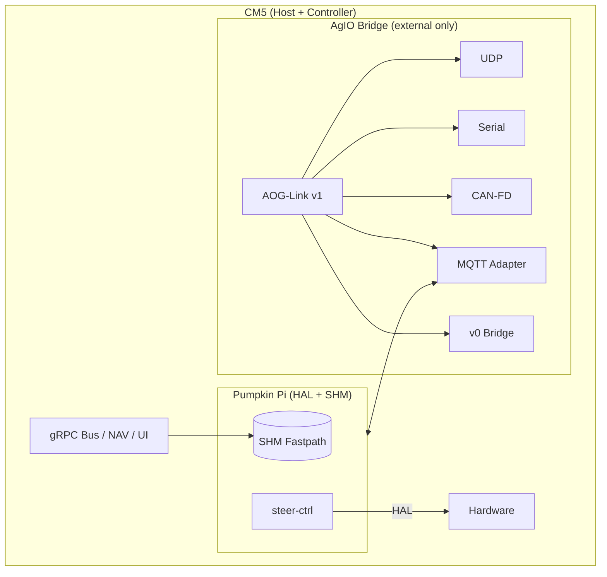

# Pumpkin Pi Plugin

Pumpkin Pi lets a CM5 run NAV and steer-ctrl loops without leaving the box. The plugin exposes a shared-memory (SHM) ring for setpoints, owns the local hardware abstraction layer (HAL), and still mirrors telemetry through the AgIO Bridge so external devices remain compatible.

## Capabilities
- SHM fastpath (`/dev/shm/aoglink_steer`) between NAV producer and steer-ctrl consumer with eventfd notification.
- HAL drivers for GPIO, PWM, SocketCAN, I²C, and SPI via libgpiod and Linux character devices.
- MQTT loopback mirrors for `SteerTarget`, `SteerStatus`, and health topics (QoS1 retained).
- Authority topic `aog/v1/ctrl/authority/steer` for takeover or external controller nomination.

## Configuration
```yaml
fastpath:
  shm_name: "/aoglink_steer"
  setpoint_ttl_ms: 250
hal:
  backend: pwm          # pwm | gpio | can | i2c | spi
  pwm: { chip: 0, channel: 0, period_ns: 2000000 }
mqtt:
  broker: "localhost:1883"
  publish_status: true
```

- `fastpath.setpoint_ttl_ms` defines the maximum age NAV/steer-ctrl should honor before forcing neutral outputs.
- `hal.backend` selects which hardware driver to load; each backend injects additional configuration blocks.
- `mqtt.publish_status` controls whether Pumpkin Pi mirrors telemetry to loopback (recommended `true`).

## Interaction with AgIO Bridge
Pumpkin Pi bypasses AgIO for CM5-internal traffic but keeps the bridge online for UDP, serial, CAN-FD, and MQTT-SN transports. The bridge still reports authority state, mirrored steer targets, and health so UI shells and external modules can monitor activity.



## Safety & Authority
- Authority defaults to CM5 on boot; external controllers publish retained tokens to take control.
- Setpoints older than `fastpath.setpoint_ttl_ms` must be ignored and reset to neutral outputs.
- Pumpkin Pi should be scheduled with real-time priority (`CPUSchedulingPolicy=fifo`, priority ≥80) and lock memory (`mlockall`) to avoid jitter.

## Rollout Checklist
- Install config at `/etc/aog/pumpkin.yaml`.
- Enable systemd service `pumpkin-pi`.
- Verify SHM ring version matches NAV/steer-ctrl build.
- Confirm MQTT loopback mirrors `SteerTarget` + `SteerStatus` retained messages.
