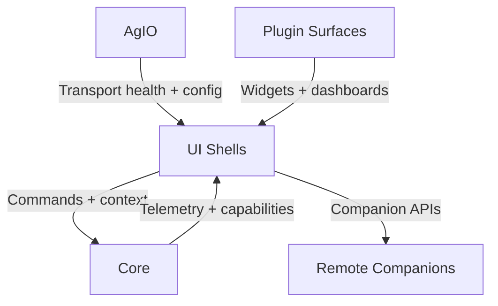

# UI Platform Overview

These notes focus on UI operational guides, migration workbooks, and
runbooks. The canonical UI requirements, metadata schemas, and layout
contracts are captured in the SRS — see
[Section 91 — UI Shell & Layout](../SRS/sections/9X_Frontends_Ops/91_UI_Shell_Layout.md)
and [ADR-034 Metadata Dashboards](../SRS/sections/9X_Frontends_Ops/91-ADR-034%20-%20Metadata-driven%20dashboards%20and%20inspector%20surfaces.md).
Use this folder for implementation playbooks and reference the SRS for
spec-grade directives.

The Nexus UI platform modernises legacy WinForms experiences into shared
Avalonia shells that can run on desktops, tablets, and companion devices.
It consumes Core contracts, surfaces AgIO telemetry, and hosts plugin
workflows through metadata-driven layouts.

## Responsibilities
- Deliver responsive shells (desktop and companion) that bind to Core and
  AgIO transports using shared Avalonia components.
- Provide modernization roadmaps and migration plans for legacy dialogs
  and dashboards.
- Enforce styling, accessibility, and metadata-driven layout guidance so
  plugin surfaces feel consistent across bundles.

## Feature Highlights
- **Run modes:** [Avalonia run modes](avalonia-run-modes.md) explain
  CompanionRemote, LocalInProc, and LocalOutOfProc hosting patterns.
- **Shell roadmap:** [UI shell & plugin integration plan](../reference/agvalonia/ui-shell-and-plugin-integration.md)
  tracks phased delivery across NX-410…NX-418.
- **Session lifecycle:** [UI session lifecycle reference](ui-session-lifecycle.md)
  covers state synchronization with Core jobs and sessions.
- **Styling governance:** The [metadata-driven UI style guide](metadata-driven-ui-style-guide.md)
  and [modernization prompt bundle](../reference/agvalonia/ui-modernization-ai-prompts.md)
  document reusable assets and AI tooling for designers.
- **Phase workbooks:** Detailed plans for [Phase 3](../reference/agvalonia/ui-phase3-job-field-lifecycle.md),
  [Phase 4](../reference/agvalonia/ui-phase4-settings-hotkeys.md), and
  [Phase 5](ui-phase5-plugin-surfaces.md) surface acceptance criteria and
  plugin dependencies, while the
  [migration workbook](../reference/agvalonia/ui-migration-workbook-phase0.md) inventories legacy assets.

## Plugin Touchpoints
- UI surfaces integrate with plugin contracts enumerated in
  [`artifacts/ui-to-plugin.yaml`](../../artifacts/ui-to-plugin.yaml) and
  collaborate with plugins such as
  [Device Manager](../plugins/DeviceManager.md),
  [Guidance](../plugins/Guidance.md), and
  [Telemetry Logging](../plugins/TelemetryLogging.md).
- Styling and telemetry parity requirements ensure plugin dashboards
  align with Core data (see
  [performance budget dashboards](../Core/performance-budget-telemetry-dashboards.md)).
- Companion UX parity depends on metadata snapshots produced by plugins
  like [Sync Dashboard](../plugins/SyncDashboard.md) and
  [Automation Engine](../plugins/AutomationEngine.md).

## Additional References
- [Avalonia run modes](avalonia-run-modes.md)
- [UI migration workbook](../reference/agvalonia/ui-migration-workbook-phase0.md)
- [UI session lifecycle](ui-session-lifecycle.md)
- [Metadata-driven UI style guide](metadata-driven-ui-style-guide.md)
- [UI modernization prompt bundle](../reference/agvalonia/ui-modernization-ai-prompts.md)
